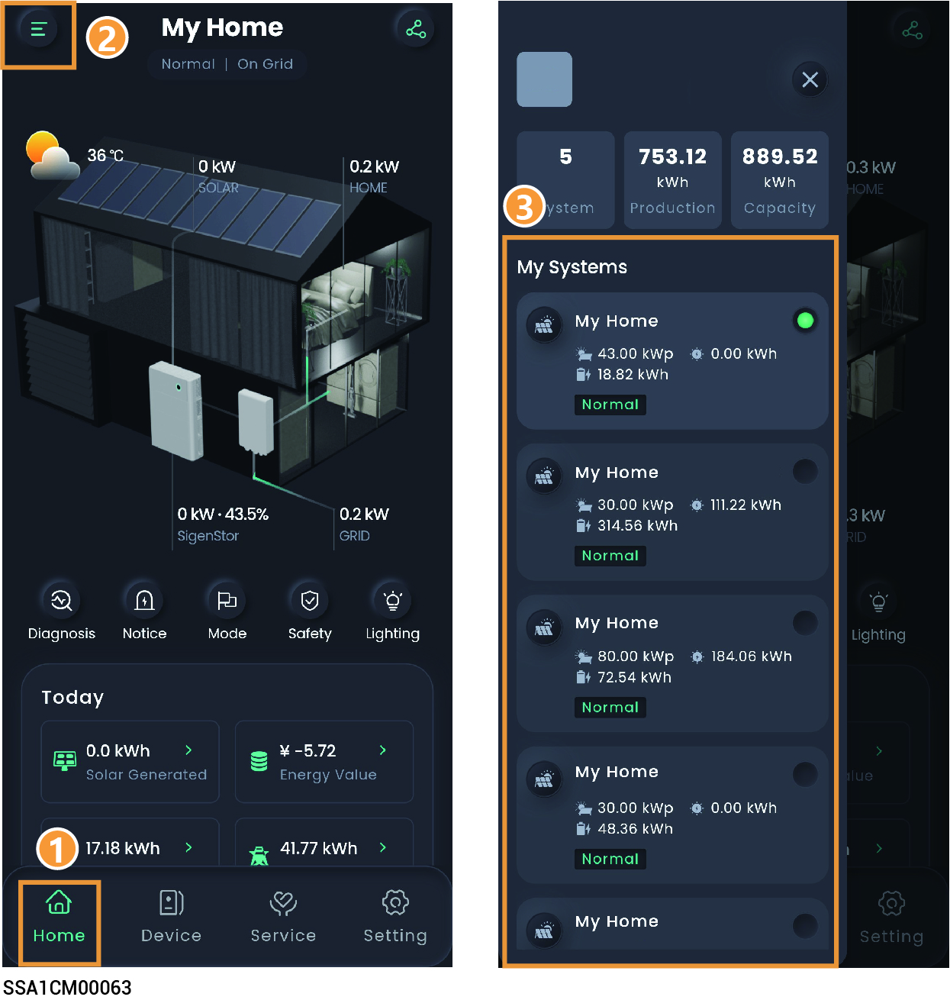

# Account Setting

## Switch Accounts

The App enables you to quickly switch among accounts when you have set multiple accounts for different products.

<figure><figcaption></figcaption></figure>

## Changing password

### **Method 1:**

On the login screen, click "Forgot Password" to reset the login password.

### **Method 2:**

Click "Setting" and  on the screen top to change "Password."

## Changing nickname

Click "Setting" and ![](data:image/png;base64,R0lGODdhHwAeAHcAACH+GlNvZnR3YXJlOiBNaWNyb3NvZnQgT2ZmaWNlACwAAAAAHwAeAIchEBkhKSlrGVpKGVoxMUJCQlIxQkoQKVJrWs4pWs5rGc4pGc4QCFJKWs4IWs5KGc4IGc4pMToxEFJja1oQa1prSloQSlpra5Strd6MrZytrZytzt6MjJxrjJzv795r795rWu/va97v71pr71rva1qt794p796ta96t71op71qta1opWu8pa5Rrrd7vrd7vKd7vrVprrVrvKVoprd6tKd6trVoprVqtKVprGe8pGe9rKZSt75xrrZzv75xr75zva5zv7xlr7xnvaxkp75yta5yt7xkp7xmtaxkpKZTvrZzvKZzvrRlrrRnvKRkprZytKZytrRkprRmtKRlraxkpaxlrKRlKa5SMrd6M795KrZzO795K797Oa97O71pK71rOa1oI796Ma96M71oI71qMa1oIa5RKrd7Ord7OKd7OrVpKrVrOKVoIrd6MKd6MrVoIrVqMKVpKKZSM75zO75xK75zOa5zO7xlK7xnOaxkI75yMa5yM7xkI7xmMaxkIKZTOrZzOKZzOrRlKrRnOKRkIrZyMKZyMrRkIrRmMKRlKaxkIaxlKKRlrSpStjN6tjJzvzt5rzt5KWu/vSt7vzlprzlrvSlopzt6tSt6tzlopzlqtSloIWu8pSpRrjN7vjN7vCN7vjFprjFrvCFopjN6tCN6tjFopjFqtCFpKGe8IGe9rCJStzpzvzpxrzpzvSpzvzhlrzhnvShkpzpytSpytzhkpzhmtShkpCJTvjJzvCJzvjBlrjBnvCBkpjJytCJytjBkpjBmtCBlrShkpShlrCBlKSpSMjN6Mzt5KjJzOzt5Kzt7OSt7OzlpKzlrOSloIzt6MSt6MzloIzlqMSloISpRKjN7OjN7OCN7OjFpKjFrOCFoIjN6MCN6MjFoIjFqMCFpKCJSMzpzOzpxKzpzOSpzOzhlKzhnOShkIzpyMSpyMzhkIzhmMShkICJTOjJzOCJzOjBlKjBnOCBkIjJyMCJyMjBkIjBmMCBlKShkIShlKCBlKY1oxY1oIKRkICBkpMRAI/wALGCggkGBBgwgPDiw4sGHChwsfSkS4MCLCfQQHRjjIsKNFiRFC/hMZciNBfBFRcjTID1/JCAYiECBQcmTFjgb3LZQZskBImi9LEjA4FGFLgj8NuJRJwCXQmhtvXozwz8DMmT+f/nvaEyUBizStMm0a9GWACGe/Stz6NSvap4tCnp07tKjBmD7D9pxgtuTcs1ERbg2J7+kEDBcCAI4AAC3jtwXUCoR59amEUMkuOJa76G9Pg0G5hrwgLrFiuY8VF8AncJ/TpUEVX8BABm0ACYAVB5Dsc+xPqjQVc9gw4S+AAI2ZLqT5VHSAAho4+Dw+17ZkAwYGkyQwtwCGDAWOo6iV8A95WslcmXfH4MiA7vfvIyMsu/u5hgwGxOumfrqpQNbclRQXWhNw4N5f8DV2lUMFVIdaffBFKFNkYC2Wm2K43YacBMcp+NVQG21U2GmNNRbhfopdpZJSRBGQ3HgIRkgThWoNZJdc7/GnGHWVeVVXQ4VFVp1xul210YdDLSdQXULCON5Yecm3E0FJAlgYVkzJpFRYLln1lUomfShfU15GhpIEGsm3UUAAOw==) on the screen top to modify "Nickname".

## Changing binding information

Click "Setting" and ![](data:image/png;base64,R0lGODdhHwAeAHcAACH+GlNvZnR3YXJlOiBNaWNyb3NvZnQgT2ZmaWNlACwAAAAAHwAeAIchEBkhKSlrGVpKGVoxMUJCQlIxQkoQKVJrWs4pWs5rGc4pGc4QCFJKWs4IWs5KGc4IGc4pMToxEFJja1oQa1prSloQSlpra5Strd6MrZytrZytzt6MjJxrjJzv795r795rWu/va97v71pr71rva1qt794p796ta96t71op71qta1opWu8pa5Rrrd7vrd7vKd7vrVprrVrvKVoprd6tKd6trVoprVqtKVprGe8pGe9rKZSt75xrrZzv75xr75zva5zv7xlr7xnvaxkp75yta5yt7xkp7xmtaxkpKZTvrZzvKZzvrRlrrRnvKRkprZytKZytrRkprRmtKRlraxkpaxlrKRlKa5SMrd6M795KrZzO795K797Oa97O71pK71rOa1oI796Ma96M71oI71qMa1oIa5RKrd7Ord7OKd7OrVpKrVrOKVoIrd6MKd6MrVoIrVqMKVpKKZSM75zO75xK75zOa5zO7xlK7xnOaxkI75yMa5yM7xkI7xmMaxkIKZTOrZzOKZzOrRlKrRnOKRkIrZyMKZyMrRkIrRmMKRlKaxkIaxlKKRlrSpStjN6tjJzvzt5rzt5KWu/vSt7vzlprzlrvSlopzt6tSt6tzlopzlqtSloIWu8pSpRrjN7vjN7vCN7vjFprjFrvCFopjN6tCN6tjFopjFqtCFpKGe8IGe9rCJStzpzvzpxrzpzvSpzvzhlrzhnvShkpzpytSpytzhkpzhmtShkpCJTvjJzvCJzvjBlrjBnvCBkpjJytCJytjBkpjBmtCBlrShkpShlrCBlKSpSMjN6Mzt5KjJzOzt5Kzt7OSt7OzlpKzlrOSloIzt6MSt6MzloIzlqMSloISpRKjN7OjN7OCN7OjFpKjFrOCFoIjN6MCN6MjFoIjFqMCFpKCJSMzpzOzpxKzpzOSpzOzhlKzhnOShkIzpyMSpyMzhkIzhmMShkICJTOjJzOCJzOjBlKjBnOCBkIjJyMCJyMjBkIjBmMCBlKShkIShlKCBlKY1oxY1oIKRkICBkpMRAI/wALGCggkGBBgwgPDiw4sGHChwsfSkS4MCLCfQQHRjjIsKNFiRFC/hMZciNBfBFRcjTID1/JCAYiECBQcmTFjgb3LZQZskBImi9LEjA4FGFLgj8NuJRJwCXQmhtvXozwz8DMmT+f/nvaEyUBizStMm0a9GWACGe/Stz6NSvap4tCnp07tKjBmD7D9pxgtuTcs1ERbg2J7+kEDBcCAI4AAC3jtwXUCoR59amEUMkuOJa76G9Pg0G5hrwgLrFiuY8VF8AncJ/TpUEVX8BABm0ACYAVB5Dsc+xPqjQVc9gw4S+AAI2ZLqT5VHSAAho4+Dw+17ZkAwYGkyQwtwCGDAWOo6iV8A95WslcmXfH4MiA7vfvIyMsu/u5hgwGxOumfrqpQNbclRQXWhNw4N5f8DV2lUMFVIdaffBFKFNkYC2Wm2K43YacBMcp+NVQG21U2GmNNRbhfopdpZJSRBGQ3HgIRkgThWoNZJdc7/GnGHWVeVVXQ4VFVp1xul210YdDLSdQXULCON5Yecm3E0FJAlgYVkzJpFRYLln1lUomfShfU15GhpIEGsm3UUAAOw==) on the screen top to change "Binding Information," for example, email address.
