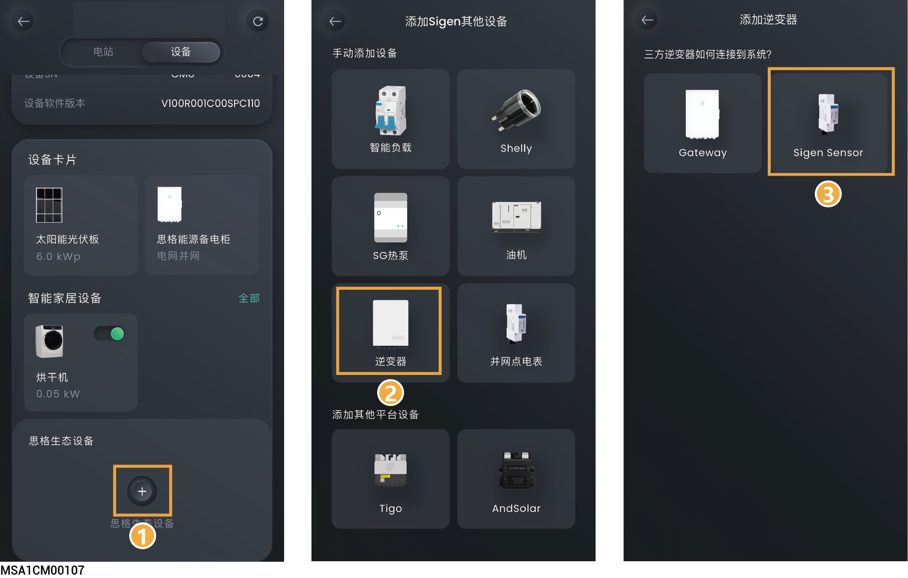
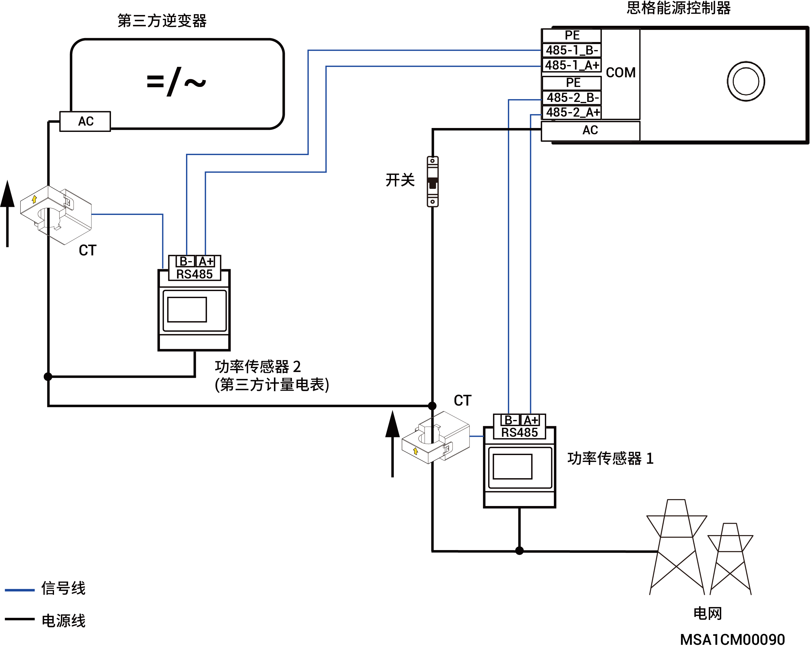

# 第三方厂家逆变器

## **方式一：通过思格能源备电柜接入**



* <mark style="color:blue;">在接入第三方厂家逆变器前，请确保第三方厂家逆变器已经连接思格能源备电柜，具体接线请参见对应产品的《安装指南》。</mark>
* <mark style="color:blue;">仅支持无离网功能的第三方厂家逆变器接入。</mark>
* <mark style="color:blue;">进入界面后，请根据第三方厂家逆变器设置相关参数，完成接入后，可在“设备”界面查看。</mark>

<figure><figcaption></figcaption></figure>

## **方式二：通过计量电表接入**



<mark style="color:blue;">在接入第三方厂家逆变器前，请确保以下信息：</mark>

* <mark style="color:blue;">第三方厂家逆变器已经正确连接计量电表（计量电表请从本公司购买）。</mark>
* <mark style="color:blue;">计量电表已正确连接至本公司逆变器的COM端口，具体接线接口请参见对应产品的《安装指南》。</mark>
* <mark style="color:blue;">可选择单台或多台第三方厂家逆变器，请根据实际情况选择。</mark>
* <mark style="color:blue;">若采用RGM电表，需根据实际接线情况，选择对应设备SN号。</mark>

<figure><figcaption></figcaption></figure>

## **第三方厂家逆变器接线关系示意**

<figure><figcaption></figcaption></figure>



* <mark style="color:blue;">图示仅展示设备间不同线缆的接线关系，具体的端口请以实际设备为准。</mark>
* <mark style="color:blue;">进入界面后，请根据第三方厂家逆变器及其所连接的计量电表情况设置相关参数，完成接入后，可在“设备”界面查看。</mark>
* <mark style="color:blue;">电网离网状态下，当第三方厂家逆变器运行功率≤（负载使用功率+思格逆变器充电功率）时，第三方厂家逆变器可正常运行。</mark>
* <mark style="color:blue;">电网离网状态下，当第三方厂家逆变器运行功率＞（负载使用功率+思格逆变器充电功率）时，第三方厂家逆变器将停止运行。</mark>
