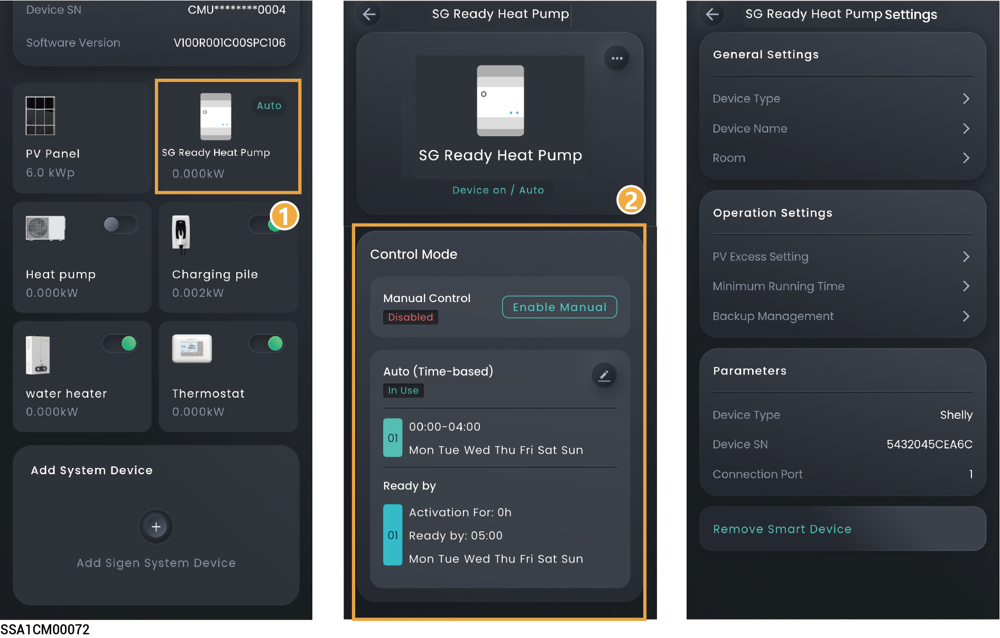
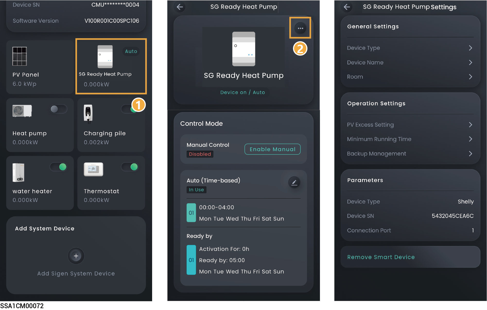

# SG Ready heat pump



<mark style="color:blue;">Before connecting to a heat pump, make sure that:</mark>

* <mark style="color:blue;">The heat pump has been properly connected to the DO port of the company's inverter, and the software version of the inverter enables users to connect the heat pump.</mark>
* <mark style="color:blue;">"DO Custom Function Enable" in the "System Settings" menu has been set to</mark> <mark style="color:blue;">.</mark>

## Control Mode

On the device interface, click the SG heat pump to set the SG heat pump control mode.

<figure><figcaption></figcaption></figure>

<table><thead><tr><th width="49.54547119140625" align="center">No.</th><th width="182.1817626953125">Parameter name</th><th>Description</th></tr></thead><tbody><tr><td align="center">1</td><td>Manual Control</td><td><ul><li>When it is displayed as In Use, you can turn on and off the SG heat pump through " " on the App.</li><li>When displayed as Disable, You can click "Enable Manual" to switch to manual mode.</li></ul></td></tr><tr><td align="center">2</td><td>Auto (Time-based)</td><td><ul><li>When displayed as In Use, it indicates automatic control mode. You can modify or create a schedule.</li><li>When displayed as Disable, you can click "Set a Schedule" → "Yes, save and use" to switch to automatic mode.</li></ul></td></tr><tr><td align="center">3</td><td>Schedule</td><td>
Energy Source Control: Set the Energy Source Type. The following three modes can be set:

<strong>Depends on System</strong>
<ul><li>Battery Boost: When set to , home batteries charge SG Ready heat pump.</li></ul>
<strong>Surplus PV Only</strong>
<ul><li>Starting Power: Set the starting power of the SG Ready heat pump.</li><li>Rated Power: Set the rated power of the connected device, which can be checked on the SG Ready heat pump's label.</li><li>Battery Boost: When set to , the home battery charges the SG Ready heat pump.</li></ul>
<strong>Battery Level Control</strong>
<ul><li>Device Activation Threshold: The SG Ready heat pump will activate when the actual SOC is greater than the set parameter.</li><li>Device Deactivation Threshold: The SG Ready heat pump will deactivate when the actual SOC is less than the set parameter.</li></ul></td></tr><tr><td align="center">4</td><td>Ready by</td><td><ul><li>Activation For: Total running time. Before the time set in Be Ready By, if the running time on that day is less than the set value, the SG heat pump will be turned on.</li></ul><ul><li>Be Ready By: Set the running time. It is used in conjunction with the total running time.</li></ul></td></tr><tr><td align="center">5</td><td>Resume Schedule</td><td>If a schedule has been added, you can click to delete the schedule parameters.</td></tr></tbody></table>

## SG Ready Heat Pump Settings

<figure><figcaption></figcaption></figure>

<table><thead><tr><th width="72" align="center">No.</th><th width="152">Parameter name</th><th>Description</th></tr></thead><tbody><tr><td align="center">1</td><td>General Settings</td><td>
Device Name: Set the device name.

Room: Set the room where the device is located.
</td></tr><tr><td align="center">3</td><td>Operation Settings</td><td>
<strong>PV Excess Setting</strong>
<ul><li>Starting Power: Set the starting power of the SG heat pump.</li></ul><ul><li>Rated Power: Set the rated power of the connected device, which can be checked on the SG heat pump's label.</li></ul>
<strong>Minimum Running Time: Set the minimum running time for the device.</strong> <strong>Backup Management (When configuring the Gateway in the network setup, this parameter is displayed.)</strong>
<ul><li>When Essential Load is set to , the SOC for SG heat pump startup and shutdown can be configured.</li></ul><ul><li>Cut-in: The SG heat pump will activate when the actual SOC is greater than the set parameter.</li><li>Cut-off: The SG heat pump will deactivate when the actual SOC is less than the set parameter.</li></ul></td></tr><tr><td align="center">3</td><td>Remove Smart Device</td><td>Click to remove the SG heat pump.</td></tr></tbody></table>

