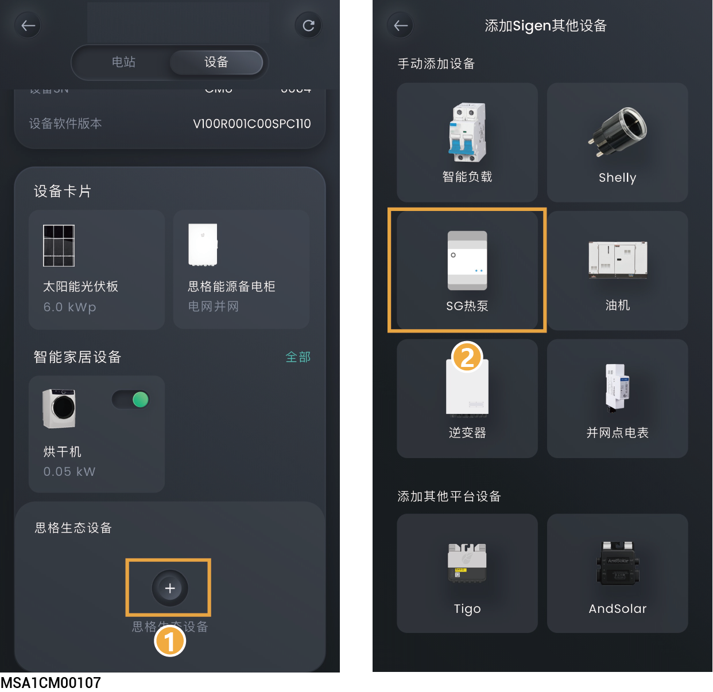

# SG热泵



<mark style="color:blue;">在接入热泵前，请确保以下信息：</mark>

* <mark style="color:blue;">热泵已经正确连接至本公司逆变器的DO端口，且逆变器软件版本支持连接热泵。</mark>
* <mark style="color:blue;">请确保，已经在“电网参数设置”菜单下，将“DO自定义”设置为</mark> 。

<figure><figcaption></figcaption></figure>

## **控制模式**

在设备界面，点击SG热泵，可设置SG热泵控制模式。

<table><thead><tr><th width="75" align="center">序号</th><th width="141">参数名称</th><th>说明</th></tr></thead><tbody><tr><td align="center">1</td><td>手动控制</td><td><ul><li>显示为“使用中”时，为手动控制模式。通过“”对SG热泵进行开关机。</li></ul><ul><li>显示为“关闭”时，可点击“打开手动模式”切换成手动模式。</li></ul></td></tr><tr><td align="center">2</td><td>自动（时间控制）</td><td><ul><li>显示为“使用中”时，为自动控制模式。可修改或添加时间表。</li><li>显示为“关闭”时，可点击“设置一个计划”→“是的，储存和使用”切换成自动模式。</li></ul></td></tr><tr><td align="center">3</td><td>时间表</td><td>
能源控制：设置能源控制模式。可设置如下三种模式。

<strong>取决于系统：模式下，智能负载根据设置时间启动和关闭。</strong>
<ul><li>电池能否放电：设置为时，家用电池给SG热泵充电</li></ul>
<strong>仅光伏盈余：此模式下，智能负载根据设置功率启动和关闭。</strong>
<ul><li>启动功率：设置SG热泵的启动功率，启动功率可通过SG热泵的标签查看。</li><li>额定功率：设置SG热泵的额定功率，额定功率可通过SG热泵的标签查看。</li><li>电池能否放电：设置为时，家用电池给SG热泵充电</li></ul>
<strong>电池水平控制：此模式下，负载根据电池SOC值启动或关闭。</strong>
<ul><li>设备切入SOC：当实际的SOC＞设置参数，启动SG热泵。</li><li>设备切出SOC：当实际的SOC＜设置参数，关闭SG热泵。</li></ul></td></tr><tr><td align="center">4</td><td>就绪</td><td><ul><li>激活时长：运行总时间。在就绪时间设置的时刻前，当天运行时间不足该设置值时，会启动SG热泵</li><li>就绪时间：设置运行时刻。和运行总时间配合使用</li></ul></td></tr></tbody></table>

## **智能负载设置**

在设备界面，点击需要设置的SG热泵→点击右上角“![](data:image/png;base64,/9j/4AAQSkZJRgABAQEAYABgAAD/2wBDAAoHBwgHBgoICAgLCgoLDhgQDg0NDh0VFhEYIx8lJCIfIiEmKzcvJik0KSEiMEExNDk7Pj4+JS5ESUM8SDc9Pjv/2wBDAQoLCw4NDhwQEBw7KCIoOzs7Ozs7Ozs7Ozs7Ozs7Ozs7Ozs7Ozs7Ozs7Ozs7Ozs7Ozs7Ozs7Ozs7Ozs7Ozs7Ozv/wAARCAAjACkDASIAAhEBAxEB/8QAHwAAAQUBAQEBAQEAAAAAAAAAAAECAwQFBgcICQoL/8QAtRAAAgEDAwIEAwUFBAQAAAF9AQIDAAQRBRIhMUEGE1FhByJxFDKBkaEII0KxwRVS0fAkM2JyggkKFhcYGRolJicoKSo0NTY3ODk6Q0RFRkdISUpTVFVWV1hZWmNkZWZnaGlqc3R1dnd4eXqDhIWGh4iJipKTlJWWl5iZmqKjpKWmp6ipqrKztLW2t7i5usLDxMXGx8jJytLT1NXW19jZ2uHi4+Tl5ufo6erx8vP09fb3+Pn6/8QAHwEAAwEBAQEBAQEBAQAAAAAAAAECAwQFBgcICQoL/8QAtREAAgECBAQDBAcFBAQAAQJ3AAECAxEEBSExBhJBUQdhcRMiMoEIFEKRobHBCSMzUvAVYnLRChYkNOEl8RcYGRomJygpKjU2Nzg5OkNERUZHSElKU1RVVldYWVpjZGVmZ2hpanN0dXZ3eHl6goOEhYaHiImKkpOUlZaXmJmaoqOkpaanqKmqsrO0tba3uLm6wsPExcbHyMnK0tPU1dbX2Nna4uPk5ebn6Onq8vP09fb3+Pn6/9oADAMBAAIRAxEAPwDjKa8qxj1PpQWwM1SeTc5J9a0JLP2mQ9No/CpEuf8AnoAB/eFUwT6HipAaAL3XPH/16SordsqU/u9PpUtMCu/Q1R3GObIxlWyMjPvV41Xmh38jgikwNSXxTfz3F7O8dsGvYRDIBFwFHp78/wCcVXvtWuNSjtY51jUWsXlJsTGR71mhHH8J/CpY4mY88Ci4Fm2/ib8KmzTEAVQBS5pgMNNNFFIBMD0p4oooAcKKKKYH/9k=)”，可设置SG热泵参数。

<table><thead><tr><th width="70" align="center" valign="middle">序号</th><th width="158" valign="middle">参数名称</th><th>说明</th></tr></thead><tbody><tr><td align="center" valign="middle">1</td><td valign="middle">通用参数设置</td><td>设置SG热泵类型、名称、所在房间。</td></tr><tr><td align="center" valign="middle">2</td><td valign="middle">操作设置</td><td>
<strong>最小运行时间：设置SG热泵最小运行时间。</strong>

<strong>备电管理（组网中配置思格能源备电柜时，显示此参数）</strong>
<ul><li>备电开关设置为时，可设置SG热泵启动和关闭的SOC。</li></ul><ul><li>切入：当实际的SOC＞设置参数，启动SG热泵。</li><li>切出：当实际的SOC＜设置参数，关闭SG热泵。</li></ul></td></tr><tr><td align="center" valign="middle">3</td><td valign="middle">参数</td><td>查看SG热泵接入相关参数。</td></tr><tr><td align="center" valign="middle">4</td><td valign="middle">移除SG热泵</td><td>点击可移除SG热泵。</td></tr></tbody></table>
