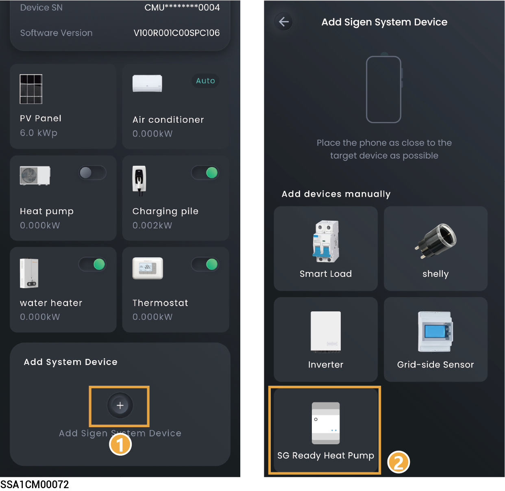

# SG热泵



<mark style="color:blue;">在接入热泵前，请确保以下信息：</mark>

* <mark style="color:blue;">热泵已经正确连接至本公司逆变器的DO端口，且逆变器软件版本支持连接热泵。</mark>
* <mark style="color:blue;">请确保，已经在“System Settings”菜单下，将“DO Custom Function Enable”设置为</mark> <mark style="color:blue;">。</mark>

<figure><figcaption></figcaption></figure>

## **Control Mode**

在设备界面，点击SG热泵，可设置SG热泵控制模式。

<table><thead><tr><th width="61" align="center" valign="middle">序号</th><th width="187" valign="middle">参数名称</th><th>说明</th></tr></thead><tbody><tr><td align="center" valign="middle">1</td><td valign="middle">Manual Control</td><td><ul><li>显示为In Use时，为手动控制模式。通过“”对SG热泵进行开关机。</li><li>显示为Disable时候，可点击“Enable Manual”切换成手动模式。</li></ul></td></tr><tr><td align="center" valign="middle">2</td><td valign="middle">Auto（Time-based）</td><td><ul><li>显示为In Use时，为自动控制模式。可修改或添加Schedule。</li><li>显示为Disable时，可点击“Set a Schedule”→“Yes, save and use”切换成自动模式。</li></ul></td></tr><tr><td align="center" valign="middle">3</td><td valign="middle">Schedule</td><td>
Energy Source Control：设置Energy Source Type。可设置如下三种模式。

<strong>Depends on System</strong>
<ul><li>Battery Boost：设置为时，家用电池给智能负载充电。</li></ul>
<strong>Surplus PV Only</strong>
<ul><li>Starting Power：设置SG热泵的启动功率。</li><li>Rated Power：设置SG热泵的额定功率，额定功率可通过SG热泵的标签查看。</li><li>Battery Boost：设置为时，家用电池给智能负载充电。</li></ul>
<strong>Battery Level Control</strong>
<ul><li>Device Activation Threshold：当实际的SOC＞设置参数，启动SG热泵。</li><li>Device Deactivation Threshold：当实际的SOC＜设置参数，关闭SG热泵。</li></ul></td></tr><tr><td align="center" valign="middle">4</td><td valign="middle">Ready by</td><td><ul><li>Activation For：设置运行总时间。在Be Ready By设置的时刻前，当天运行时间不足该设置值时，会启动 SG热泵。</li><li>Be Ready By：设置运行时刻。和运行总时间配合使用。</li></ul></td></tr><tr><td align="center" valign="middle">5</td><td valign="middle">Resume Schedule</td><td>若已添加Schedule，点击可删除Schedule相关参数。</td></tr></tbody></table>

## SG Ready Heat Pump Settings

在设备界面，点击SG热泵→点击右上角“”，可设置SG热泵参数。

<table><thead><tr><th width="61" align="center" valign="middle">序号</th><th width="192" valign="middle">参数名称</th><th>说明</th></tr></thead><tbody><tr><td align="center" valign="middle">1</td><td valign="middle">General Settings</td><td>设置智能负载类型、名称、所在房间等信息。</td></tr><tr><td align="center" valign="middle">2</td><td valign="middle">Operation Settings</td><td>
<strong>PV Excess Setting</strong>
<ul><li>Starting Power：设置连接设备的启动功率。</li><li>Rated Power：设置连接设备的额定功率，额定功率可通过SG热泵的标签查看。</li></ul>
<strong>Minimum Running Time：设置设备最小运行时间。</strong>

<strong>Backup Management（组网中配置Gateway时，显示此参数）</strong>
<ul><li>Essential Load设置为时，可设置SG热泵的启动和关闭的SOC。</li><li>Cut-in：当实际的SOC＞设置参数，启动SG热泵。</li><li>Cut-off：当实际的SOC＜设置参数，关闭SG热泵。</li></ul></td></tr><tr><td align="center" valign="middle">3</td><td valign="middle">Remove Smart Device</td><td>点击可移除SG热泵。</td></tr></tbody></table>
