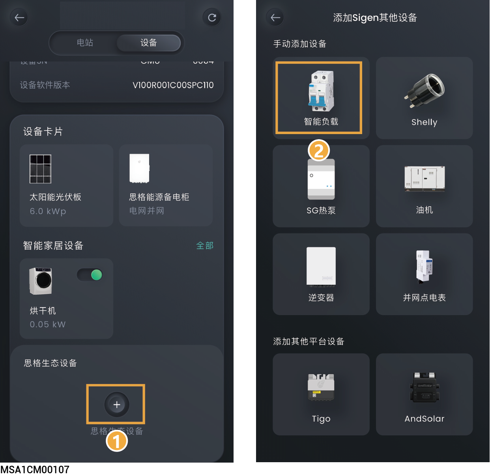
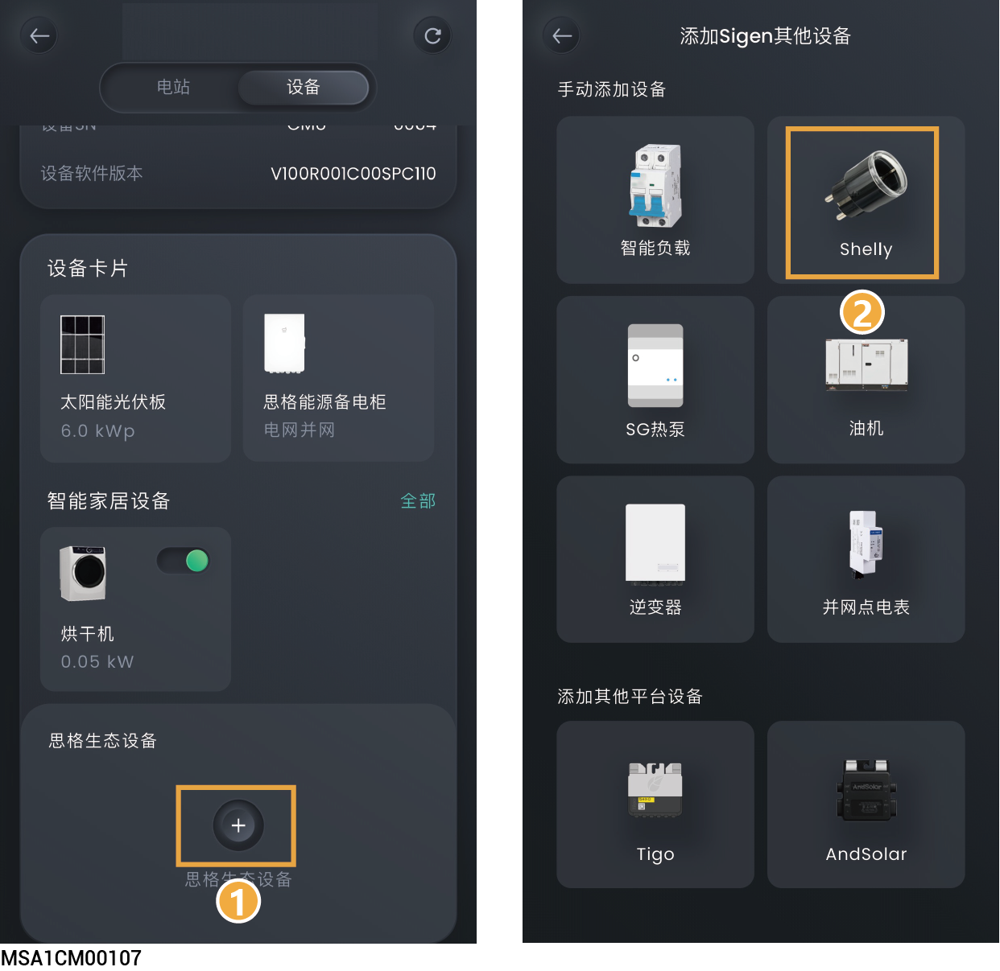

# 智能负载

## **方式一：通过思格能源备电柜接入**



* <mark style="color:blue;">在接入智能负载前，请确保组网中已配置</mark>思格能源备电柜<mark style="color:blue;">。</mark>
* <mark style="color:blue;">智能负载接入的台数，由</mark>思格能源备电柜<mark style="color:blue;">支持接入智能负载的台数决定。</mark>
* <mark style="color:blue;">App添加智能负载后，可通过App对智能负载进行开关机，或系统根据您设置的</mark>时间表<mark style="color:blue;">，结合设备实际的运行情况实现远程控制设备开关机。</mark>
* <mark style="color:blue;">若您未找到所接设备的图标（如热得快），可选择“其他”进行接入。智能负载接入后，可在“设备”界面查看。</mark>

<figure><figcaption></figcaption></figure>

## **方式二：通过Shelly接入**



* <mark style="color:blue;">连接Shelly前需开启手机蓝牙功能。</mark>
* <mark style="color:blue;">Shelly需和SigenStor连相同WLAN网络。</mark>
* <mark style="color:blue;">Shelly由智能插座，智能继电器等组成，用于功率/电量统计，可远程控制智能负载。</mark>

<figure><figcaption></figcaption></figure>



* <mark style="color:blue;">Shelly的相关信息请参见Shelly对应型号的使用说明书和规格书。</mark>
* <mark style="color:blue;">下表为Sigen户用系列逆变器支持的Shelly型号等信息，请根据实际情况匹配。</mark>

<table><thead><tr><th width="58" align="center" valign="top">序号</th><th width="109.9090576171875" valign="top">产品类型</th><th width="186" valign="top">产品型号</th><th width="219.272705078125" valign="top">推荐支持Shelly的固件版本</th><th width="180" valign="top">支持负载的最大电流</th></tr></thead><tbody><tr><td align="center" valign="top">1</td><td valign="top">智能插座</td><td valign="top">Shelly Plug S Gen3</td><td valign="top">1.2.2, 1.2.3</td><td valign="top">交流供电12A</td></tr><tr><td align="center" valign="top">2</td><td valign="top">智能插座</td><td valign="top">Shelly Outdoor Plug S Gen3</td><td valign="top">1.2.3-matter22</td><td valign="top">交流供电12A</td></tr><tr><td align="center" valign="top">3</td><td valign="top">智能插座</td><td valign="top">Shelly Plus Plug S</td><td valign="top">1.0.7, 1.3.3, 1.4.4</td><td valign="top">交流供电12A</td></tr><tr><td align="center" valign="top">4</td><td valign="top">智能插座</td><td valign="top">Shelly Plus Plug UK</td><td valign="top">1.0.7, 1.3.3, 1.4.4</td><td valign="top">交流供电13A</td></tr><tr><td align="center" valign="top">5</td><td valign="top">智能继电器</td><td valign="top">Shelly 1PM Gen3</td><td valign="top">1.2.2, 1.3.3</td><td valign="top">
交流供电16A

直流供电10A
</td></tr><tr><td align="center" valign="top">6</td><td valign="top">智能继电器</td><td valign="top">Shelly 2PM Gen3</td><td valign="top">1.2.2, 1.3.3</td><td valign="top">交流供电单通道10A，总共16A</td></tr><tr><td align="center" valign="top">7</td><td valign="top">智能继电器</td><td valign="top">Shelly 2PM Gen3</td><td valign="top">1.3.3, 1.4.4, 1.5.0-beta1</td><td valign="top">交流供电8A</td></tr><tr><td align="center" valign="top">8</td><td valign="top">智能继电器</td><td valign="top">Shelly Plus 1PM</td><td valign="top">1.3.3, 1.4.4, 1.5.0-beta1</td><td valign="top">
交流供电16A

直流供电10A
</td></tr><tr><td align="center" valign="top">9</td><td valign="top">智能继电器</td><td valign="top">Shelly Plus 2PM</td><td valign="top">1.3.3, 1.4.4, 1.5.0-beta1</td><td valign="top">交流供电单通道10A，总共16A</td></tr><tr><td align="center" valign="top">10</td><td valign="top">智能继电器</td><td valign="top">Shelly Pro 1PM</td><td valign="top">0.10.2-beta1, 1.4.4, 1.5.0-beta1</td><td valign="top">交流供电单通道16A</td></tr><tr><td align="center" valign="top">11</td><td valign="top">智能继电器</td><td valign="top">Shelly Pro 2PM</td><td valign="top">0.10.2-beta1, 1.4.4, 1.5.0-beta1</td><td valign="top">交流供电单通道16A，总共25A</td></tr><tr><td align="center" valign="top">12</td><td valign="top">智能继电器</td><td valign="top">Shelly Pro 4PM</td><td valign="top">0.10.2-beta1, 1.4.4, 1.5.0-beta1</td><td valign="top">交流供电单通道16A，总共40A</td></tr><tr><td align="center" valign="top">13</td><td valign="top">智能继电器</td><td valign="top">Shelly Pro 1</td><td valign="top">0.10.2-beta1、1.3.3</td><td valign="top">交流供电16A</td></tr><tr><td align="center" valign="top">14</td><td valign="top">智能继电器</td><td valign="top">Shelly Pro 2</td><td valign="top">1.3.2-g34c651b、1.3.3</td><td valign="top">交流供电单通道16A,总共25A</td></tr><tr><td align="center" valign="top">15</td><td valign="top">智能继电器</td><td valign="top">Shelly Pro 3</td><td valign="top">1.3.0-ga3fdd3d、1.3.3</td><td valign="top">交流供电单通道16A,总共48A</td></tr><tr><td align="center" valign="top">16</td><td valign="top">智能继电器</td><td valign="top">Shelly 1PM Gen4</td><td valign="top">1.5.99-g4prod1、1.6.2</td><td valign="top">
交流供电16A

直流供电10A
</td></tr><tr><td align="center" valign="top">17</td><td valign="top">智能继电器</td><td valign="top">Shelly 1PM Mini Gen4</td><td valign="top">1.5.99-g4prod1、1.6.2</td><td valign="top">交流供电8A</td></tr><tr><td align="center" valign="top">18</td><td valign="top">智能继电器</td><td valign="top">Shelly 1 Gen4</td><td valign="top">1.5.99-g4prod1、1.6.2</td><td valign="top">
交流供电16A

直流供电10A
</td></tr><tr><td align="center" valign="top">19</td><td valign="top">智能继电器</td><td valign="top">Shelly Plus 1</td><td valign="top">1.4.0-gb2aeadb、1.6.2</td><td valign="top">
交流供电16A

直流供电10A
</td></tr></tbody></table>

## **控制模式**

在设备界面，点击需要设置的智能负载，可设置智能负载控制模式。

<table><thead><tr><th width="75" align="center">序号</th><th width="141">参数名称</th><th>说明</th></tr></thead><tbody><tr><td align="center">1</td><td>手动控制</td><td><ul><li>显示为“使用中”时，为手动控制模式。通过“”对智能负载进行开关机。</li></ul><ul><li>显示为“关闭”时，可点击“打开手动模式”切换成手动模式。</li></ul></td></tr><tr><td align="center">2</td><td>自动（时间控制）</td><td><ul><li>显示为“使用中”时，为自动控制模式。可修改或添加时间表。</li><li>显示为“关闭”时，可点击“设置一个计划”→“是的，储存和使用”切换成自动模式。</li></ul></td></tr><tr><td align="center">3</td><td>时间表</td><td>
能源控制：设置能源控制模式。可设置如下三种模式。

<strong>取决于系统：模式下，智能负载根据设置时间启动和关闭。</strong>
<ul><li>电池能否放电：设置为时，家用电池给智能负载充电</li></ul>
<strong>仅光伏盈余：此模式下，智能负载根据设置功率启动和关闭。</strong>
<ul><li>启动功率：设置智能负载的启动功率，启动功率可通过智能负载的标签查看。</li><li>额定功率：设置智能负载的额定功率，额定功率可通过智能负载的标签查看。</li><li>电池能否放电：设置为时，家用电池给智能负载充电</li></ul>
电池水平控制<strong>：此模式下，负载根据电池SOC值启动或关闭。</strong>
<ul><li>设备切入SOC：当实际的SOC＞设置参数，启动智能负载。</li><li>设备切出SOC：当实际的SOC＜设置参数，关闭智能负载。</li></ul></td></tr><tr><td align="center">4</td><td>就绪</td><td><ul><li>激活时长：运行总时间。在就绪时间设置的时刻前，当天运行时间不足该设置值时，会启动负载</li><li>就绪时间：设置运行时刻。和运行总时间配合使用</li></ul></td></tr></tbody></table>

## **智能负载设置**

在设备界面，点击需要设置的智能负载→点击右上角“![](data:image/png;base64,/9j/4AAQSkZJRgABAQEAYABgAAD/2wBDAAoHBwgHBgoICAgLCgoLDhgQDg0NDh0VFhEYIx8lJCIfIiEmKzcvJik0KSEiMEExNDk7Pj4+JS5ESUM8SDc9Pjv/2wBDAQoLCw4NDhwQEBw7KCIoOzs7Ozs7Ozs7Ozs7Ozs7Ozs7Ozs7Ozs7Ozs7Ozs7Ozs7Ozs7Ozs7Ozs7Ozs7Ozs7Ozv/wAARCAAjACkDASIAAhEBAxEB/8QAHwAAAQUBAQEBAQEAAAAAAAAAAAECAwQFBgcICQoL/8QAtRAAAgEDAwIEAwUFBAQAAAF9AQIDAAQRBRIhMUEGE1FhByJxFDKBkaEII0KxwRVS0fAkM2JyggkKFhcYGRolJicoKSo0NTY3ODk6Q0RFRkdISUpTVFVWV1hZWmNkZWZnaGlqc3R1dnd4eXqDhIWGh4iJipKTlJWWl5iZmqKjpKWmp6ipqrKztLW2t7i5usLDxMXGx8jJytLT1NXW19jZ2uHi4+Tl5ufo6erx8vP09fb3+Pn6/8QAHwEAAwEBAQEBAQEBAQAAAAAAAAECAwQFBgcICQoL/8QAtREAAgECBAQDBAcFBAQAAQJ3AAECAxEEBSExBhJBUQdhcRMiMoEIFEKRobHBCSMzUvAVYnLRChYkNOEl8RcYGRomJygpKjU2Nzg5OkNERUZHSElKU1RVVldYWVpjZGVmZ2hpanN0dXZ3eHl6goOEhYaHiImKkpOUlZaXmJmaoqOkpaanqKmqsrO0tba3uLm6wsPExcbHyMnK0tPU1dbX2Nna4uPk5ebn6Onq8vP09fb3+Pn6/9oADAMBAAIRAxEAPwDjKa8qxj1PpQWwM1SeTc5J9a0JLP2mQ9No/CpEuf8AnoAB/eFUwT6HipAaAL3XPH/16SordsqU/u9PpUtMCu/Q1R3GObIxlWyMjPvV41Xmh38jgikwNSXxTfz3F7O8dsGvYRDIBFwFHp78/wCcVXvtWuNSjtY51jUWsXlJsTGR71mhHH8J/CpY4mY88Ci4Fm2/ib8KmzTEAVQBS5pgMNNNFFIBMD0p4oooAcKKKKYH/9k=)”，可设置智能负载参数。

<table><thead><tr><th width="70" align="center" valign="middle">序号</th><th width="158" valign="middle">参数名称</th><th>说明</th></tr></thead><tbody><tr><td align="center" valign="middle">1</td><td valign="middle">通用参数设置</td><td>设置智能负载类型、名称、所在房间。</td></tr><tr><td align="center" valign="middle">2</td><td valign="middle">操作设置</td><td>
<strong>最小运行时间：设置智能负载最小运行时间。</strong>

<strong>备电管理（组网中配置思格能源备电柜时，显示此参数）</strong>
<ul><li>备电开关设置为时，可设置负载启动和关闭的SOC。</li></ul><ul><li>切入：当实际的SOC＞设置参数，启动智能负载。</li><li>切出：当实际的SOC＜设置参数，关闭智能负载。</li></ul></td></tr><tr><td align="center" valign="middle">3</td><td valign="middle">参数</td><td>可查看智能负接入相关信息。</td></tr><tr><td align="center" valign="middle">4</td><td valign="middle">移除智能负载</td><td>点击可移除智能负载。</td></tr></tbody></table>
