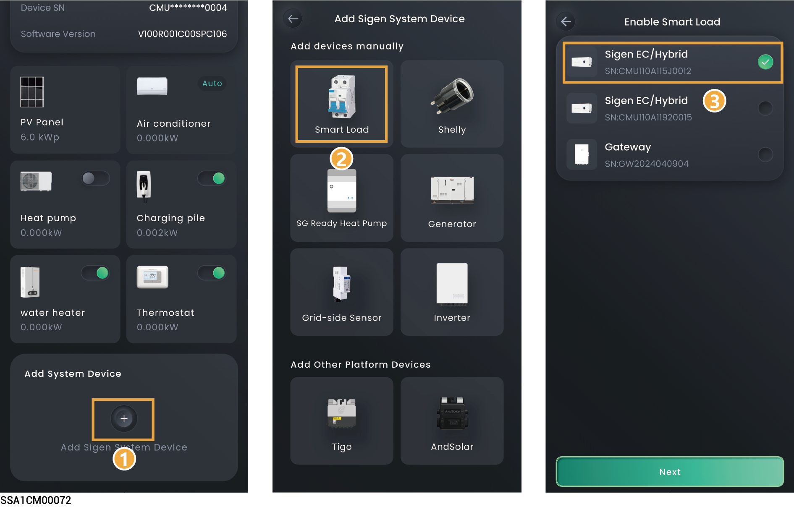

# Smart load



* <mark style="color:blue;">After adding the Smart Load to the App, you can switch the Smart Load on and off through the App. Alternatively, the system can remotely control the equipment on and off based on the actual running conditions and the SOC threshold you set.</mark>
* <mark style="color:blue;">If you cannot locate the icon of the connected device, for example, an immersion heater, select "Other" and connect it. You can check the connected smart load on the "Device" screen.</mark>

## Method 1: Connecting using Gateway



* <mark style="color:blue;">Before connecting the smart load, ensure that a Gateway has been configured in the network and that the smart load port is not connected to a generator.</mark>
* <mark style="color:blue;">The number of Smart Loads that can be connected is determined by the supported capacity of the Gateway.</mark>

<figure><figcaption></figcaption></figure>

## Method 2: Connecting using Sigen Inverter



* <mark style="color:blue;">Before connecting smart loads, ensure that a Sigenergy inverter has been configured in the network and that a DOLI generator is not connected.</mark>
* <mark style="color:blue;">The number of connectable smart loads is determined by the maximum number of smart loads supported by the Sigenergy inverter.</mark>

<figure><figcaption></figcaption></figure>

## Method 3: Connecting using Shelly



<mark style="color:blue;">If Shelly is not configured with the same WLAN as SigenStor, you can connect to Shelly through Bluetooth on your mobile phone. Configure Shelly to the WLAN where SigenStor is located, and establish communication.</mark>

<figure><figcaption></figcaption></figure>



<mark style="color:blue;">If Shelly is already configured with the same WLAN as SigenStor, you can connect the phone, SigenStor, and Shelly to the same WLAN to establish communication.</mark>

<figure><figcaption></figcaption></figure>



* <mark style="color:blue;">Shelly can connect to the router through a network cable or WLAN. For related information about Shelly, please refer to the user manual and specifications of the corresponding Shelly model.</mark>
* <mark style="color:blue;">Shelly consists of a smart socket, a smart relay, and a smart meter. It is used for power and energy statistics and can be used to remotely control smart loads.</mark>
* <mark style="color:blue;">The following table lists the Shelly models supported by the Sigen household series inverter. Please match your model according to the actual situation.</mark>

<table><thead><tr><th width="69" align="center">No.</th><th width="131">Product Type</th><th width="167">Model Number</th><th width="145.2423095703125">Recommended firmware versions supporting Shelly</th><th>Maximum supported load current</th></tr></thead><tbody><tr><td align="center">1</td><td>Smart plugs</td><td>Shelly Plug S Gen3</td><td>1.2.2, 1.2.3</td><td>AC power supply: 12A</td></tr><tr><td align="center">2</td><td>Smart plugs</td><td>Shelly Outdoor Plug S Gen3</td><td>1.2.3-matter22</td><td>AC power supply: 12A</td></tr><tr><td align="center">3</td><td>Smart plugs</td><td>Shelly Plus Plug S</td><td>1.0.7, 1.3.3, 1.4.4</td><td>AC power supply: 12A</td></tr><tr><td align="center">4</td><td>Smart plugs</td><td>Shelly Plus Plug UK</td><td>1.0.7, 1.3.3, 1.4.4</td><td>AC power supply: 13A</td></tr><tr><td align="center">5</td><td>Smart relays</td><td>Shelly 1PM Gen3</td><td>1.2.2, 1.3.3</td><td>
AC power supply: 16A

DC power supply: 10A
</td></tr><tr><td align="center">6</td><td>Smart relays</td><td>Shelly 2PM Gen3</td><td>1.2.2, 1.3.3</td><td>AC power supply: 10A per channel, 16A total</td></tr><tr><td align="center">7</td><td>Smart relays</td><td>Shelly 1PM Mini Gen3</td><td>1.3.3, 1.4.4, 1.5.0-beta1</td><td>AC power supply: 8A</td></tr><tr><td align="center">8</td><td>Smart relays</td><td>Shelly Plus 1PM</td><td>1.3.3, 1.4.4, 1.5.0-beta1</td><td>
AC power supply: 16A

DC power supply: 10A
</td></tr><tr><td align="center">9</td><td>Smart relays</td><td>Shelly Plus 2PM</td><td>1.3.3, 1.4.4, 1.5.0-beta1</td><td>AC power supply: 10A per channel, 16A total</td></tr><tr><td align="center">10</td><td>Smart relays</td><td>Shelly Pro 1PM</td><td>0.10.2-beta1, 1.4.4, 1.5.0-beta1</td><td>AC power supply: 16A per channel</td></tr><tr><td align="center">11</td><td>Smart relays</td><td>Shelly Pro 2PM</td><td>0.10.2-beta1, 1.4.4, 1.5.0-beta1</td><td>AC power supply: 16A per channel, 25A total</td></tr><tr><td align="center">12</td><td>Smart relays</td><td>Shelly Pro 4PM</td><td>0.10.2-beta1, 1.4.4, 1.5.0-beta1</td><td>AC power supply: 16A per channel, 40A total</td></tr><tr><td align="center">13</td><td>Smart relays</td><td>Shelly Pro 1</td><td>0.10.2-beta1、1.3.3</td><td>AC power supply: 16A</td></tr><tr><td align="center">14</td><td>Smart relays</td><td>Shelly Pro 2</td><td>1.3.2-g34c651b、1.3.3</td><td>AC power supply: 16A per channel, 25A total</td></tr><tr><td align="center">15</td><td>Smart relays</td><td>Shelly Pro 3</td><td>1.3.0-ga3fdd3d、1.3.3</td><td>AC power supply: 16A per channel, 48A total</td></tr><tr><td align="center">16</td><td>Smart relays</td><td>Shelly 1PM Gen4</td><td>1.5.99-g4prod1、1.6.2</td><td>
AC power supply: 16A

DC power supply: 10A
</td></tr><tr><td align="center">17</td><td>Smart relays</td><td>Shelly 1PM Mini Gen4</td><td>1.5.99-g4prod1、1.6.2</td><td>AC power supply: 8A</td></tr><tr><td align="center">18</td><td>Smart relays</td><td>Shelly 1 Gen4</td><td>1.5.99-g4prod1、1.6.2</td><td>
AC power supply: 16A

DC power supply: 10A
</td></tr><tr><td align="center">19</td><td>Smart relays</td><td>Shelly Plus 1</td><td>1.4.0-gb2aeadb、1.6.2</td><td>
AC power supply: 16A

DC power supply: 10A
</td></tr><tr><td align="center">20</td><td>Smart relay</td><td>Ogemray Smart relay 25A</td><td>1.5.0, 1.7.1</td><td>AC power supply: 25 A</td></tr><tr><td align="center">21</td><td>Single-phase electricity meter</td><td>Shelly Pro EM - 50</td><td>1.3.3,1.7.1</td><td>Supports a maximum current of 50A</td></tr><tr><td align="center">22</td><td>Single-phase electricity meter</td><td>Shelly Pro EM</td><td>1.3.3,1.7.1</td><td>Supports a maximum current of 50A</td></tr><tr><td align="center">23</td><td>Three-phase electricity meter</td><td>Shelly Pro 3EM</td><td>1.7.0,1.7.1</td><td>Supports a maximum current of 120A</td></tr><tr><td align="center">24</td><td>Three-phase electricity meter</td><td>Shelly Pro 3EM 3CT 6</td><td>1.3.3,1.7.1</td><td>Supports a maximum current of 63A</td></tr><tr><td align="center">25</td><td>Three-phase electricity meter</td><td>Shelly Pro 3EM - 400</td><td>1.3.99,1.7.1</td><td>Supports a maximum current of 400A</td></tr><tr><td align="center">26</td><td>Three-phase electricity meter</td><td>Shelly 3EM - 63W Gen3</td><td>1.3.3,1.7.1</td><td>Supports a maximum current of 63A</td></tr></tbody></table>

## Control Mode

On the device interface, click the Smart load you want to configure to set the Smart load control mode.

<table><thead><tr><th width="75.3409423828125" align="center">No.</th><th width="156.93182373046875">Parameter name</th><th>Description</th></tr></thead><tbody><tr><td align="center">1</td><td>Manual Control</td><td><ul><li>When it is displayed as In Use, you can turn on and off the Smart Load through "" on the App.</li><li>When displayed as Disable, You can click "Enable Manual" to switch to manual mode.</li></ul></td></tr><tr><td align="center">2</td><td>Auto (Time-based）</td><td><ul><li>When displayed as In Use, it indicates automatic control mode. You can modify or add a schedule.</li><li>When displayed as Disable, you can click "Set a Schedule" → "Yes, save and use" to switch to automatic mode.</li></ul></td></tr><tr><td align="center">3</td><td>Schedule</td><td>
Energy Source Control: Set the Energy Source Type. The following three modes can be set:
<ol><li><strong>Depends on System: In this mode, the Smart load activates and deactivates according to the preset schedule.</strong></li><li><strong>Surplus PV Only: In this mode, the Smart load activates/deactivates based on configured power thresholds. Solar Producing Source priority can be set.</strong></li><li><strong>Battery Level Control: In this mode, the load is controlled based on battery SOC thresholds.</strong></li></ol><ul><li>Battery Boost: When set to , home batteries charge Smart Home Device.</li><li>Starting Power: Set the starting power of the Smart load.</li><li>Rated Power: Set the rated power of the Smart Home Device, which can be checked on the Smart load's label.</li><li>Device Activation Threshold: The Smart load will activate when the actual SOC is greater than the set parameter.</li><li>Device Deactivation Threshold: The Smart load will deactivate when the actual SOC is less than the set parameter.</li></ul></td></tr><tr><td align="center">4</td><td>Ready by</td><td><ul><li>Activation For: Total running time. Before the time set in Ready By, if the running time on that day is less than the set value, the load will be turned on.</li><li>Be Ready By: Set the running time.It is used in conjunction with the total running time.</li></ul></td></tr><tr><td align="center">5</td><td>Resume Schedule</td><td>If a schedule has been added, you can click to delete the schedule parameters.</td></tr></tbody></table>

## Smart Load Settings

On the device interface, click the Smart load you want to configure → click " " in the upper right corner to set the smart load parameters.

<table><thead><tr><th width="71.2728271484375" align="center">No.</th><th width="157.2728271484375">Parameter name</th><th>Description</th></tr></thead><tbody><tr><td align="center">1</td><td>General Settings</td><td>Set the smart load type, name, and assigned room.</td></tr><tr><td align="center">2</td><td>Operation Settings</td><td>
<strong>PV Excess Setting</strong>
<ul><li>Starting Power: Set the starting power of the Smart load.</li><li>Rated Power: Set the rated power of the Smart load, which can be checked on the Smart Home Device's label.</li></ul>
<strong>Minimum Running Time: Set the minimum running time for the Smart load.</strong> <strong>Backup Management (When configuring the Gateway in the network setup, this parameter is displayed.)</strong>
<ul><li>When Essential Load is set to , the SOC for load startup and shutdown can be configured.</li><li>Cut-in: The Smart load will activate when the actual SOC is greater than the set parameter.</li><li>Cut-off: The Smart load will deactivate when the actual SOC is less than the set parameter.</li></ul></td></tr><tr><td align="center">3</td><td>Remove smart load</td><td>Click to remove the smart load.</td></tr></tbody></table>
