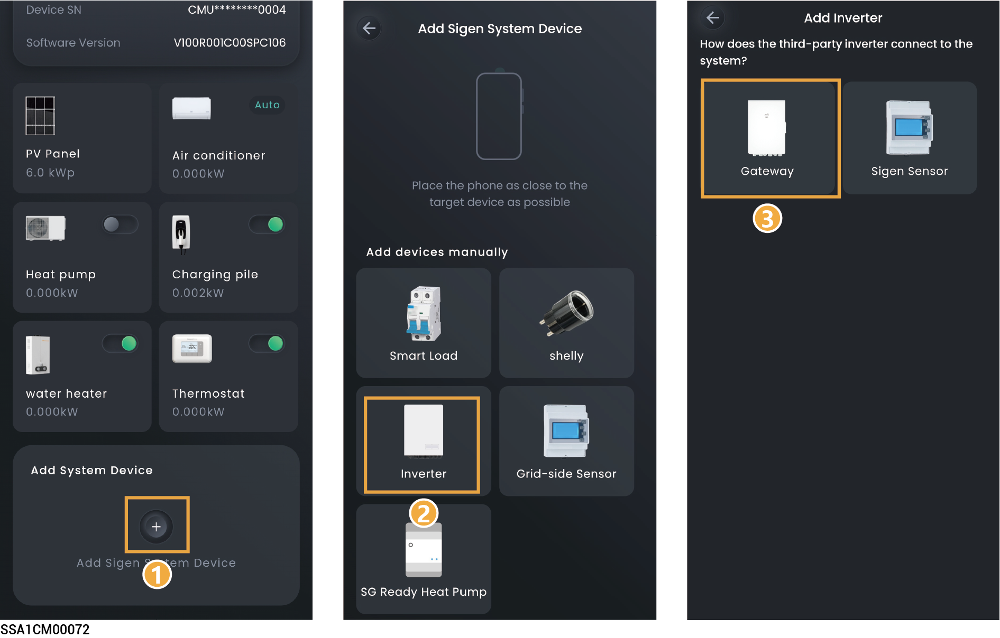
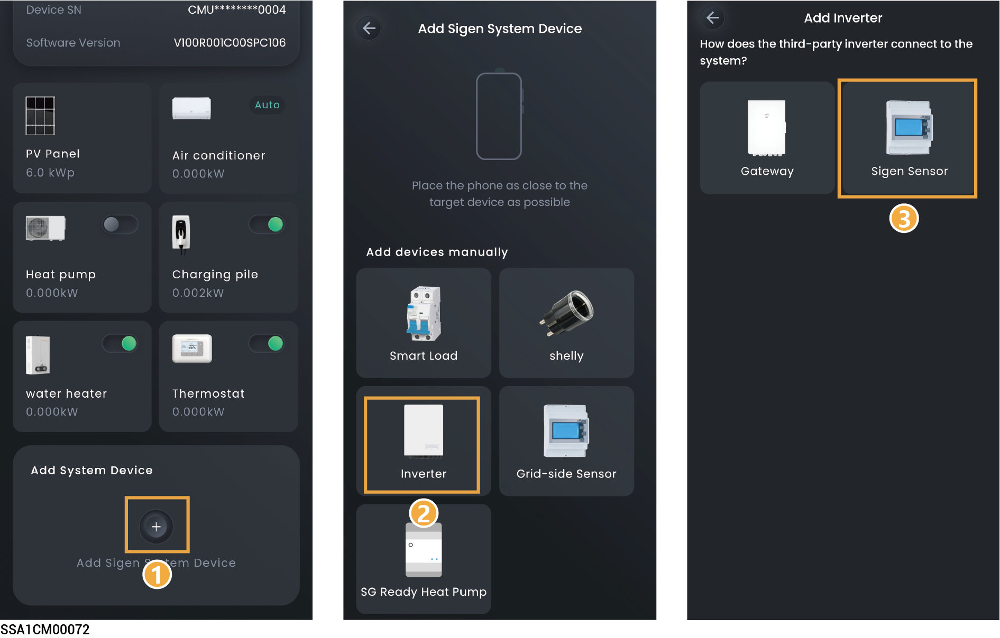
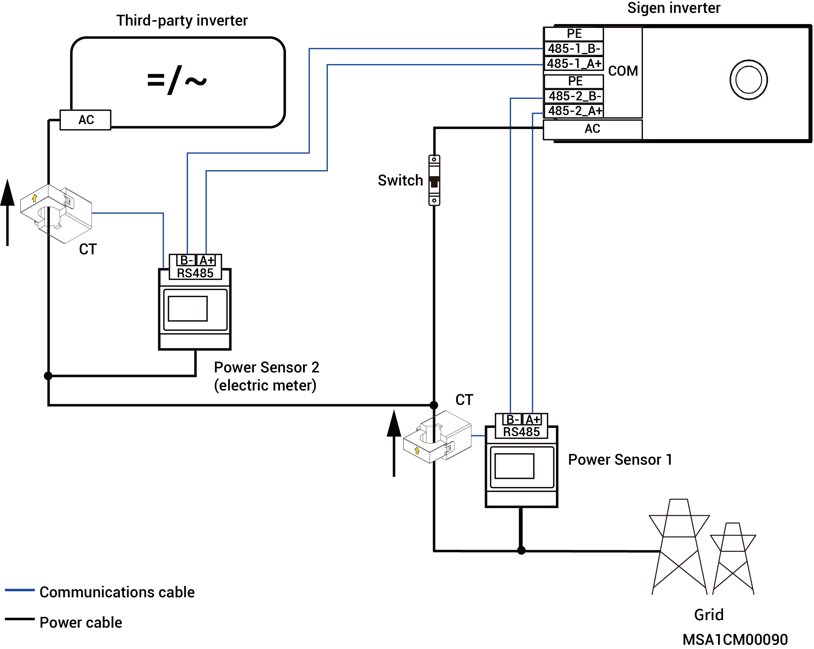

# Third-party inverter

### Method 1: **Connecting using Gateway**



* <mark style="color:blue;">Only third-party inverters that not support off-grid functionality are allowed to connect.</mark>
* <mark style="color:blue;">Before connecting to a third-party inverter, ensure that the third-party inverter is connected to the smart load circuit breaker of the Gateway. For connection details, refer to the Installation Guide of the respective product.</mark>
* <mark style="color:blue;">On the "Device" screen, set related parameters based on the third-party inverter. Then, you can check detailed settings on the "Device" screen.</mark>

<figure><figcaption></figcaption></figure>

### Method 2: **Connecting using an electric meter**



<mark style="color:blue;">Before connecting to a third-party inverter, make sure that:</mark>

* <mark style="color:blue;">The third-party inverter is properly connected to an electric meter which is purchased from our company.</mark>
* <mark style="color:blue;">The electric meter is properly connected to the COM port of our inverter. For connection ports, please refer to the respective Installation Guide.</mark>

<figure><figcaption></figcaption></figure>

**Diagram of third-party inverter wiring connections**

<figure><figcaption></figcaption></figure>



* <mark style="color:blue;">The diagram displays the connections among different cables of equipment. The specific ports shall be determined by actual equipment.</mark>
* <mark style="color:blue;">On the "Device" screen, set related parameters based on the third-party inverter and the connected meter. Then, you can check detailed settings on the "Device" screen.</mark>
* <mark style="color:blue;">In the off grid state, when the operating power of the third-party inverter is ≤ (load usage power + Sigen inverter charging power), the third-party inverter can operate normally.</mark>
* <mark style="color:blue;">In the off grid state, when the operating power of the third-party inverter is greater than (load usage power + Sigen inverter charging power), the third-party inverter will stop running.</mark>
