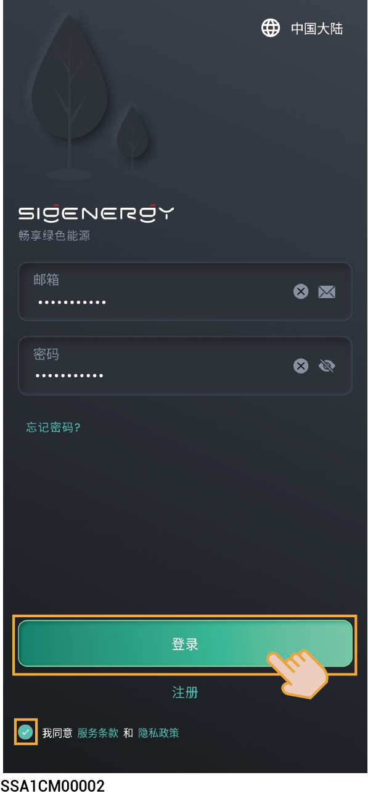

# 安装并登录App



<mark style="color:blue;">本文档以3.1.0版本为例，介绍相关操作。文档中的截图仅为示意，不同时期的界面可能会存在差异，请以实际界面为准。</mark>

## **App下载**



<mark style="color:blue;">手机操作系统要求：Android OS 6.0、iOS 12.0及其以上版本的手机。</mark>

**App可通过如下两种方式下载**：

<figure><figcaption></figcaption></figure>

## **App登录**

### **注册账号：**

1. 将您的邮箱账号提供给安装商进行账号注册。
2. 安装商账号注册完成后，将通知您进行账号激活。
3. 请您查收“sigencloud”账号的邮件，设置初始密码，激活账号。

### **登录账号：**

输入账号和密码，点击“Log in”登录。

<figure><figcaption></figcaption></figure>
