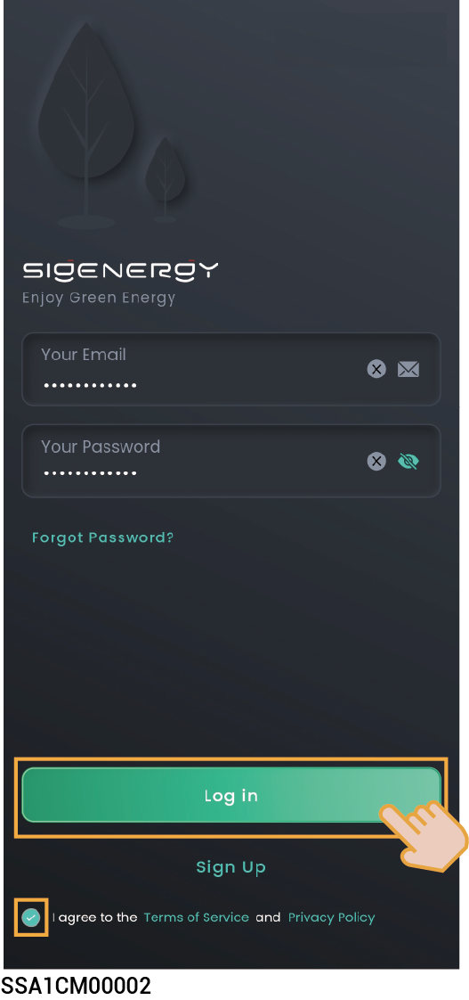

# Installing and Login



<mark style="color:blue;">**This document takes version 3.0.0 as an example to introduce relevant operations. The screenshots given in this document are for illustration purposes only. Interfaces in different periods may differ. The actual interface display shall prevail.**</mark>

## Downloading the App



<mark style="color:blue;">**Mobile operating systems: Android 6.0, iOS 12.0, and later versions.**</mark>

**You can download** **the App using the following two methods:**

<figure><figcaption></figcaption></figure>

## App login

### **Sign up:**

1. Provide your email account to the installer for signing up.
2. After signing up your account, the installer will ask you to activate your account.
3. Please check the email sent from the "sigencloud" account in your inbox, set your initial password, and activate your account.

### **Login:**

Enter your account and password and click "Log in".

