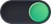

# Local Access

## Settings



<mark style="color:blue;">Scan the SN code label on the accompanying materials. If it is lost, scan the SN code on the side of the inverter.</mark>

<table><thead><tr><th width="85">No.</th><th width="197">Parameter name</th><th>Description</th></tr></thead><tbody><tr><td>1</td><td>Log Download</td><td>After connecting to the device locally, download its operation logs.</td></tr><tr><td>2</td><td>Software Update</td><td>Click to upgrade the locally connected device's software.</td></tr><tr><td>3</td><td>self-diagnosis</td><td>Tap "Diagnostics for Locally Connected Device".</td></tr><tr><td>4</td><td>Connectivity</td><td>Ethernet, WLAN, Cellular Network Configuration</td></tr><tr><td>5</td><td>Maintenance</td><td>Device Power On/Off</td></tr></tbody></table>

## Connectivity

<table><thead><tr><th width="85">No.</th><th width="197">Parameter name</th><th width="461">Description</th></tr></thead><tbody><tr><td>1</td><td>Ethernet</td><td>
Display FE connection status.
<ul><li>
Ethernet: After configuring this parameter, it takes effect for Ethernet, WLAN, and Cellular.
<ul><li>Primary DNS: Primary DNS server for domain name resolution (non-editable).</li><li>Secondary DNS: Secondary DNS server for domain name resolution (editable).</li></ul></li><li>
Obtain IP address automatically: When set to "", IP addresses are obtained automatically. When set to "", users need to configure a static IP address.
<ul><li>IP Address: FE IP address of the current SigenStor/SigenStack Unit.</li><li>Gateway: FE gateway of the current SigenStor/SigenStack Unit.</li><li>Subnet Mask: FE subnet mask of the currentSigenStor/SigenStack Unit.</li></ul></li><li>FE network connection parameters are set to DHCP by default. If you need to modify them, follow these steps:</li></ul><ol><li>Set "Obtain IP address automatically" to "", then modify the parameters.</li><li>Re-plug the network cable used for connectivity into the device.</li></ol></td></tr><tr><td>2</td><td>WLAN</td><td>
Display WLAN connection status.

If it shows "Not Connected" here, but you intend to use WLAN for network connectivity, please follow the instructions below:
<ul><li>Before configuring WLAN communication, ensure that the antenna is installed on the device.</li><li>Connecting to an unencrypted WLAN may result in network unavailability and is not recommended. When the device can only use WLAN for network connectivity, do not switch to other wireless router WLANs.</li><li>Tap "Go Set Up" to configure the WLAN network.</li></ul></td></tr><tr><td>3</td><td>Cellular</td><td>
Display 4G connection status. If it shows "Not Connected" here, but you intend to use 4G for network connectivity, please follow the instructions below:
<ul><li>Before configuring 4G communication, ensure that the Sigen CommMod is inserted.</li><li>When using 4G communication, you can view the current monthly data usage.</li></ul></td></tr></tbody></table>

## (Optional) Off-grid Self-powered Setting



* <mark style="color:blue;">This feature is only available in C\&I power stations.</mark>
* <mark style="color:blue;">After the off-grid self-powered feature is enabled, the device can operate off-grid to supply power to construction equipment.</mark>

<figure><figcaption></figcaption></figure>

<table><thead><tr><th width="70">No.</th><th width="186">Parameter name</th><th>Description</th></tr></thead><tbody><tr><td>1</td><td>Off-grid self-powered device</td><td>When it is set to , the off-grid self-powered feature is enabled.</td></tr><tr><td>2</td><td>Output Mode</td><td><ul><li>Single Phase: In this mode, the inverter draws power from phases L1 and L2 of the three-phase grid to supply power to single-phase loads.</li><li>Three-Phase Three-Wire: In this mode, the inverter draws power from phases L1, L2, and L3 of the three-phase grid to supply power to three-phase loads (Sigen PV (50–110)M1-HYB series is the load port).</li></ul></td></tr><tr><td>3</td><td>Serial number of the connected device</td><td>Enter the SN of the self-powered device.</td></tr></tbody></table>
