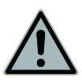
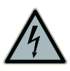
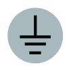

# Label Description

| Symbol                                                                 | Definitions                                                                                                                                                                                                                                           |
| ---------------------------------------------------------------------- | ----------------------------------------------------------------------------------------------------------------------------------------------------------------------------------------------------------------------------------------------------- |
|  | 
Warning! Life-threatening Potential risks exist when the equipment is running. Please take protective measures before operating the equipment.
                                                                                              |
|  | 
Danger! High Voltage High voltage exists inside the equipment when powered on. Do not open the casing when the equipment is running. Any maintenance or servicing operations must be performed by trained and skilled electrical engineers.
 |
|  | Operate the equipment by referring to the User Manual.                                                                                                                                                                                                |
|                                     | GND symbol                                                                                                                                                                                                                                            |
