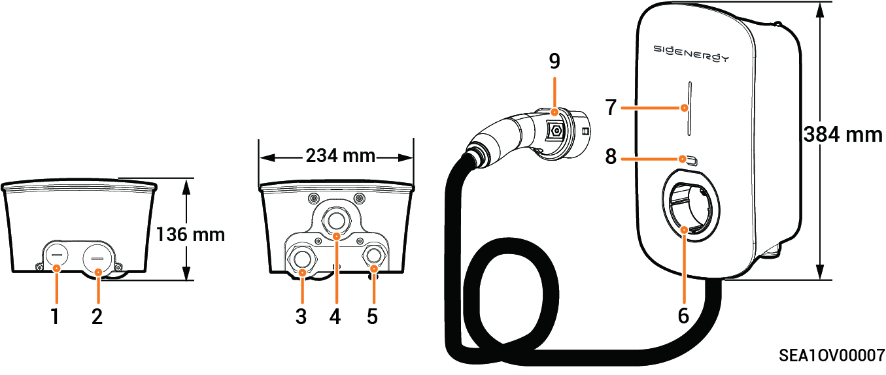
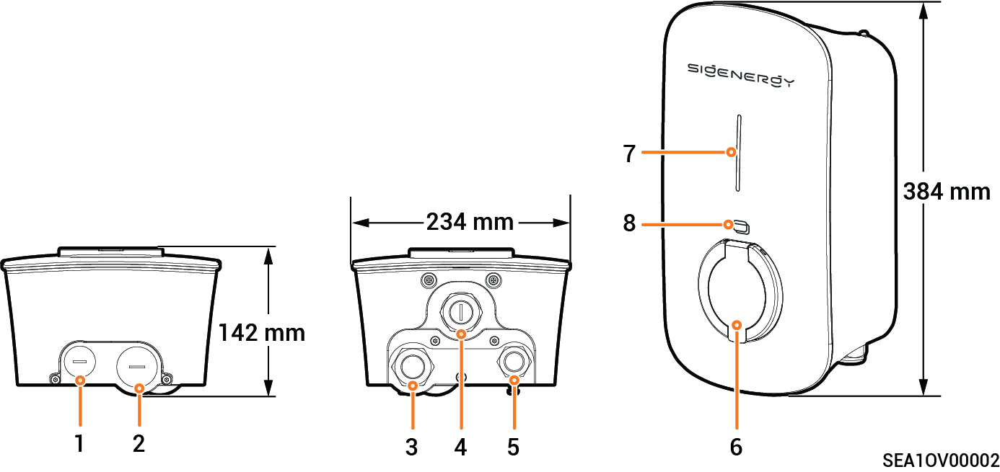

# Product Appearance

### **Sigen EVAC 7/11/22 4G T2 WH**

<figure><figcaption></figcaption></figure>

|  S/N  | Description                                 |
| :---: | ------------------------------------------- |
| **1** | Top routing hole for communication cable    |
| **2** | Top routing hole for AC input cable         |
| **3** | Bottom routing hole for AC input cable      |
| **4** | Bottom routing hole for charging cable      |
| **5** | Bottom routing hole for communication cable |
| **6** | Type 2 charging connector holder            |
| **7** | Indicator                                   |
| **8** | Sigen RFID Card reading area                |
| **9** | Charging connector                          |

### **Sigen EVAC 7/11/22 4G T2SH WH**

<figure><figcaption></figcaption></figure>

|  S/N  | Description                                 |
| :---: | ------------------------------------------- |
| **1** | Top routing hole for communication cable    |
| **2** | Top routing hole for AC input cable         |
| **3** | Bottom routing hole for AC input cable      |
| **4** | (Reserved) Bottom routing hole              |
| **5** | Bottom routing hole for communication cable |
| **6** | Type 2 charger socket with protective door  |
| **7** | Indicator                                   |
| **8** | Sigen RFID Card reading area                |



<mark style="color:blue;">**Cables are routed through the cable holes (No. 1 and No. 2) on the top. Please cover the top to avoid water ingress due prolonged water accumulation on the top.**</mark>
