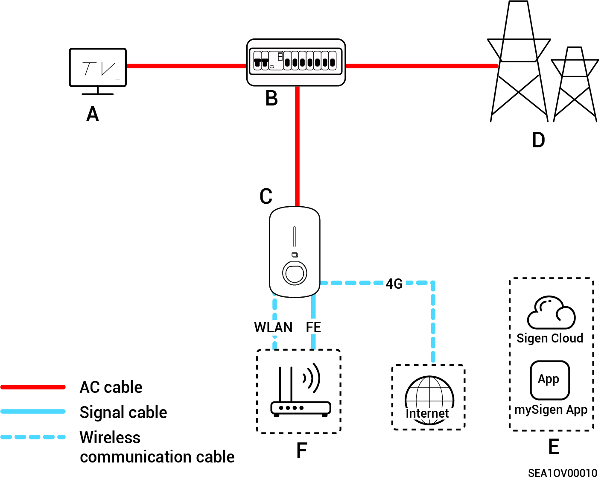
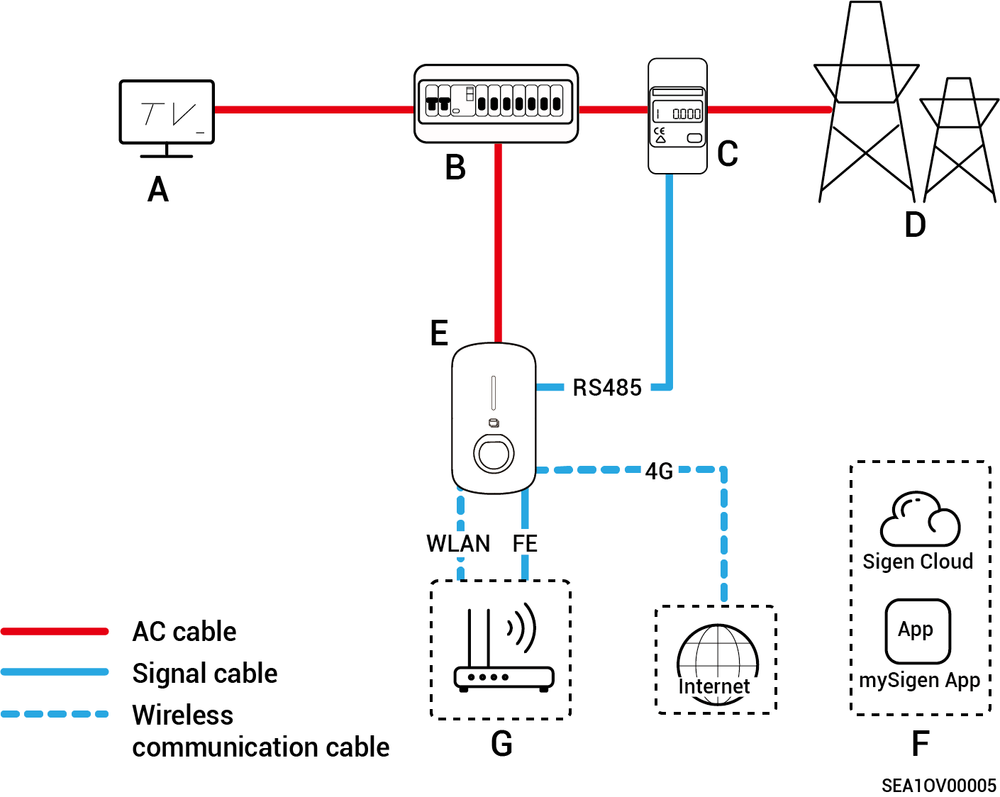
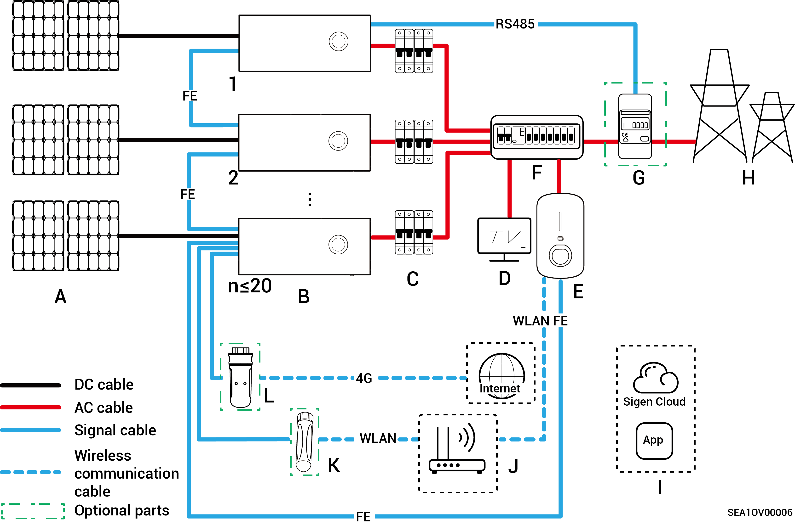
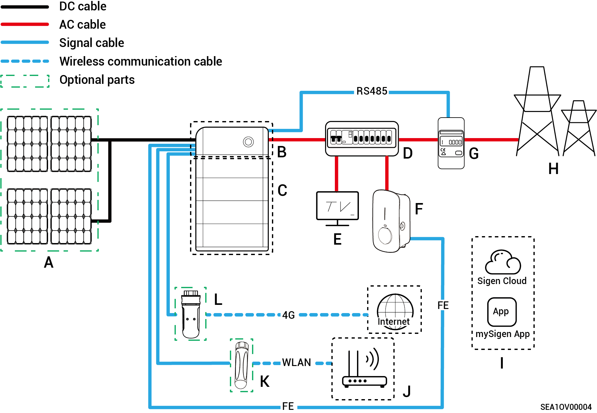
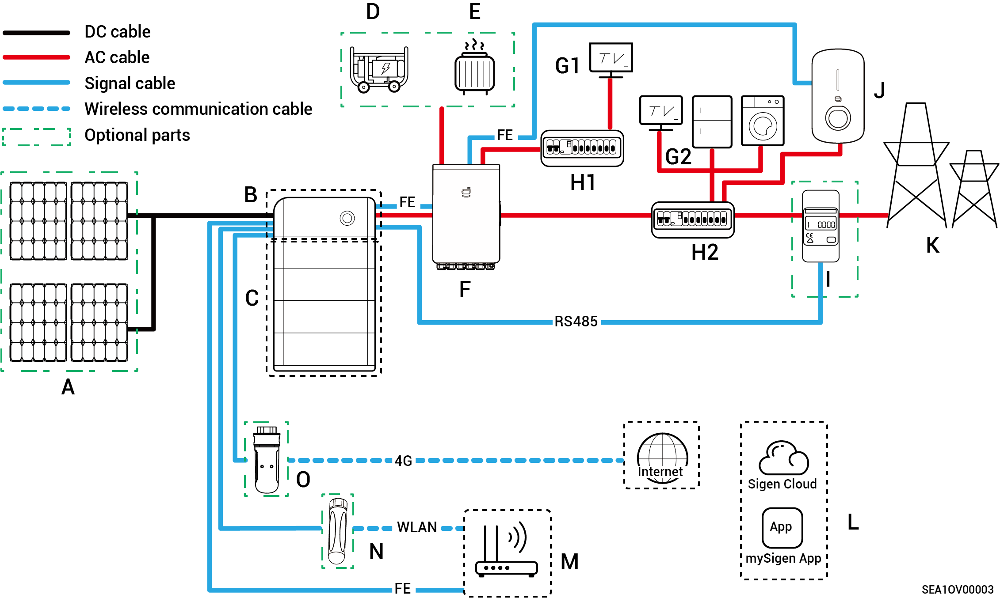

# Typical system wiring

### **Networking configuration of the charger**

<figure><figcaption></figcaption></figure>

| No.   | Description         | No.   | Description        |
| ----- | ------------------- | ----- | ------------------ |
| **A** | Power equipment     | **B** | Distribution panel |
| **C** | Sigen EV AC Charger | **D** | Power grid         |
| **E** | mySigen             | **F** | Router             |

### **Networking of the charger (with DLM)**

<figure><figcaption></figcaption></figure>

| No.   | Description         | No.   | Description        |
| ----- | ------------------- | ----- | ------------------ |
| **A** | Power equipment     | **B** | Distribution panel |
| **C** | Power Sensor        | **D** | Power grid         |
| **E** | Sigen EV AC Charger | **F** | mySigen            |
| **G** | Router              |       |                    |

### **PV charging networking**

<figure><figcaption></figcaption></figure>

| No.   | Description         | No.   | Description                               |
| ----- | ------------------- | ----- | ----------------------------------------- |
| **A** | PV panel            | **B** | Sigen PV Max/Sigen Hybrid series inverter |
| **C** | AC switch           | **D** | Power equipment                           |
| **E** | Sigen EV AC Charger | **F** | Dstribution panel                         |
| **G** | Power sensor        | **H** | Power grid                                |
| **I** | mySigen             | **J** | Router                                    |
| **K** | Antenna             | **L** | CommMod                                   |



* <mark style="color:blue;">l If F (distribution panel) features leakage protection, it is recommended that the rated residual operating current be greater than or equal to the number of inverters × 100 mA.</mark>
* <mark style="color:blue;">It is recommended to use Fast Ethernet and WLAN for communication with inverters. When free 4G traffic of CommMod runs out, users must replace an SIM card.</mark>

### **PV storage and charging networking (non-backup power scenario)**

<figure><figcaption></figcaption></figure>

| No.   | Description         | No.   | Description                    |
| ----- | ------------------- | ----- | ------------------------------ |
| **A** | PV panel            | **B** | SigenStor EC/ Sigen Hybrid\[1] |
| **C** | SigenStor BAT       | **D** | AC switch                      |
| **E** | Distribution panel  | **F** | Household load                 |
| **G** | Sigen EV AC Charger | **H** | Power Sensor                   |
| **I** | Power grid          | **J** | mySigen                        |
| **K** | Router\[2]          | **L** | Antenna\[3]                    |
| **M** | CommMod\[4]         |       |                                |



<mark style="color:blue;">Note \[1]: If Sigen Hybrid series inverters are configured with SigenStor BAT, users must purchase and activate the license to change the PV charging networking to the PV storage and charging networking.</mark>

<mark style="color:blue;">Note \[2]: Configure when Fast Ethernet or WLAN is used for communication with inverters.</mark>

<mark style="color:blue;">Note \[3]: Configure when WLAN is used for communication with inverters.</mark>

<mark style="color:blue;">Note \[4]: Configure when 4G is used for communication with inverters.</mark>

* <mark style="color:blue;">l If E (distribution panel) features leakage protection, it is recommended that the rated residual operating current be greater than or equal to the number of inverters × 100 mA.</mark>
* <mark style="color:blue;">It is recommended to use Fast Ethernet and WLAN for communication with inverters. When free 4G traffic of CommMod runs out, users must replace an SIM card.</mark>

### **PV storage and charging networking (backup power scenario)**

<figure><figcaption></figcaption></figure>

| No.    | Description           | No.    | Description                         |
| ------ | --------------------- | ------ | ----------------------------------- |
| **A**  | Solar panel           | **B**  | SigenStor EC/ Sigen Hybrid          |
| **C**  | SigenStor BAT         | **D**  | Diesel generator                    |
| **E**  | Smart load            | **F**  | Gateway                             |
| **G1** | Backup household load | **H1** | Backup power distribution panel     |
| **G2** | Non-backup home loads | **H2** | Non-backup power distribution panel |
| **I**  | Power Sensor\[1]      | **J**  | Sigen EV AC Charger                 |
| **K**  | Power grid            | **L**  | mySigen                             |
| **M**  | Router\[2]            | **N**  | Antenna\[3]                         |
| **O**  | CommMod\[4]           |        |                                     |



<mark style="color:blue;">Note \[1]: Configure for partial backup power + zero-power grid-connected control networking.</mark>

<mark style="color:blue;">Note \[2]: Configure when Fast Ethernet or WLAN is used for communication with inverters.</mark>

<mark style="color:blue;">Note \[3]: Configure when WLAN is used for communication with inverters.</mark>

<mark style="color:blue;">Note \[4]: Configure when 4G is used for communication with inverters.</mark>

* <mark style="color:blue;">If H2 (non-backup distribution panel) features leakage protection, it is recommended that the rated residual operating current be greater than or equal to the number of inverters × 100 mA.</mark>
* <mark style="color:blue;">If G1 (backup household load) experiences leakage, it may pose a risk of electric shock. In order to avoid this hazard, a residual current device (RCD) must be installed between the F (Gateway) and the G1 (backup household load).</mark>
* <mark style="color:blue;">It is recommended to use Fast Ethernet and WLAN for communication with inverters. When free 4G traffic of CommMod runs out, users must replace an SIM card.</mark>

