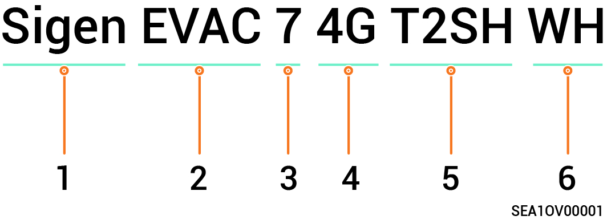

# Model Designation

Model specifications of Sigen EV AC Charger include the followings:

* Sigen EVAC 7 4G T2 WH
* Sigen EVAC 11 4G T2 WH
* Sigen EVAC 22 4G T2 WH
* Sigen EVAC 7 4G T2SH WH
* Sigen EVAC 11 4G T2SH WH
* Sigen EVAC 22 4G T2SH WH

Fig Model designation (example)

<figure><figcaption></figcaption></figure>

| S/N   | Definitions                          | Description                                                                                                                                                                                                                                                                                                                                                                                                                                                                                                                                                                                                                                                                                   |
| ----- | ------------------------------------ | --------------------------------------------------------------------------------------------------------------------------------------------------------------------------------------------------------------------------------------------------------------------------------------------------------------------------------------------------------------------------------------------------------------------------------------------------------------------------------------------------------------------------------------------------------------------------------------------------------------------------------------------------------------------------------------------- |
| **1** | Brand name                           | -                                                                                                                                                                                                                                                                                                                                                                                                                                                                                                                                                                                                                                                                                             |
| **2** | Charger type                         | **EVAC: EV AC charger**                                                                                                                                                                                                                                                                                                                                                                                                                                                                                                                                                                                                                                                                       |
| **3** | Power range (phase voltage is 230 V) | <ul><li>7：7.36kW </li><li>11：11kW </li><li>22: 22kW</li></ul>                                                                                                                                                                                                                                                                                                                                                                                                                                                                                                                                                                                                                           |
| **4** | Features                             | <ul><li>
Supported communication modes: 
<ul><li>Ethernet communication </li><li>4G communication </li><li>WLAN communication </li></ul></li><li>
Supported charging modes: 
<ul><li>Fast Charging </li><li>PV Surplus Charging  </li></ul></li><li>
Supported charging methods: 
<ul><li>RFID card authenticated charging </li><li>App authenticated charging </li><li>Unauthenticated charging mode </li><li>Scheduled charging</li></ul></li><li>You can manually adjust the charging current or connect the Power Sensor. Dynamic load management (DLM) will automatically initiate to optimize the charging process.</li></ul>

 |
| **5** | Output port                          | <ul><li>T2: Type 2 charging connector complying with IEC 62196-2 </li><li>T2SH: Type 2 charger socket with protective door complying with IEC 62196-2</li></ul>                                                                                                                                                                                                                                                                                                                                                                                                                                                                                                                            |
| **6** | Color                                | WH：White                                                                                                                                                                                                                                                                                                                                                                                                                                                                                                                                                                                                                                                                                      |

