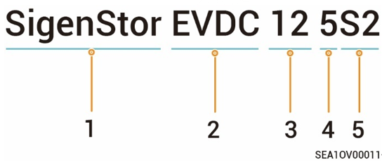

# 型号说明

### **SigenStor EVDC包含型号为：**

* SigenStor EVDC 12 5S2
* SigenStor EVDC 12 7.5S2
* SigenStor EVDC 12 10S2
* SigenStor EVDC 25 5S2
* SigenStor EVDC 25 7.5S2
* SigenStor EVDC 25 10S2
* SigenStor EVDC 12 7.5GBT
* SigenStor EVDC 12 10GBT
* SigenStor EVDC 25 7.5GBT
* SigenStor EVDC 25 10GBT

### **图 型号说明（举例）**

<figure><figcaption></figcaption></figure>

| S/N | 定义     | 说明                                                                          |
| --- | ------ | --------------------------------------------------------------------------- |
| 1   | 产品系列   | 思格光储充一体机产品                                                                  |
| 2   | 充电桩类型  | EVDC：直流充电桩                                                                  |
| 3   | 额定输出功率 | <ul><li>12:12.5kW</li><li>25:25kW </li></ul>                             |
| 4   | 充电枪线长度 | <ul><li>5:5m</li><li>7.5:7.5m</li><li>10:10m</li></ul>                      |
| 5   | 接口类型   | <ul><li>s2: CCS2，即CCS Combo2欧标直流充电接口</li><li>GBT: GBT2015国标直流充电接口</li></ul> |



<mark style="color:blue;">SigenStor EVDC 12系列机型支持将额定输出功率升级为25kW，具体操作请参见</mark>[<mark style="color:blue;">FAQs</mark>](../faqs.md)。
