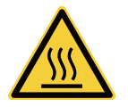
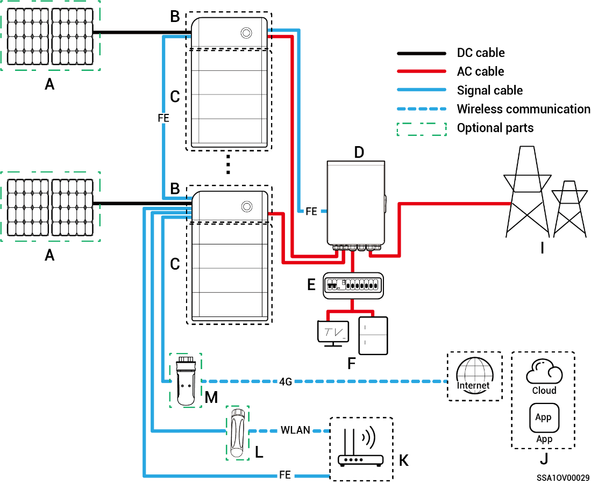

# Beschreibung des Etiketts

<table><thead><tr><th width="134">Symbol</th><th>Bedeutung</th></tr></thead><tbody><tr><td></td><td>Warnung! Gefahr! Elektrische Entladung An der Abdeckung des Ger&auml;ts liegt Wechselspannung an. Bitte ergreifen Sie vor dem Ger&auml;tebetrieb dementsprechende Schutzma&szlig;nahmen.</td></tr><tr><td></td><td>Nach dem Ausschalten des Ger&auml;ts k&ouml;nnen die internen Bauteile mit Verz&ouml;gerung noch Strom entladen. Warten Sie entsprechend der Verz&ouml;gerungszeit auf der Beschriftung, bis das Ger&auml;t den Strom komplett entladen hat.</td></tr><tr><td></td><td>Warnung! Gefahr! Hei&szlig; W&auml;hrend des Betriebs ist die Ger&auml;teoberfl&auml;che hei&szlig;. Ber&uuml;hren Sie sie nicht, um keine Verbrennungen zu erleiden.</td></tr><tr><td></td><td>Beziehen Sie sich beim Betrieb auf die Bedienungsanleitung.</td></tr><tr><td></td><td>Erdungssymbol</td></tr></tbody></table>
