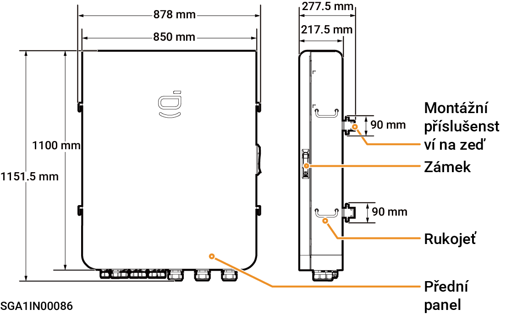

# Sigen Gateway (C120-6, TPLV C70-6)

### **Rozměry**

<figure><figcaption></figcaption></figure>

### **Pohled zespodu**

<table><thead><tr><th width="51" align="center">Č.</th><th width="125">Označen&iacute;</th><th>N&aacute;zev</th></tr></thead><tbody><tr><td align="center">1</td><td>INV1~INV6</td><td>Otvor pro veden&iacute; kabelů měniče</td></tr><tr><td align="center">2</td><td>COM2</td><td>(Vyhrazen&yacute;) otvor pro veden&iacute; komunikačn&iacute;ho kabelu</td></tr><tr><td align="center">3</td><td>BACKUP</td><td>Otvor pro veden&iacute; kabelů z&aacute;lohovan&yacute;ch spotřebičů</td></tr><tr><td align="center">4</td><td>GENERATOR</td><td>Otvor pro veden&iacute; kabelů naftov&eacute;ho gener&aacute;toru</td></tr><tr><td align="center">5</td><td>GRID</td><td>Otvor pro veden&iacute; kabelů energetick&eacute; s&iacute;tě</td></tr><tr><td align="center">6</td><td>COM1</td><td>Otvor pro veden&iacute; kabelů komunikace FE, DI a&nbsp;DO</td></tr></tbody></table>

### Vnitřní pohled

<table><thead><tr><th width="60" align="center">Č.</th><th width="102">&Scaron;t&iacute;tek</th><th>N&aacute;zev</th></tr></thead><tbody><tr><td align="center">1</td><td>&ndash;</td><td>Rozhran&iacute; FE, DI a&nbsp;DO</td></tr><tr><td align="center">2</td><td>&ndash;</td><td>Proudov&yacute; transform&aacute;tor s&iacute;tě</td></tr><tr><td align="center">3</td><td>KM1</td><td>Stykač s&iacute;tě KM1</td></tr><tr><td align="center">4</td><td>QS1</td><td>Přemosťovac&iacute; sp&iacute;nač QS1</td></tr><tr><td align="center">5</td><td>KM2</td><td>Stykač naftov&eacute;ho gener&aacute;toru KM2</td></tr><tr><td align="center">6</td><td>&ndash;</td><td>Proudov&yacute; transform&aacute;tor naftov&eacute;ho gener&aacute;toru</td></tr><tr><td align="center">7</td><td>QF1</td><td>Jistič v&nbsp;lisovan&eacute; skř&iacute;ňce QF1 (připojen&yacute; k&nbsp;elektrick&eacute; s&iacute;ti)</td></tr><tr><td align="center">8</td><td>QF3</td><td>Jistič v&nbsp;lisovan&eacute; skř&iacute;ňce QF3 (připojen&yacute; k&nbsp;z&aacute;lohovan&eacute;mu spotřebiči)</td></tr><tr><td align="center">9</td><td>QF2</td><td>Jistič v&nbsp;lisovan&eacute; skř&iacute;ňce QF2 (připojen&yacute; k&nbsp;naftov&eacute;mu gener&aacute;toru)</td></tr><tr><td align="center">10</td><td>&ndash;</td><td>Měděn&aacute; př&iacute;pojnice uzemněn&iacute;</td></tr><tr><td align="center">11</td><td>QF11</td><td>(Rezervov&aacute;no) jistič v&nbsp;lisovan&eacute; skř&iacute;ňce QF11</td></tr><tr><td align="center">12</td><td>QF5~QF10</td><td>Jističe v&nbsp;lisovan&eacute; skř&iacute;ňce QF5 až QF10 (připojen&eacute; k&nbsp;měničům)</td></tr><tr><td align="center">13</td><td>QF4</td><td>Přep&iacute;nač přepěťov&eacute;ho ochrann&eacute;ho zař&iacute;zen&iacute; QF4</td></tr><tr><td align="center">14</td><td>FC1</td><td>Přepěťov&eacute; ochrann&eacute; zař&iacute;zen&iacute; FC1</td></tr></tbody></table>
