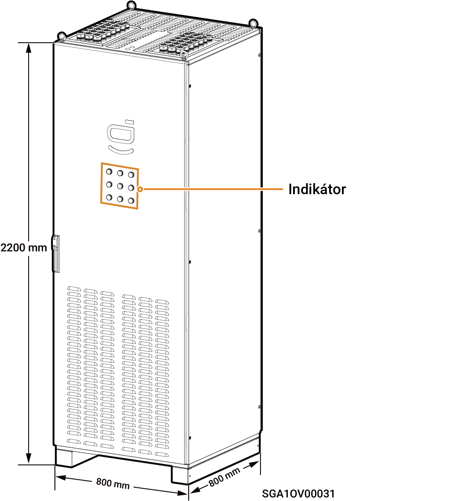
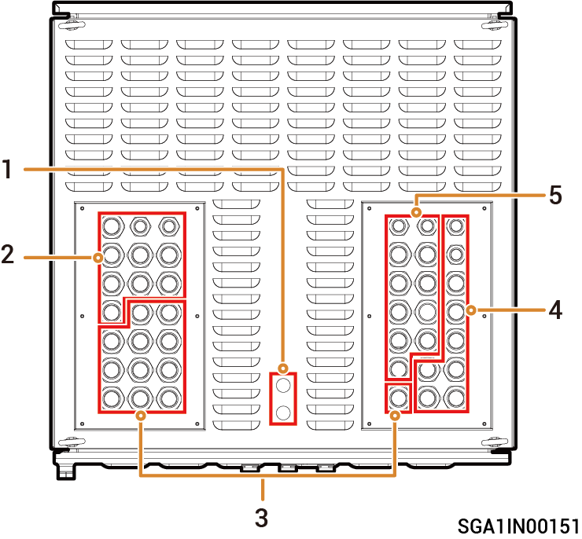
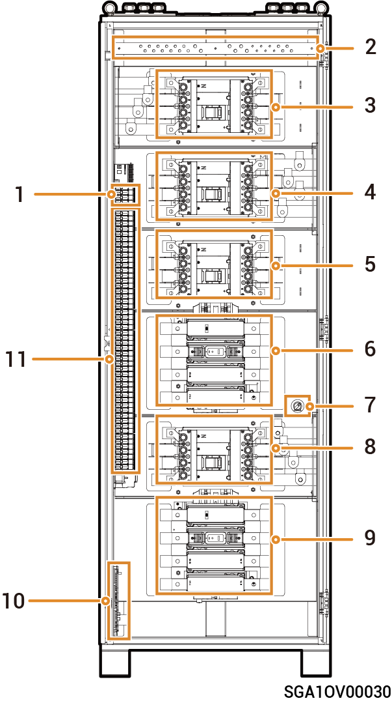

# Sigen Gateway (C180-9, C300-12)

### **Rozměry**

<figure><figcaption></figcaption></figure>

### **Pohled zespodu**

<table><thead><tr><th width="64" align="center">Č.</th><th>N&aacute;zev</th></tr></thead><tbody><tr><td align="center">1</td><td>Otvor pro veden&iacute; sign&aacute;lov&eacute;ho kabelu</td></tr><tr><td align="center">2</td><td>Otvor pro veden&iacute; kabelů stř&iacute;dav&eacute;ho proudu spotřebiče</td></tr><tr><td align="center">3</td><td>Otvor pro veden&iacute; kabelů stř&iacute;dav&eacute;ho proudu měniče</td></tr><tr><td align="center">4</td><td>Otvor pro veden&iacute; kabelů stř&iacute;dav&eacute;ho proudu naftov&eacute;ho gener&aacute;toru</td></tr><tr><td align="center">5</td><td>Otvor pro veden&iacute; kabelů stř&iacute;dav&eacute;ho proudu energetick&eacute; s&iacute;tě</td></tr></tbody></table>

### Vnitřní pohled

<table><thead><tr><th width="61" align="center" valign="middle">Č.</th><th width="76" valign="top">&Scaron;t&iacute;tek</th><th valign="top">N&aacute;zev</th></tr></thead><tbody><tr><td align="center" valign="middle">1</td><td valign="top">QF4</td><td valign="top">Sp&iacute;nač přepěťov&eacute; ochrany</td></tr><tr><td align="center" valign="middle">2</td><td valign="top">&ndash;</td><td valign="top">Př&iacute;pojnice uzemněn&iacute; (připojuje se k&nbsp;PE kabelu)</td></tr><tr><td align="center" valign="middle">3</td><td valign="top">QF3</td><td valign="top">Sp&iacute;nač spotřebiče (připojuje se ke spotřebiči)</td></tr><tr><td align="center" valign="middle">4</td><td valign="top">QF1</td><td valign="top">Sp&iacute;nač s&iacute;tě (připojuje se k&nbsp;energetick&eacute; s&iacute;ti)</td></tr><tr><td align="center" valign="middle">5</td><td valign="top">QS1</td><td valign="top">Přemosťovac&iacute; sp&iacute;nač</td></tr><tr><td align="center" valign="middle">6</td><td valign="top">KM1</td><td valign="top">S&iacute;ťov&yacute; stykač</td></tr><tr><td align="center" valign="middle">7</td><td valign="top">&ndash;</td><td valign="top">Sp&iacute;nač indik&aacute;toru (ovl&aacute;d&aacute; nap&aacute;jen&iacute; indik&aacute;toru)</td></tr><tr><td align="center" valign="middle">8</td><td valign="top">QF2</td><td valign="top">Sp&iacute;nač naftov&eacute;ho gener&aacute;toru (připojuje se k&nbsp;naftov&eacute;mu gener&aacute;toru)</td></tr><tr><td align="center" valign="middle">9</td><td valign="top">KM2</td><td valign="top">Stykač naftov&eacute;ho gener&aacute;toru</td></tr><tr><td align="center" valign="middle">10</td><td valign="top">&ndash;</td><td valign="top">Sign&aacute;ln&iacute; port</td></tr><tr><td align="center" valign="middle">11</td><td valign="top">QF5 až QF16</td><td valign="top">Miniaturn&iacute; jističe (připojuj&iacute; se k&nbsp;měničům)</td></tr></tbody></table>
