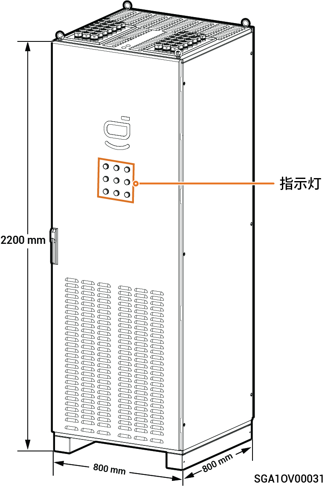

# Sigen Gateway (C180-9, C300-12)

### **尺寸图**

### **底视图**

<table><thead><tr><th width="63" align="center">序号</th><th width="219">名称</th><th>丝印</th></tr></thead><tbody><tr><td align="center">1</td><td>信号线走线孔</td><td>INV1~INV6</td></tr><tr><td align="center">2</td><td>负载交流线走线孔</td><td>COM2</td></tr><tr><td align="center">3</td><td>逆变器交流线走线孔</td><td>BACKUP</td></tr><tr><td align="center">4</td><td>发电机交流线走线孔</td><td>GENERATOR</td></tr><tr><td align="center">5</td><td>电网交流线走线孔</td><td>GRID</td></tr></tbody></table>

### **内部图**

<table><thead><tr><th width="63" align="center" valign="top">序号</th><th width="105" valign="top">标签</th><th valign="top">名称</th></tr></thead><tbody><tr><td align="center" valign="top">1</td><td valign="top">QF4</td><td valign="top">防雷器开关</td></tr><tr><td align="center" valign="top">2</td><td valign="top">-</td><td valign="top">接地排（连接PE线）</td></tr><tr><td align="center" valign="top">3</td><td valign="top">QF3</td><td valign="top">负载开关（连接负载）</td></tr><tr><td align="center" valign="top">4</td><td valign="top">QF1</td><td valign="top">网侧开关（连接电网）</td></tr><tr><td align="center" valign="top">5</td><td valign="top">QS1</td><td valign="top">旁路开关</td></tr><tr><td align="center" valign="top">6</td><td valign="top">KM1</td><td valign="top">网侧接触器</td></tr><tr><td align="center" valign="top">7</td><td valign="top">-</td><td valign="top">指示灯开关（控制指示灯供电）</td></tr><tr><td align="center" valign="top">8</td><td valign="top">QF2</td><td valign="top">发电机开关（连接发电机）</td></tr><tr><td align="center" valign="top">9</td><td valign="top">KM2</td><td valign="top">发电机接触器</td></tr><tr><td align="center" valign="top">10</td><td valign="top">-</td><td valign="top">信号端口</td></tr><tr><td align="center" valign="top">11</td><td valign="top">QF5~QF16</td><td valign="top">微型断路器（连接逆变器）</td></tr></tbody></table>
