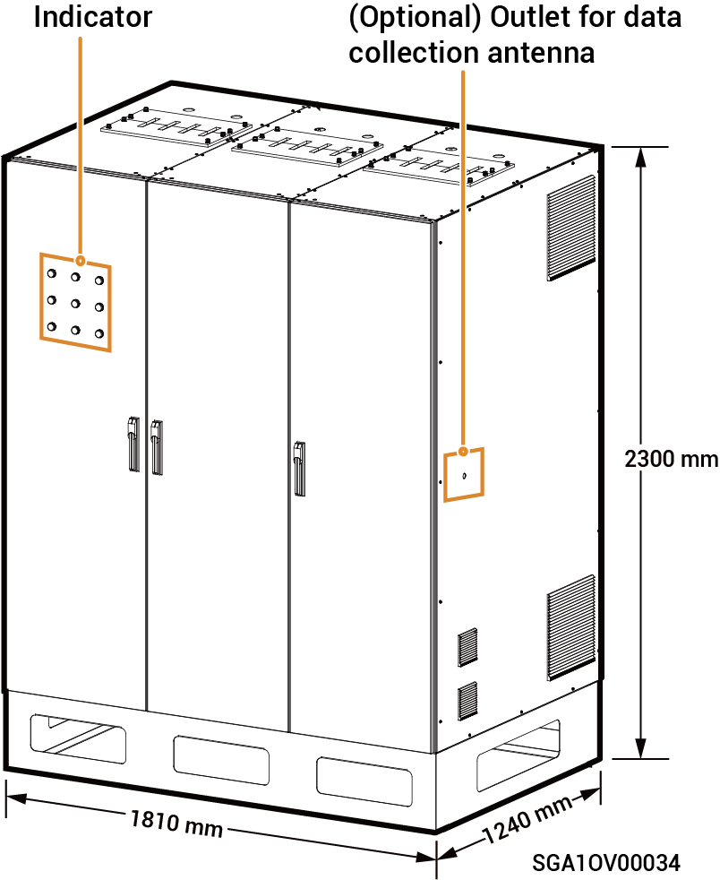

# Sigen Gateway (C600, C1200, C600-B, C1200-B)

### **Dimensions**

<figure><figcaption></figcaption></figure>

### Port Description

#### **Top view**

<figure><figcaption></figcaption></figure>

#### **C600/C1200 Bottom View**

<figure><figcaption></figcaption></figure>

#### C600-B/1200-B Bottom View

<figure><figcaption></figcaption></figure>

<table><thead><tr><th width="60" align="center">No.</th><th>Name</th></tr></thead><tbody><tr><td align="center">1</td><td>Routing hole for PE cable</td></tr><tr><td align="center">2</td><td>Copper busbar entry (grid AC cable)</td></tr><tr><td align="center">3</td><td>Copper busbar entry (smart loads/generator AC cable)</td></tr><tr><td align="center">4</td><td>Copper busbar entry (load AC cable)</td></tr><tr><td align="center">5</td><td>Routing hole for AC cable of the inverter</td></tr><tr><td align="center">6</td><td>Routing hole for signal cable</td></tr></tbody></table>

<figure><figcaption></figcaption></figure>

<mark style="color:blue;">**C600/C1200 only has one difference in the number of miniature circuit breakers in the structure, this manual takes C1200 as an example.**</mark>

### **C1200** Interior View

<table><thead><tr><th width="60" align="center" valign="middle">No.</th><th width="107" valign="middle">Label</th><th valign="middle">Name</th></tr></thead><tbody><tr><td align="center" valign="middle">1</td><td valign="middle">1QF1</td><td valign="middle">PCB board secondary control switch (connected to the power grid, and power supply switch for indicators)</td></tr><tr><td align="center" valign="middle">2</td><td valign="middle">1QF3</td><td valign="middle">PCB board secondary control switch (connected to smart loads[1]/generator, and power supply switch for indicators)</td></tr><tr><td align="center" valign="middle">3</td><td valign="middle">1QF5</td><td valign="middle">PCB board secondary control switch (connected to a load, and power supply switch for indicators)</td></tr><tr><td align="center" valign="middle">4</td><td valign="middle">1QF7</td><td valign="middle">Secondary control switch of frame circuit breaker (connected to the power grid)</td></tr><tr><td align="center" valign="middle">5</td><td valign="middle">1QF8</td><td valign="middle">Secondary control switch of frame circuit breaker (connected to smart loads/generator)</td></tr><tr><td align="center" valign="middle">6</td><td valign="middle">1QF9</td><td valign="middle">Secondary control switch of frame circuit breaker (connected to a load)</td></tr><tr><td align="center" valign="middle">7</td><td valign="middle">1QF10</td><td valign="middle">Secondary control switch (connected to a fan and a UPS)</td></tr><tr><td align="center" valign="middle">8</td><td valign="middle">QA1</td><td valign="middle">Frame circuit breaker[1] (connected to the power grid)</td></tr><tr><td align="center" valign="middle">9</td><td valign="middle">QA2</td><td valign="middle">Frame circuit breaker (connected to smart loads[2]/generator)</td></tr><tr><td align="center" valign="middle">10</td><td valign="middle">QA3</td><td valign="middle">Frame circuit breaker (connected to a load)</td></tr><tr><td align="center" valign="middle">11</td><td valign="middle">SC</td><td valign="middle">Mounting location of data collector</td></tr><tr><td align="center" valign="middle">12</td><td valign="middle">SA2</td><td valign="middle">Bypass transfer switch (connected to smart loads/generator)</td></tr><tr><td align="center" valign="middle">13</td><td valign="middle">
2QF1~2QF30

（C600）
</td><td valign="middle">Miniature circuit breaker (a gateway C600 contains 30 miniature circuit breakers, connected to an inverter)</td></tr><tr><td align="center" valign="middle">13</td><td valign="middle">2QF1~2QF50（C1200）</td><td valign="middle">Miniature circuit breaker (a gateway C1200 contains 50 miniature circuit breakers, connected to an inverter)</td></tr><tr><td align="center" valign="middle">14</td><td valign="middle">PE</td><td valign="middle">Grounding busbar (connects to the PE cable)</td></tr><tr><td align="center" valign="middle">15</td><td valign="middle">SA1</td><td valign="middle">Bypass transfer switch (connected to the power grid)</td></tr><tr><td align="center" valign="middle">16</td><td valign="middle">1QF2</td><td valign="middle">Surge arrester switch (connected to the power grid)</td></tr><tr><td align="center" valign="middle">17</td><td valign="middle">1QF4</td><td valign="middle">Surge arrester switch (connected to smart loads/generator)</td></tr><tr><td align="center" valign="middle">18</td><td valign="middle">1QF6</td><td valign="middle">Surge arrester switch (connected to a load)</td></tr><tr><td align="center" valign="middle">19</td><td valign="middle">-</td><td valign="middle">Single-pole control box</td></tr></tbody></table>

<figure><figcaption></figcaption></figure>

<mark style="color:blue;">**C600-B/C1200-B only has one difference in the number of miniature circuit breakers in the structure, this manual takes C1200-B as an example.**</mark>

<figure><figcaption></figcaption></figure>

<table><thead><tr><th width="60" align="center" valign="middle">No.</th><th width="124" valign="middle">Label</th><th valign="top">Name</th></tr></thead><tbody><tr><td align="center" valign="middle">1.</td><td valign="middle">1QF1</td><td valign="top">PCB board secondary control switch (connected to the power grid, and power supply switch for indicators)</td></tr><tr><td align="center" valign="middle">2.</td><td valign="middle">1QF3</td><td valign="top">PCB board secondary control switch (connected to smart loads[1]/generator, and power supply switch for indicators)</td></tr><tr><td align="center" valign="middle">3.</td><td valign="middle">1QF5</td><td valign="top">PCB board secondary control switch (connected to a load, and power supply switch for indicators)</td></tr><tr><td align="center" valign="middle">4.</td><td valign="middle">1QF7</td><td valign="top">Secondary control switch of frame circuit breaker (connected to the power grid)</td></tr><tr><td align="center" valign="middle">5.</td><td valign="middle">1QF8</td><td valign="top">Secondary control switch of frame circuit breaker (connected to smart loads/generator)</td></tr><tr><td align="center" valign="middle">6.</td><td valign="middle">1QF9</td><td valign="top">Secondary control switch of frame circuit breaker (connected to a load)</td></tr><tr><td align="center" valign="middle">7.</td><td valign="middle">1QF10</td><td valign="top">Secondary control switch (connected to a fan and a UPS)</td></tr><tr><td align="center" valign="middle">8.</td><td valign="middle">QA1</td><td valign="top">Frame circuit breaker[1] (connected to the power grid)</td></tr><tr><td align="center" valign="middle">9.</td><td valign="middle">QA2</td><td valign="top">Frame circuit breaker (connected to smart loads[2]/generator)</td></tr><tr><td align="center" valign="middle">10.</td><td valign="middle">QA3</td><td valign="top">Frame circuit breaker (connected to a load)</td></tr><tr><td align="center" valign="middle">11.</td><td valign="middle">SC</td><td valign="top">Mounting location of data collector</td></tr><tr><td align="center" valign="middle">12.</td><td valign="middle">SA2</td><td valign="top">Bypass transfer switch (connected to smart loads/generator)</td></tr><tr><td align="center" valign="middle">13.</td><td valign="middle">
2QF1~2QF10

（C600-B）
</td><td valign="top">Molded case circuit breaker(a gateway C600-B contains 10 molded case circuit breakers, connected to an inverter)</td></tr><tr><td align="center" valign="middle">13.</td><td valign="middle">2QF1~2QF20（C1200-B）</td><td valign="top">Molded case circuit breaker(a gateway C1200-B contains 20 molded case circuit breakers, connected to an inverter)</td></tr><tr><td align="center" valign="middle">14.</td><td valign="middle">PE</td><td valign="top">Grounding busbar (connects to the PE cable)</td></tr><tr><td align="center" valign="middle">15.</td><td valign="middle">SA1</td><td valign="top">Bypass transfer switch (connected to the power grid)</td></tr><tr><td align="center" valign="middle">16.</td><td valign="middle">1QF2</td><td valign="top">Surge arrester switch (connected to the power grid)</td></tr><tr><td align="center" valign="middle">17.</td><td valign="middle">1QF4</td><td valign="top">Surge arrester switch (connected to smart loads/generator)</td></tr><tr><td align="center" valign="middle">18.</td><td valign="middle">1QF6</td><td valign="top">Surge arrester switch (connected to a load)</td></tr><tr><td align="center" valign="middle">19.</td><td valign="middle">-</td><td valign="top">Single-pole control box</td></tr></tbody></table>

**Note \[1]:**

The setting value of circuit breaker must be adjusted on site according to the actual situation. For more information about the setting value, see Installation Guide for Corresponding Models, and for the operation method, see the Instruction Manual for Circuit Breaker.

**Note \[2]:**

* All the power equipment in the owner's home can be connected as smart loads.
* To ensure that this product maximizes the benefits to users, it is recommended that the high-power equipment be connected as smart loads (heat pumps, third-party inverter, etc.), which can be cut off when the energy storage system has low power.
