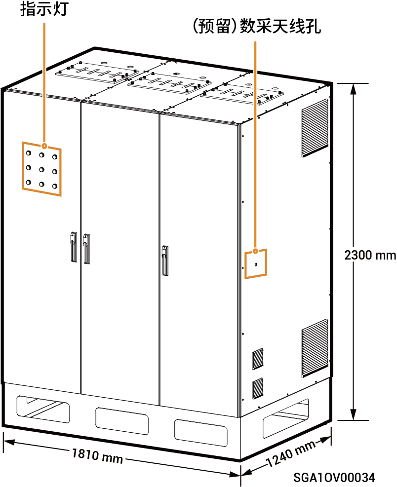

# Sigen Gateway (C600, C1200, C600-B, C1200-B)

### **尺寸图**

### **端口介绍**

#### **顶视图**

<figure><figcaption></figcaption></figure>

#### C600/C1200 **底视图**

<figure><figcaption></figcaption></figure>

#### C600-B/C1200-B **底视图**

<figure><figcaption></figcaption></figure>

<table><thead><tr><th width="62" align="center">序号</th><th valign="top">名称</th></tr></thead><tbody><tr><td align="center">1</td><td valign="top">PE线走线孔</td></tr><tr><td align="center">2</td><td valign="top">铜排进线位置（电网交流线）</td></tr><tr><td align="center">3</td><td valign="top">铜排进线位置（智能负载/发电机交流线）</td></tr><tr><td align="center">4</td><td valign="top">铜排进线位置（负载交流线）</td></tr><tr><td align="center">5</td><td valign="top">逆变器交流线走线孔</td></tr><tr><td align="center">6</td><td valign="top">信号线走线孔</td></tr></tbody></table>

<figure><figcaption></figcaption></figure>

<mark style="color:blue;">C600/C1200在出厂结构上仅微型断路器的数量有差异，本文以C1200为例。</mark>

### **C1200 内部图**

<table><thead><tr><th width="60" align="center" valign="middle">序号</th><th width="107" valign="top">标签</th><th valign="middle">名称</th></tr></thead><tbody><tr><td align="center" valign="middle">1</td><td valign="top">1QF1</td><td valign="middle">PCB板二次控制开关（连接电网，并给其指示灯供电）</td></tr><tr><td align="center" valign="middle">2</td><td valign="top">1QF3</td><td valign="middle">PCB板二次控制开关（连接智能负载/发电机，并给其指示灯供电）</td></tr><tr><td align="center" valign="middle">3</td><td valign="top">1QF5</td><td valign="middle">PCB板二次控制开关（连接负载，并给其指示灯供电）</td></tr><tr><td align="center" valign="middle">4</td><td valign="top">1QF7</td><td valign="middle">框架断路器二次控制开关（连接电网）</td></tr><tr><td align="center" valign="middle">5</td><td valign="top">1QF8</td><td valign="middle">框架断路器二次控制开关（连接智能负载/发电机）</td></tr><tr><td align="center" valign="middle">6</td><td valign="top">1QF9</td><td valign="middle">框架断路器二次控制开关（连接负载）</td></tr><tr><td align="center" valign="middle">7</td><td valign="top">1QF10</td><td valign="middle">二次控制开关（连接风扇和UPS）</td></tr><tr><td align="center" valign="middle">8</td><td valign="top">QA1</td><td valign="middle">框架断路器【1】（连接电网）</td></tr><tr><td align="center" valign="middle">9</td><td valign="top">QA2</td><td valign="middle">框架断路器（连接智能负载【2】/发电机）</td></tr><tr><td align="center" valign="middle">10</td><td valign="top">QA3</td><td valign="middle">框架断路器（连接负载）</td></tr><tr><td align="center" valign="middle">11</td><td valign="top">SC</td><td valign="middle">数据采集器安装位置</td></tr><tr><td align="center" valign="middle">12</td><td valign="top">SA2</td><td valign="middle">旁路转换开关（连接智能负载/发电机）</td></tr><tr><td align="center" valign="middle">13</td><td valign="top">
2QF1~2QF30

（C600）
</td><td valign="middle">微型断路器（C600含30个微型断路器，连接逆变器）</td></tr><tr><td align="center" valign="middle">13</td><td valign="top">2QF1~2QF50（C1200）</td><td valign="middle">微型断路器（C1200含50个微型断路器，连接逆变器）</td></tr><tr><td align="center" valign="middle">14</td><td valign="top">PE</td><td valign="middle">接地排（连接PE线）</td></tr><tr><td align="center" valign="middle">15</td><td valign="top">SA1</td><td valign="middle">旁路转换开关（连接电网）</td></tr><tr><td align="center" valign="middle">16</td><td valign="top">1QF2</td><td valign="middle">防雷器开关（连接电网）</td></tr><tr><td align="center" valign="middle">17</td><td valign="top">1QF4</td><td valign="middle">防雷器开关（连接智能负载/发电机）</td></tr><tr><td align="center" valign="middle">18</td><td valign="top">1QF6</td><td valign="middle">防雷器开关（连接负载）</td></tr><tr><td align="center" valign="middle">19</td><td valign="top">-</td><td valign="middle">单板控制盒</td></tr></tbody></table>

<figure><figcaption></figcaption></figure>

<mark style="color:blue;">**C600-B/C1200-B在出厂结构上仅微型断路器的数量有差异，本文以C1200-B为例。**</mark>

<figure><figcaption></figcaption></figure>

<table><thead><tr><th width="61" align="center" valign="middle">序号</th><th width="124" valign="middle">标签</th><th valign="top">名称</th></tr></thead><tbody><tr><td align="center" valign="middle">1</td><td valign="middle">1QF1</td><td valign="top">PCB板二次控制开关（连接电网，并给其指示灯供电）</td></tr><tr><td align="center" valign="middle">2</td><td valign="middle">1QF3</td><td valign="top">PCB板二次控制开关（连接智能负载/发电机，并给其指示灯供电）</td></tr><tr><td align="center" valign="middle">3</td><td valign="middle">1QF5</td><td valign="top">PCB板二次控制开关（连接负载，并给其指示灯供电）</td></tr><tr><td align="center" valign="middle">4</td><td valign="middle">1QF7</td><td valign="top">框架断路器二次控制开关（连接电网）</td></tr><tr><td align="center" valign="middle">5</td><td valign="middle">1QF8</td><td valign="top">框架断路器二次控制开关（连接智能负载/发电机）</td></tr><tr><td align="center" valign="middle">6</td><td valign="middle">1QF9</td><td valign="top">框架断路器二次控制开关（连接负载）</td></tr><tr><td align="center" valign="middle">7</td><td valign="middle">1QF10</td><td valign="top">二次控制开关（连接风扇和UPS）</td></tr><tr><td align="center" valign="middle">8</td><td valign="middle">QA1</td><td valign="top">框架断路器【1】（连接电网）</td></tr><tr><td align="center" valign="middle">9</td><td valign="middle">QA2</td><td valign="top">框架断路器（连接智能负载【2】/发电机）</td></tr><tr><td align="center" valign="middle">10</td><td valign="middle">QA3</td><td valign="top">框架断路器（连接负载）</td></tr><tr><td align="center" valign="middle">11</td><td valign="middle">SC</td><td valign="top">数据采集器安装位置</td></tr><tr><td align="center" valign="middle">12</td><td valign="middle">SA2</td><td valign="top">旁路转换开关（连接智能负载/发电机）</td></tr><tr><td align="center" valign="middle">13</td><td valign="middle">
2QF1~2QF10

（C600-B）
</td><td valign="top">塑壳断路器（C600-B含10个塑壳断路器，连接逆变器）</td></tr><tr><td align="center" valign="middle">13</td><td valign="middle">
2QF1~2QF20

（C1200-B）
</td><td valign="top">塑壳断路器（C1200-B含20个塑壳断路器，连接逆变器）</td></tr><tr><td align="center" valign="middle">14</td><td valign="middle">PE</td><td valign="top">接地排（连接PE线）</td></tr><tr><td align="center" valign="middle">15</td><td valign="middle">SA1</td><td valign="top">旁路转换开关（连接电网）</td></tr><tr><td align="center" valign="middle">16</td><td valign="middle">1QF2</td><td valign="top">防雷器开关（连接电网）</td></tr><tr><td align="center" valign="middle">17</td><td valign="middle">1QF4</td><td valign="top">防雷器开关（连接智能负载/发电机）</td></tr><tr><td align="center" valign="middle">18</td><td valign="middle">1QF6</td><td valign="top">防雷器开关（连接负载）</td></tr><tr><td align="center" valign="middle">19</td><td valign="middle">-</td><td valign="top">单板控制盒</td></tr></tbody></table>

**注【1】：**

现场若需根据实际情况调整断路器的整定值，请参见对应机型安装指南，具体操作方式参见断路器说明书。

**注【2】：**

* 业主家中的用电设备均可作为智能负载接入。
* 为保证本产品对用户利益最大化，建议大功率设备作为智能负载接入（如第三方逆变器、热泵等），当储能电量不足时可切出。
