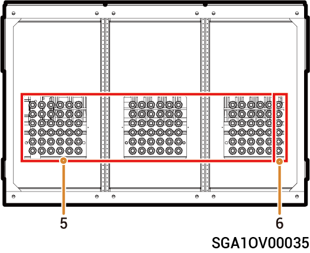
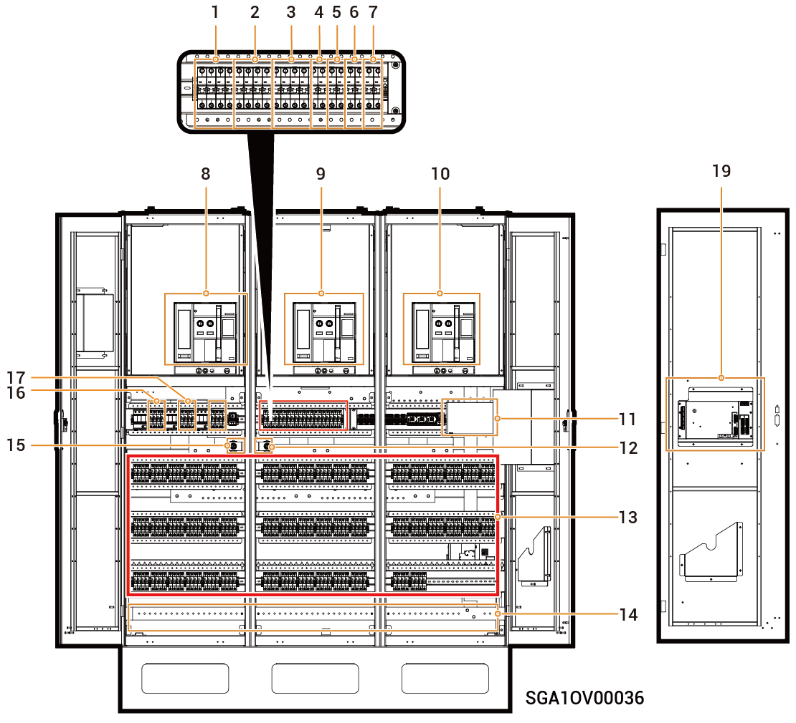

# Sigen Gateway (C600, C1200, C600-B, C1200-B)

### **Rozměry**

<figure><figcaption></figcaption></figure>

### Popis portu

#### **Horní pohled**

<figure><figcaption></figcaption></figure>

#### **Spodní pohled na C600/C1200**

<figure><figcaption></figcaption></figure>

#### **Spodní pohled na C600-B/1200-B**

<figure><figcaption></figcaption></figure>

<table><thead><tr><th width="60" align="center">Č.</th><th>N&aacute;zev</th></tr></thead><tbody><tr><td align="center">1</td><td>Otvor pro veden&iacute; PE kabelu</td></tr><tr><td align="center">2</td><td>Vstup měděn&eacute; př&iacute;pojnice (kabel stř&iacute;dav&eacute;ho proudu s&iacute;tě)</td></tr><tr><td align="center">3</td><td>Vstup měděn&eacute; př&iacute;pojnice (kabel stř&iacute;dav&eacute;ho proudu inteligentn&iacute;ch spotřebičů&nbsp;/ gener&aacute;toru)</td></tr><tr><td align="center">4</td><td>Vstup měděn&eacute; př&iacute;pojnice (kabel stř&iacute;dav&eacute;ho proudu spotřebiče)</td></tr><tr><td align="center">5</td><td>Otvor pro veden&iacute; kabelů stř&iacute;dav&eacute;ho proudu měniče</td></tr><tr><td align="center">6</td><td>Otvor pro veden&iacute; sign&aacute;lov&eacute;ho kabelu</td></tr></tbody></table>

<figure><figcaption></figcaption></figure>

<mark style="color:blue;">**C600/C1200 se liší pouze počtem miniaturních jističů v&nbsp;konstrukci, tato příručka používá jako příklad model C1200.**</mark>

### Pohled zevnitř na **C1200**

<table><thead><tr><th width="60" align="center" valign="middle">Č.</th><th width="107" valign="middle">&Scaron;t&iacute;tek</th><th valign="middle">N&aacute;zev</th></tr></thead><tbody><tr><td align="center" valign="middle">1</td><td valign="middle">1QF1</td><td valign="middle">Sekund&aacute;rn&iacute; ř&iacute;dic&iacute; sp&iacute;nač na desce plo&scaron;n&yacute;ch spojů (připojen&yacute; k&nbsp;energetick&eacute; s&iacute;ti a&nbsp;sp&iacute;nač nap&aacute;jen&iacute; pro indik&aacute;tory)</td></tr><tr><td align="center" valign="middle">2</td><td valign="middle">1QF3</td><td valign="middle">Sekund&aacute;rn&iacute; ř&iacute;dic&iacute; sp&iacute;nač na desce plo&scaron;n&yacute;ch spojů (připojen&yacute; k&nbsp;inteligentn&iacute;m spotřebičům[1]&nbsp;/ gener&aacute;toru a&nbsp;sp&iacute;nač nap&aacute;jen&iacute; pro indik&aacute;tory)</td></tr><tr><td align="center" valign="middle">3</td><td valign="middle">1QF5</td><td valign="middle">Sekund&aacute;rn&iacute; ř&iacute;dic&iacute; sp&iacute;nač na desce plo&scaron;n&yacute;ch spojů (připojen&yacute; ke spotřebiči a&nbsp;sp&iacute;nač nap&aacute;jen&iacute; pro indik&aacute;tory)</td></tr><tr><td align="center" valign="middle">4</td><td valign="middle">1QF7</td><td valign="middle">Sekund&aacute;rn&iacute; ř&iacute;dic&iacute; sp&iacute;nač r&aacute;mov&eacute;ho jističe (připojen&yacute; k&nbsp;energetick&eacute; s&iacute;ti)</td></tr><tr><td align="center" valign="middle">5</td><td valign="middle">1QF8</td><td valign="middle">Sekund&aacute;rn&iacute; ř&iacute;dic&iacute; sp&iacute;nač r&aacute;mov&eacute;ho jističe (připojen&yacute; k&nbsp;inteligentn&iacute;m spotřebičům&nbsp;/ gener&aacute;toru)</td></tr><tr><td align="center" valign="middle">6</td><td valign="middle">1QF9</td><td valign="middle">Sekund&aacute;rn&iacute; ř&iacute;dic&iacute; sp&iacute;nač r&aacute;mov&eacute;ho jističe (připojen&yacute; ke spotřebiči)</td></tr><tr><td align="center" valign="middle">7</td><td valign="middle">1QF10</td><td valign="middle">Sekund&aacute;rn&iacute; ř&iacute;dic&iacute; sp&iacute;nač (připojen&yacute; k&nbsp;ventil&aacute;toru a&nbsp;UPS)</td></tr><tr><td align="center" valign="middle">8</td><td valign="middle">QA1</td><td valign="middle">R&aacute;mov&yacute; jistič[1] (připojen&yacute; k&nbsp;energetick&eacute; s&iacute;ti)</td></tr><tr><td align="center" valign="middle">9</td><td valign="middle">QA2</td><td valign="middle">R&aacute;mov&yacute; jistič (připojen&yacute; k&nbsp;inteligentn&iacute;m spotřebičům[2]&nbsp;/ gener&aacute;toru)</td></tr><tr><td align="center" valign="middle">10</td><td valign="middle">QA3</td><td valign="middle">R&aacute;mov&yacute; jistič (připojen&yacute; ke spotřebiči)</td></tr><tr><td align="center" valign="middle">11</td><td valign="middle">SC</td><td valign="middle">M&iacute;sto pro mont&aacute;ž datov&eacute;ho sběrače</td></tr><tr><td align="center" valign="middle">12</td><td valign="middle">SA2</td><td valign="middle">Sp&iacute;nač přemosťovac&iacute;ho přenosu (připojen&yacute; k&nbsp;inteligentn&iacute;m spotřebičům&nbsp;/ gener&aacute;toru)</td></tr><tr><td align="center" valign="middle">13</td><td valign="middle">
2QF1~2QF30

(C600)
</td><td valign="middle">Miniaturn&iacute; jistič (br&aacute;na C600 obsahuje 30 miniaturn&iacute;ch jističů, připojen&yacute;ch k&nbsp;měniči)</td></tr><tr><td align="center" valign="middle">13</td><td valign="middle">2QF1&ndash;2QF50 (C1200)</td><td valign="middle">Miniaturn&iacute; jistič (br&aacute;na C1200 obsahuje 50 miniaturn&iacute;ch jističů, připojen&yacute;ch k&nbsp;měniči)</td></tr><tr><td align="center" valign="middle">14</td><td valign="middle">PE</td><td valign="middle">Př&iacute;pojnice uzemněn&iacute; (připojuje se k&nbsp;PE kabelu)</td></tr><tr><td align="center" valign="middle">15</td><td valign="middle">SA1</td><td valign="middle">Sp&iacute;nač přemosťovac&iacute;ho přenosu (připojen&yacute; k&nbsp;energetick&eacute; s&iacute;ti)</td></tr><tr><td align="center" valign="middle">16</td><td valign="middle">1QF2</td><td valign="middle">Sp&iacute;nač přepěťov&eacute; ochrany (připojen&yacute; k&nbsp;energetick&eacute; s&iacute;ti)</td></tr><tr><td align="center" valign="middle">17</td><td valign="middle">1QF4</td><td valign="middle">Sp&iacute;nač přepěťov&eacute; ochrany (připojen&yacute; k&nbsp;inteligentn&iacute;m spotřebičům&nbsp;/ gener&aacute;toru)</td></tr><tr><td align="center" valign="middle">18</td><td valign="middle">1QF6</td><td valign="middle">Sp&iacute;nač přepěťov&eacute; ochrany (připojen&yacute; ke spotřebiči)</td></tr><tr><td align="center" valign="middle">19</td><td valign="middle">&ndash;</td><td valign="middle">Jednop&oacute;lov&aacute; ovl&aacute;dac&iacute; skř&iacute;ň</td></tr></tbody></table>

<figure><figcaption></figcaption></figure>

<mark style="color:blue;">**C600-B/C1200-B se liší pouze počtem miniaturních jističů v&nbsp;konstrukci, tato příručka používá jako příklad model C1200.**</mark>

<figure><figcaption></figcaption></figure>

<table><thead><tr><th width="60" align="center" valign="middle">Č.</th><th width="124" valign="middle">&Scaron;t&iacute;tek</th><th valign="top">N&aacute;zev</th></tr></thead><tbody><tr><td align="center" valign="middle">1.</td><td valign="middle">1QF1</td><td valign="top">Sekund&aacute;rn&iacute; ř&iacute;dic&iacute; sp&iacute;nač na desce plo&scaron;n&yacute;ch spojů (připojen&yacute; k&nbsp;energetick&eacute; s&iacute;ti a&nbsp;sp&iacute;nač nap&aacute;jen&iacute; pro indik&aacute;tory)</td></tr><tr><td align="center" valign="middle">2.</td><td valign="middle">1QF3</td><td valign="top">Sekund&aacute;rn&iacute; ř&iacute;dic&iacute; sp&iacute;nač na desce plo&scaron;n&yacute;ch spojů (připojen&yacute; k&nbsp;inteligentn&iacute;m spotřebičům[1]&nbsp;/ gener&aacute;toru a&nbsp;sp&iacute;nač nap&aacute;jen&iacute; pro indik&aacute;tory)</td></tr><tr><td align="center" valign="middle">3.</td><td valign="middle">1QF5</td><td valign="top">Sekund&aacute;rn&iacute; ř&iacute;dic&iacute; sp&iacute;nač na desce plo&scaron;n&yacute;ch spojů (připojen&yacute; ke spotřebiči a&nbsp;sp&iacute;nač nap&aacute;jen&iacute; pro indik&aacute;tory)</td></tr><tr><td align="center" valign="middle">4.</td><td valign="middle">1QF7</td><td valign="top">Sekund&aacute;rn&iacute; ř&iacute;dic&iacute; sp&iacute;nač r&aacute;mov&eacute;ho jističe (připojen&yacute; k&nbsp;energetick&eacute; s&iacute;ti)</td></tr><tr><td align="center" valign="middle">5.</td><td valign="middle">1QF8</td><td valign="top">Sekund&aacute;rn&iacute; ř&iacute;dic&iacute; sp&iacute;nač r&aacute;mov&eacute;ho jističe (připojen&yacute; k&nbsp;inteligentn&iacute;m spotřebičům&nbsp;/ gener&aacute;toru)</td></tr><tr><td align="center" valign="middle">6.</td><td valign="middle">1QF9</td><td valign="top">Sekund&aacute;rn&iacute; ř&iacute;dic&iacute; sp&iacute;nač r&aacute;mov&eacute;ho jističe (připojen&yacute; ke spotřebiči)</td></tr><tr><td align="center" valign="middle">7.</td><td valign="middle">1QF10</td><td valign="top">Sekund&aacute;rn&iacute; ř&iacute;dic&iacute; sp&iacute;nač (připojen&yacute; k&nbsp;ventil&aacute;toru a&nbsp;UPS)</td></tr><tr><td align="center" valign="middle">8.</td><td valign="middle">QA1</td><td valign="top">R&aacute;mov&yacute; jistič[1] (připojen&yacute; k&nbsp;energetick&eacute; s&iacute;ti)</td></tr><tr><td align="center" valign="middle">9.</td><td valign="middle">QA2</td><td valign="top">R&aacute;mov&yacute; jistič (připojen&yacute; k&nbsp;inteligentn&iacute;m spotřebičům[2]&nbsp;/ gener&aacute;toru)</td></tr><tr><td align="center" valign="middle">10.</td><td valign="middle">QA3</td><td valign="top">R&aacute;mov&yacute; jistič (připojen&yacute; ke spotřebiči)</td></tr><tr><td align="center" valign="middle">11.</td><td valign="middle">SC</td><td valign="top">M&iacute;sto pro mont&aacute;ž datov&eacute;ho sběrače</td></tr><tr><td align="center" valign="middle">12.</td><td valign="middle">SA2</td><td valign="top">Sp&iacute;nač přemosťovac&iacute;ho přenosu (připojen&yacute; k&nbsp;inteligentn&iacute;m spotřebičům&nbsp;/ gener&aacute;toru)</td></tr><tr><td align="center" valign="middle">13.</td><td valign="middle">
2QF1~2QF10

(C600-B)
</td><td valign="top">Jistič v&nbsp;lisovan&eacute; skř&iacute;ňce (br&aacute;na C600-B obsahuje 10 jističů v&nbsp;lisovan&eacute; skř&iacute;ňce, připojen&yacute;ch k&nbsp;měniči)</td></tr><tr><td align="center" valign="middle">13.</td><td valign="middle">2QF1~2QF20 (C1200-B)</td><td valign="top">Jistič v&nbsp;lisovan&eacute; skř&iacute;ňce (br&aacute;na C1200-B obsahuje 20 jističů v&nbsp;lisovan&eacute; skř&iacute;ňce, připojen&yacute;ch k&nbsp;měniči)</td></tr><tr><td align="center" valign="middle">14.</td><td valign="middle">PE</td><td valign="top">Př&iacute;pojnice uzemněn&iacute; (připojuje se k&nbsp;PE kabelu)</td></tr><tr><td align="center" valign="middle">15.</td><td valign="middle">SA1</td><td valign="top">Sp&iacute;nač přemosťovac&iacute;ho přenosu (připojen&yacute; k&nbsp;energetick&eacute; s&iacute;ti)</td></tr><tr><td align="center" valign="middle">16.</td><td valign="middle">1QF2</td><td valign="top">Sp&iacute;nač přepěťov&eacute; ochrany (připojen&yacute; k&nbsp;energetick&eacute; s&iacute;ti)</td></tr><tr><td align="center" valign="middle">17.</td><td valign="middle">1QF4</td><td valign="top">Sp&iacute;nač přepěťov&eacute; ochrany (připojen&yacute; k&nbsp;inteligentn&iacute;m spotřebičům&nbsp;/ gener&aacute;toru)</td></tr><tr><td align="center" valign="middle">18.</td><td valign="middle">1QF6</td><td valign="top">Sp&iacute;nač přepěťov&eacute; ochrany (připojen&yacute; ke spotřebiči)</td></tr><tr><td align="center" valign="middle">19.</td><td valign="middle">&ndash;</td><td valign="top">Jednop&oacute;lov&aacute; ovl&aacute;dac&iacute; skř&iacute;ň</td></tr></tbody></table>

**Poznámka [1]:**

Hodnota nastavení jističe musí být upravena na místě podle skutečné situace. Více informací o&nbsp;hodnotě nastavení naleznete v&nbsp;průvodci instalací pro příslušné modely a&nbsp;způsob obsluhy naleznete v&nbsp;návodu k&nbsp;obsluze jističe.

**Poznámka [2]:**

* Veškerá napájená zařízení v domácnosti majitele lze připojit jako inteligentní spotřebiče.
* Aby tento produkt přinesl uživatelům co největší užitek, doporučuje se připojit zařízení s&nbsp;vysokým příkonem jako inteligentní spotřebiče (tepelná čerpadla, měnič jiného výrobce apod.), které lze odpojit, když má systém ukládání energie nízký stav nabití.
