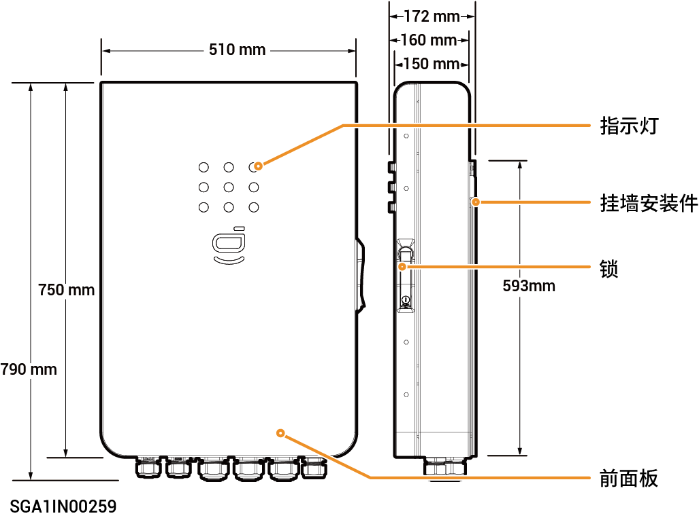
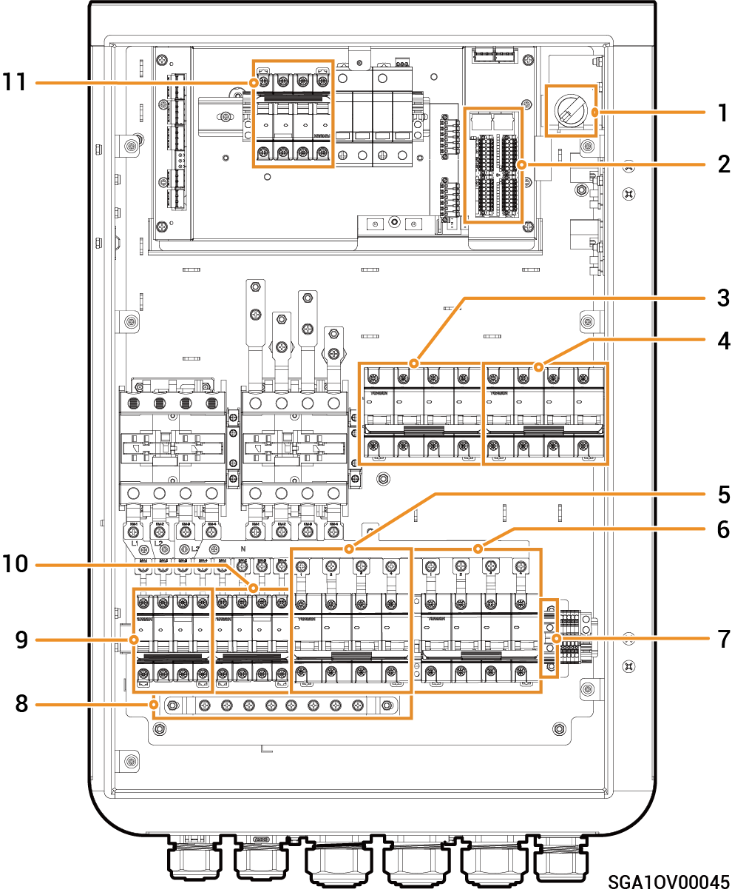

# Sigen Gateway C60-2

### **尺寸图**

<figure><figcaption></figcaption></figure>

### **底视图**

<figure><figcaption></figcaption></figure>

<table><thead><tr><th width="70" align="center">序号</th><th width="141">丝印</th><th>名称</th></tr></thead><tbody><tr><td align="center">1</td><td>INV1</td><td>逆变器进线口1</td></tr><tr><td align="center">2</td><td>INV2</td><td>逆变器进线口2</td></tr><tr><td align="center">3</td><td>BACKUP</td><td>备电负载进线口</td></tr><tr><td align="center">4</td><td>SMART-PORT</td><td>智能负载/发电机进线口</td></tr><tr><td align="center">5</td><td>GRID</td><td>电网进线口</td></tr><tr><td align="center">6</td><td>COM</td><td>通信进线口</td></tr></tbody></table>

### **内部图**

<figure><figcaption></figcaption></figure>

<table><thead><tr><th width="60" align="center" valign="middle">序号</th><th width="70" valign="top">标签</th><th valign="top">名称</th></tr></thead><tbody><tr><td align="center" valign="middle">1</td><td valign="top">Q1</td><td valign="top">LED旋钮开关</td></tr><tr><td align="center" valign="middle">2</td><td valign="top">–</td><td valign="top">通信端子（连接FE、DI、DI等通信线）</td></tr><tr><td align="center" valign="middle">3</td><td valign="top">QF2</td><td valign="top">微型断路器（连接智能负载【1】/发电机）</td></tr><tr><td align="center" valign="middle">4</td><td valign="top">QF1</td><td valign="top">微型断路器（连接电网）</td></tr><tr><td align="center" valign="middle">5</td><td valign="top">QF5</td><td valign="top">微型断路器（连接备电负载）</td></tr><tr><td align="center" valign="middle">6</td><td valign="top">QS1</td><td valign="top">旁路开关</td></tr><tr><td align="center" valign="middle">7</td><td valign="top">GND</td><td valign="top">GND端子</td></tr><tr><td align="center" valign="middle">8</td><td valign="top">PE</td><td valign="top">接地铜排</td></tr><tr><td align="center" valign="middle">9</td><td valign="top">QF3</td><td valign="top">微型断路器（连接逆变器1）</td></tr><tr><td align="center" valign="middle">10</td><td valign="top">QF4</td><td valign="top">微型断路器（连接逆变器2）</td></tr><tr><td align="center" valign="middle">11</td><td valign="top">QF6</td><td valign="top">浪涌保护器开关</td></tr></tbody></table>

注【1】：

* 业主家中的用电设备均可作为智能负载接入。
* 为保证本产品对用户利益最大化，建议大功率设备作为智能负载接入（如第三方逆变器、热泵、泳池加热器、干衣机、热得快等），当储能电量不足时可切出。其他小功率设备作为家用负载接入（如灯、路由器等）。
