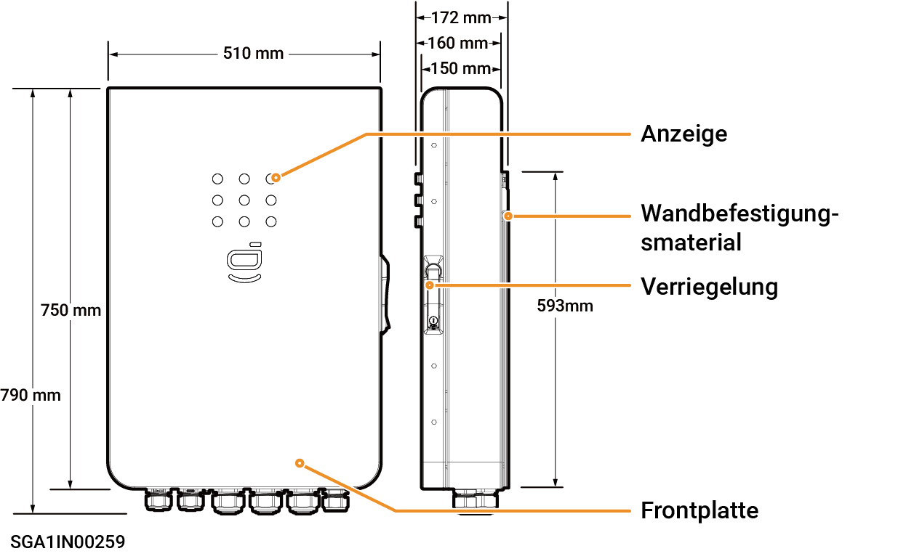
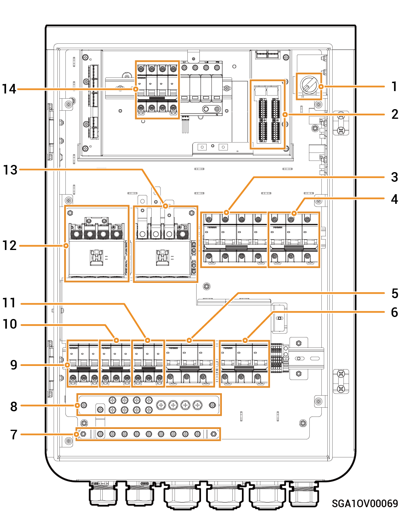

# Sigen Gateway C60 AU

### **Abmessungen**

<figure><figcaption></figcaption></figure>

### **Ansicht von unten**

<table><thead><tr><th width="69" align="center" valign="middle">Nr.</th><th width="131">Kennzeichnung</th><th>Bezeichnung</th></tr></thead><tbody><tr><td align="center" valign="middle">1</td><td>INV1</td><td>Verdrahtungsanschluss f&uuml;r Wechselrichter 1</td></tr><tr><td align="center" valign="middle">2</td><td>INV2</td><td>Verdrahtungsanschluss f&uuml;r Wechselrichter 2</td></tr><tr><td align="center" valign="middle">3</td><td>BACKUP</td><td>Verdrahtungsanschluss f&uuml;r Notstromlasten</td></tr><tr><td align="center" valign="middle">4</td><td>SMART-PORT</td><td>Verdrahtungsanschluss f&uuml;r intelligente Lasten / Generator</td></tr><tr><td align="center" valign="middle">5</td><td>GRID</td><td>Verdrahtungsanschluss f&uuml;r Stromnetz</td></tr><tr><td align="center" valign="middle">6</td><td>COM</td><td>Verdrahtungsanschluss f&uuml;r Kommunikation</td></tr></tbody></table>

### Innenansicht

<figure><figcaption></figcaption></figure>

<table><thead><tr><th width="60" align="center" valign="top">Nr.</th><th width="80" valign="top">Beschriftung</th><th valign="top">Bezeichnung</th></tr></thead><tbody><tr><td align="center" valign="top">1</td><td valign="top">Q1</td><td valign="top">LED‑Schalter</td></tr><tr><td align="center" valign="top">2</td><td valign="top">&ndash;</td><td valign="top">Kommunikationsklemme (Anschluss an FE, DI, DI-Kommunikationskabel)</td></tr><tr><td align="center" valign="top">3</td><td valign="top">QF2</td><td valign="top">Miniatur-Leitungsschutzschalter (Anschluss an intelligente Verbraucher[1]/Generator)</td></tr><tr><td align="center" valign="top">4</td><td valign="top">QF1</td><td valign="top">Kompaktleistungsschalter (Anschluss an Stromnetz)</td></tr><tr><td align="center" valign="top">5</td><td valign="top">QF6</td><td valign="top">Leistungsschutzschalter (Anschluss an Notstromlasten)</td></tr><tr><td align="center" valign="top">6</td><td valign="top">QS1</td><td valign="top">Umgehungsschalter</td></tr><tr><td align="center" valign="top">7</td><td valign="top">PE</td><td valign="top">Erdungsschiene aus Kupfer</td></tr><tr><td align="center" valign="top">8</td><td valign="top">N</td><td valign="top">N-Leitung Erdungsschiene aus Kupfer</td></tr><tr><td align="center" valign="top">9</td><td valign="top">QF3</td><td valign="top">Leistungsschutzschalter (Anschluss an Wechselrichter 1, maximale Unterst&uuml;tzung 30 kW)</td></tr><tr><td align="center" valign="top">10</td><td valign="top">QF4</td><td valign="top">Leistungsschutzschalter (Anschluss an Wechselrichter 2, maximale Unterst&uuml;tzung 30 kW)</td></tr><tr><td align="center" valign="top">11</td><td valign="top">QF5</td><td valign="top">Leistungsschutzschalter (Anschluss an Wechselrichter 3, maximale Unterst&uuml;tzung 20 kW)</td></tr><tr><td align="center" valign="top">12</td><td valign="top">KM2</td><td valign="top">Sch&uuml;tz f&uuml;r intelligente Lasten/Generator</td></tr><tr><td align="center" valign="top">13</td><td valign="top">KM1</td><td valign="top">Netzsch&uuml;tz</td></tr><tr><td align="center" valign="top">14</td><td valign="top">QF7</td><td valign="top">&Uuml;berspannungsschutzger&auml;t</td></tr></tbody></table>

Hinweis [1]:

* Alle Stromgeräte im Heim des Eigentümers können als intelligente Verbraucher angeschlossen werden.
* Um sicherzustellen, dass dieses Produkt den Benutzern maximale Vorteile bietet, wird empfohlen, die Hochleistungsgeräte als intelligente Verbraucher anzuschließen (Fremdinverter, Wärmepumpen, Schwimmbadheizungen, Wäschetrockner, Tauchsieder usw.), die abgeschaltet werden können, wenn das Energiespeichersystem wenig Leistung hat. Andere Geräte mit geringem Leistungsbedarf sind als Haushaltslasten (Beleuchtung, Router usw.) angeschlossen.
