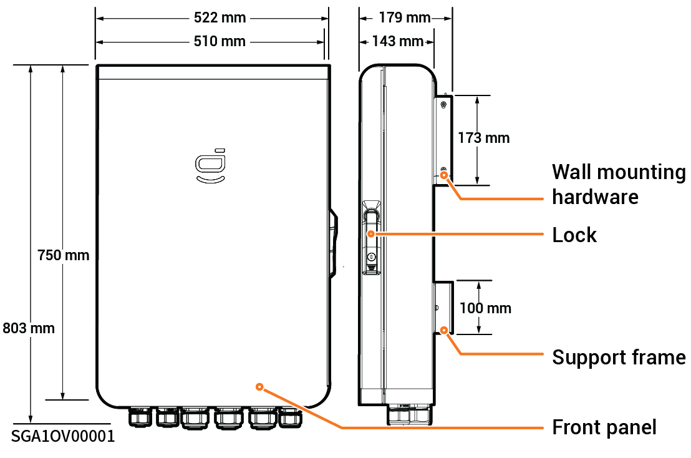

# Sigen Gateway TPLV C30-2

### **Dimensions**

<figure><figcaption></figcaption></figure>

### **Bottom View**

<table><thead><tr><th width="69" align="center" valign="middle">No.</th><th width="131">Marking</th><th>Name</th></tr></thead><tbody><tr><td align="center" valign="middle">1</td><td>INV1</td><td>Wire-in port of inverter 1</td></tr><tr><td align="center" valign="middle">2</td><td>INV2</td><td>Wire-in port of inverter 2</td></tr><tr><td align="center" valign="middle">3</td><td>BACKUP</td><td>Wire-in port of backup loads</td></tr><tr><td align="center" valign="middle">4</td><td>SMART-PORT</td><td>Wire-in port for smart loads/diesel generator</td></tr><tr><td align="center" valign="middle">5</td><td>GRID</td><td>Wire-in port of power grid</td></tr><tr><td align="center" valign="middle">6</td><td>COM</td><td>Wire-in port of communication</td></tr></tbody></table>

### Interior View

<figure><figcaption></figcaption></figure>

<table><thead><tr><th width="70" align="center">No.</th><th width="95">Label</th><th>Name</th></tr></thead><tbody><tr><td align="center">1</td><td>-</td><td>RS485, DI, and DO interfaces</td></tr><tr><td align="center">2</td><td>QF2</td><td>Miniature circuit breaker (Diesel generator)</td></tr><tr><td align="center">3</td><td>QF1</td><td>Miniature circuit breaker (Power grid)</td></tr><tr><td align="center">4</td><td>QF5</td><td>Miniature circuit breaker (backup loads)</td></tr><tr><td align="center">5</td><td>QS1</td><td>Bypass switch</td></tr><tr><td align="center">6</td><td>GND</td><td>GND</td></tr><tr><td align="center">7</td><td>-</td><td>Cable clamp</td></tr><tr><td align="center">8</td><td>-</td><td>Earthing bar</td></tr><tr><td align="center">9</td><td>QF3</td><td>Miniature circuit breaker (Inverters 1)</td></tr><tr><td align="center">10</td><td>QF4</td><td>Miniature circuit breaker (Inverters 2)</td></tr><tr><td align="center">11</td><td>FC1+QF6</td><td>Miniature circuit breaker + Surge protection device</td></tr></tbody></table>
