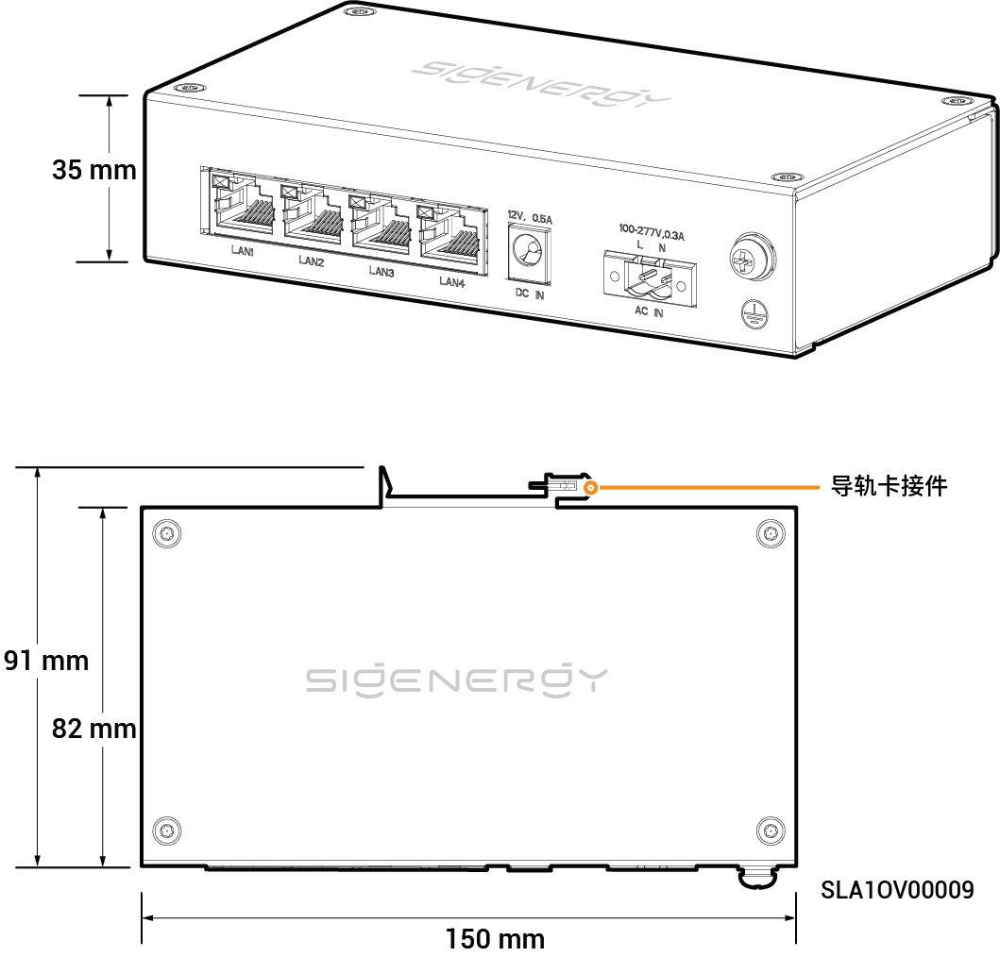
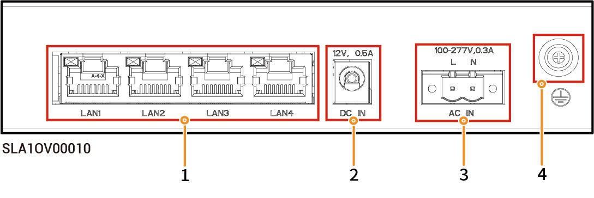

# 思格通信网桥

## 尺寸图

<figure><figcaption></figcaption></figure>

## 端口介绍

<figure><figcaption></figcaption></figure>

<table><thead><tr><th width="60.5555419921875" align="center" valign="middle">序号</th><th valign="top">名称</th><th valign="top">丝印</th></tr></thead><tbody><tr><td align="center" valign="middle">1</td><td valign="top">LAN局域网接口</td><td valign="top">LAN1/LAN2/LAN3/LAN4</td></tr><tr><td align="center" valign="middle">2</td><td valign="top">12V直流供电输入口</td><td valign="top">DC IN 12V，0.5A</td></tr><tr><td align="center" valign="middle">3</td><td valign="top">220V交流供电输入口</td><td valign="top">AC IN 100-277V，0.3A</td></tr><tr><td align="center" valign="middle">4</td><td valign="top">保护接地点</td><td valign="top">-</td></tr></tbody></table>
