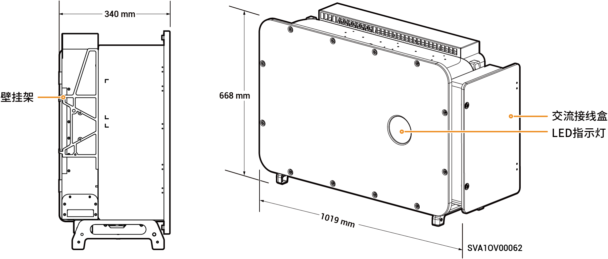

# Sigen PV (150–160)M2逆变器

## 尺寸图

<figure><figcaption></figcaption></figure>

### 端口介绍

<figure><figcaption></figcaption></figure>

<table><thead><tr><th width="79">序号</th><th width="331.5">名称</th><th>丝印</th></tr></thead><tbody><tr><td>1</td><td>直流开关1</td><td>DC SWITCH 1</td></tr><tr><td>2</td><td>直流输入端子组1（由DC SWITCH 1控制）</td><td>PV1 ~ PV9</td></tr><tr><td>3</td><td>直流输入端子组2（由DC SWITCH 2控制）</td><td>PV10 ~ PV18</td></tr><tr><td>4</td><td>直流开关2</td><td>DC SWITCH 2</td></tr><tr><td>5</td><td>天线接口</td><td>ANT</td></tr><tr><td>6</td><td>网线接口</td><td>RJ45 1</td></tr><tr><td>7</td><td>多芯线走线孔</td><td>-</td></tr><tr><td>8</td><td>单芯线走线孔【1】</td><td>-</td></tr><tr><td>9</td><td>Sigen CommMod接口</td><td>4G</td></tr><tr><td>10</td><td>通信接口</td><td>COM</td></tr><tr><td>11</td><td>网线接口</td><td>RJ45 2</td></tr><tr><td>12</td><td>散热风扇</td><td>-</td></tr></tbody></table>

注【1】：若需要单芯线走线孔，请联系思格购买。
