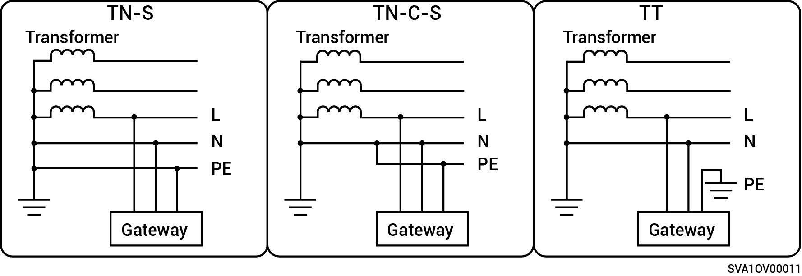
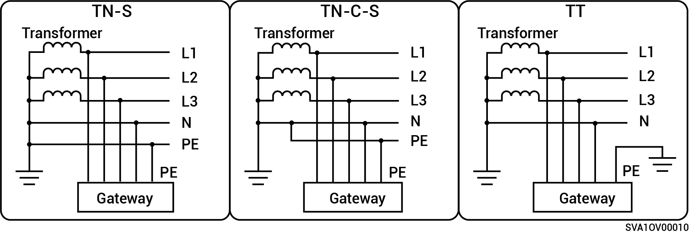

# Unterstützte Stromversorgungsmethoden für das Stromnetz

* Die unterstützten Netzversorgungsmethoden beinhalten N-S, TN-C-S und TT.
* Wenn TT als Stromversorgungsmethode des Stromnetzes verwendet wird, muss die Spannung zwischen N und PE <30 V betragen.

### Produkte der einphasigen Gateway-Serie:

<figure><figcaption></figcaption></figure>

### Produkte der dreiphasigen Gateway-Serie:

<figure><figcaption></figcaption></figure>
