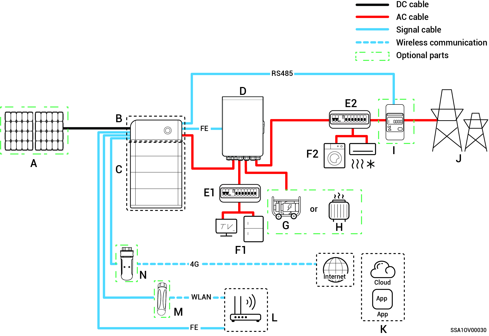

# Einführung in die Systemverdrahtung

* Dieses Produkt ist für Netzszenarien von Notstromsystemen für Haushalte ausgelegt. Es muss in Verbindung mit PV-Modulen, Wechselrichtern, Batterien/Akkus, Hauptschaltern, Lasten, Generatoren und Stromnetzen verwendet werden.
* Bei einem Stromausfall schaltet das Energiespeichersystem des Haushalts in den netzunabhängigen Betriebsmodus. Sobald das Stromnetz wieder normal funktioniert, schaltet das Energiespeichersystem des Haushalts wieder in den netzabhängigen Modus. Dadurch wird ein nahtloser Wechsel zwischen PV-Speicher und Generator erreicht.



* <mark style="color:blue;">Bei einem Notstromnetz hängt die Dauer des netzunabhängigen Betriebs der Notstromlast von der Stromversorgungskapazität des PV-Speichersystems ab. Bei Anomalien in der Stromversorgung des PV-Speichersystems während des netzunabhängigen Betriebs (unter anderem abnormale PV-Stromerzeugung, unzureichende Batterieleistung und anomale Stromversorgung des Generators) kann kein Reservestrom genutzt werden.</mark>
* <mark style="color:blue;">Das Netzwerkdiagramm zeigt zwei Wechselrichter als Beispiel. Die Anzahl der anschließbaren Wechselrichter hängt von der Gateway-Spezifikation ab. Weitere Informationen finden Sie in Tabelle 2-1.</mark>

**Tabelle 2-1**

<table><thead><tr><th width="102" align="center">Serien-Nr.</th><th width="204">Modell</th><th>Anzahl der anschlie&szlig;baren Wechselrichter</th></tr></thead><tbody><tr><td align="center">1</td><td>Sigen Gateway TPLV C30-2</td><td>2 Einheiten</td></tr><tr><td align="center">2</td><td>Sigen Gateway C60-2</td><td>2 Einheiten</td></tr><tr><td align="center">3</td><td>Sigen Gateway C60 AU</td><td>2 Einheiten</td></tr><tr><td align="center">4</td><td>Sigen Gateway TPLV C70-6</td><td>6 Einheiten</td></tr><tr><td align="center">5</td><td>Sigen Gateway C120-6</td><td>6 Einheiten</td></tr><tr><td align="center">6</td><td>Sigen Gateway C180-9</td><td>9 Einheiten</td></tr><tr><td align="center">7</td><td>Sigen Gateway C300-12</td><td>12 Einheiten</td></tr><tr><td align="center">8</td><td>Sigen Gateway C600</td><td>30 Einheiten</td></tr><tr><td align="center">9</td><td>Sigen Gateway C1200</td><td>50 Einheiten</td></tr><tr><td align="center">10</td><td>Sigen Gateway C600-B</td><td>10 Einheiten</td></tr><tr><td align="center">11</td><td>Sigen Gateway C1200-B</td><td>20 Einheiten</td></tr></tbody></table>

### **Verdrahtungsplan für die vollständige Notstromversorgung**

**Einzelner Wechselrichter (Gateway verfügt über den Schutzschalter für den Anschluss der intelligenten Last/des Dieselgenerators)**

<figure><figcaption></figcaption></figure>

**Einzelner Wechselrichter (Gateway verfügt nicht über den Schutzschalter, der an die intelligente Last/den Dieselgenerator angeschlossen ist)**

<figure><figcaption></figcaption></figure>

### **Mehrere Wechselrichter (Gateway verfügt über den Schutzschalter für den Anschluss der intelligenten Last/des Dieselgenerators)**

<figure><figcaption></figcaption></figure>

### **Mehrere Wechselrichter (Gateway verfügt nicht über den Schutzschalter, der an die intelligente Last/den Dieselgenerator angeschlossen ist)**

<figure><figcaption></figcaption></figure>

<table><thead><tr><th width="64" align="center">Nr.</th><th width="114">Beschreibung</th><th width="65" align="center">Nr.</th><th width="295">Beschreibung</th><th width="63">Nr.</th><th>Beschreibung</th></tr></thead><tbody><tr><td align="center"><strong>A</strong></td><td>PV-Modul</td><td align="center"><strong>B</strong></td><td>SigenStor EC/Sigen Hybrid</td><td><strong>C</strong></td><td>SigenStor BAT</td></tr><tr><td align="center"><strong>D</strong></td><td>Gateway</td><td align="center"><strong>E</strong></td><td>Notstrom-Verteilertafel</td><td><strong>F</strong></td><td>Haushaltslasten mit Notstrom</td></tr><tr><td align="center"><strong>G</strong></td><td>Dieselgenerator</td><td align="center"><strong>H</strong></td><td>Intelligente Verbraucher</td><td><strong>I</strong></td><td>Stromnetz</td></tr><tr><td align="center"><strong>J</strong></td><td>mySigen</td><td align="center"><strong>K</strong></td><td>Router</td><td><strong>L</strong></td><td>Antenne</td></tr><tr><td align="center"><strong>M</strong></td><td>CommMod</td><td align="center"></td><td></td><td></td><td></td></tr></tbody></table>



* <mark style="color:blue;">Wenn F (Notstromverbraucher) ein Leck aufweist, besteht Stromschlaggefahr. Um diese Gefahr zu vermeiden, muss zwischen D (Gateway) und F (Notstromverbraucher) ein Fehlerstromschutzschalter (RCD) installiert werden.</mark>
* <mark style="color:blue;">Als Reserveenergiequelle für langfristige netzunabhängige Anwendungen kann der Dieselgenerator zusammen mit dem Gateway einen reibungslosen Übergang zwischen Photovoltaik, Speicherung und Dieselgenerierung gewährleisten.</mark>
* <mark style="color:blue;">Alle Stromgeräte im Heim des Eigentümers können als intelligente Verbraucher angeschlossen werden. Um sicherzustellen, dass dieses Produkt den größtmöglichen Nutzen für die Benutzer bringt, wird empfohlen, die Hochleistungsgeräte als intelligente Lasten (Wärmepumpen, Poolheizungen, Wäschetrockner usw.) anzuschließen, die abgeschaltet werden können, wenn das Energiespeichersystem nur noch über eine geringe Leistung verfügt. Andere Geräte mit niedrigem Leistungsbedarf sind als Haushaltslasten (Lampen, Router usw.) angeschlossen.</mark>
* <mark style="color:blue;">Es wird empfohlen, schnelles Ethernet und WLAN zur Kommunikation mit Wechselrichtern zu verwenden. Wenn der kostenlose 4G-Datenverkehr von CommMod aufgebraucht ist, muss der Nutzer die SIM-Karte austauschen.</mark>

### **Verdrahtungsplan für die partielle Notstromversorgung**

### **Einzelner Wechselrichter (Gateway verfügt über den Schutzschalter für den Anschluss der intelligenten Last/des Dieselgenerators)**

<figure><figcaption></figcaption></figure>

### **Einzelner Wechselrichter (Gateway verfügt nicht über den Schutzschalter, der an die intelligente Last/den Dieselgenerator angeschlossen ist)**

<figure><figcaption></figcaption></figure>

### **Mehrere Wechselrichter (Gateway verfügt über den Schutzschalter für den Anschluss der intelligenten Last/des Dieselgenerators)**

<figure><figcaption></figcaption></figure>

### **Mehrere Wechselrichter (Gateway verfügt nicht über den Schutzschalter, der an die intelligente Last/den Dieselgenerator angeschlossen ist)**

<figure><figcaption></figcaption></figure>

| Nr.| Beschreibung| Nr.| Beschreibung| Nr.| Beschreibung|
|----------|----------|----------|----------|----------|----------|
| **A**| PV-Modul| **B**| SigenStor EC/SigenStor AC /Sigen Hybrid| **C**| SigenStor BAT|
| **D**| Gateway| **E1**| Notstrom-Verteilertafel| **E2**| Nicht-Notstrom-Verteilertafel|
| **F1**| Haushaltslasten mit Notstrom| **F2**| Haushaltslasten ohne Notstrom| **G**| Dieselgenerator|
| **H**| Intelligente Verbraucher| **I**| Leistungssensor| **J**| Stromnetz|
| **K**| mySigen| **L**| Router| **M**| Antenne|
| **N**| CommMod| | | | |



* <mark style="color:blue;">Wenn E2 (Verteilertafel) ohne Rückspeisung über Leckstromschutz verfügt, wird empfohlen, dass der Nenn-Restbetriebsstrom größer oder gleich der Anzahl der Wechselrichter x 100 mA ist.</mark>
* <mark style="color:blue;">Wenn F1 (Notstromverbraucher) ein Leck aufweist, besteht Stromschlaggefahr. Um diese Gefahr zu vermeiden, muss zwischen D (Gateway) und F1 (Notstromverbraucher) ein Fehlerstromschutzschalter (RCD) installiert werden.</mark>
* <mark style="color:blue;">Als Reserveenergiequelle für langfristige netzunabhängige Anwendungen kann der Dieselgenerator zusammen mit dem Gateway einen reibungslosen Übergang zwischen Photovoltaik, Speicherung und Dieselstromerzeugung gewährleisten.</mark>
* <mark style="color:blue;">Alle Stromgeräte im Heim des Eigentümers können als intelligente Verbraucher angeschlossen werden. Um sicherzustellen, dass dieses Produkt den größtmöglichen Nutzen für die Benutzer bringt, wird empfohlen, die Hochleistungsgeräte als intelligente Lasten (Wärmepumpen, Poolheizungen, Wäschetrockner usw.) anzuschließen, die abgeschaltet werden können, wenn das Energiespeichersystem nur noch über eine geringe Leistung verfügt. Andere Niedrigleistungsgeräte werden als intelligente Lasten angeschlossen (Wärmepumpen, Poolheizungen, Wäschetrockner usw.), die bei geringem Energiepeicherstand abgeschaltet werden können. Andere Geräte mit niedrigem Leistungsbedarf sind als Haushaltslasten (Lampen, Router usw.) angeschlossen.</mark>
* <mark style="color:blue;">Der Leistungssensor verfügt über Datenerfassung am Netzanschlusspunkt, um einen Nullstrom-Netzanschluss zu erreichen. Für die partielle Notstrom-Systemverdrahtung: der Leistungssensor muss nicht konfiguriert werden. Für die Verdrahtung der partiellen Notstromversorgung und der Null-Leistungs-Netzanschlusssteuerung ist der Leistungssensor konfiguriert.</mark>
* <mark style="color:blue;">Es wird empfohlen, schnelles Ethernet und WLAN zur Kommunikation mit Wechselrichtern zu verwenden. Wenn der kostenlose 4G-Datenverkehr von CommMod aufgebraucht ist, muss der Nutzer die SIM-Karte austauschen.</mark>
