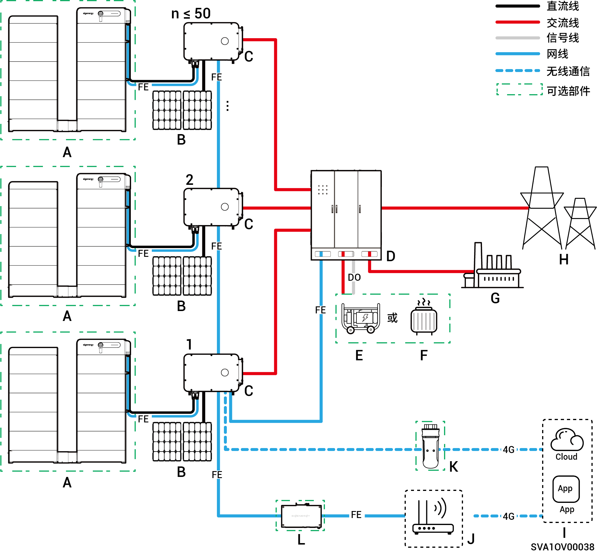
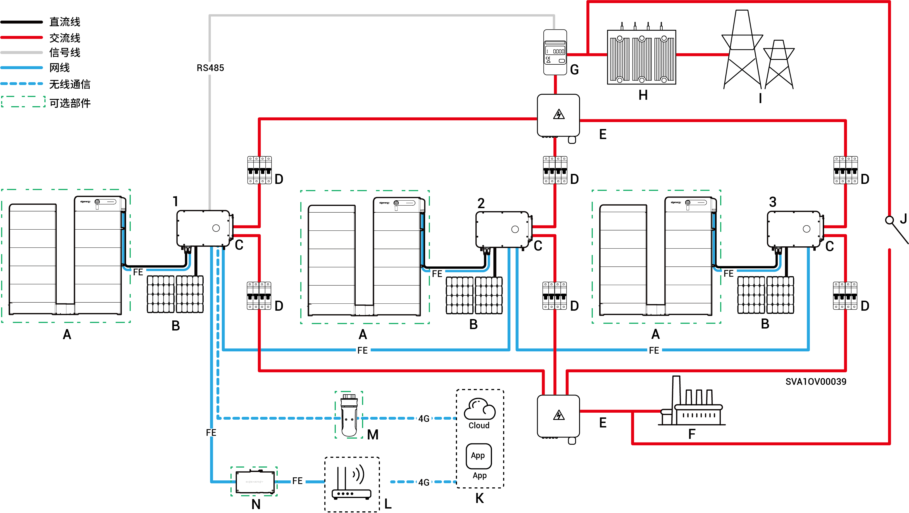

# 组网介绍

* 本公司产品可用于工商业储能系统。工商业储能系统由光伏板、逆变器、电池包、总控制开关、负载、电网等组成。
* 工商业光储系统主要功能是将光伏板产生的直流电存储到电池包中，也可以将光伏与电池包中的电转化成交流电提供给负载使用或并入电网。
* 在离网系统中，逆变器需承担全部负载功率。为应对电机启动等瞬时过载需求，逆变器虽具备短时过载能力，但超限会导致保护关机。同时，高温环境会引发逆变器功率降额，若输出功率持续低于负载需求，同样会触发保护。
  * **系统设计建议：**
    * 过载匹配：确保负载启动功率/时间小于逆变器短时过载能力；
    * 功率适配：负载长期运行功率需低于逆变器在极端环温下的实际输出功率；
    * 环境补偿：综合考虑海拔、日照等因素对功率降额的影响，预留足够余量。

## 非备电组网图（逆变器＜100台）

<figure><figcaption></figcaption></figure>

<table data-header-hidden><thead><tr><th valign="top"></th><th valign="top"></th><th valign="top"></th><th valign="top"></th><th valign="top"></th></tr></thead><tbody><tr><td valign="top">A．电池</td><td valign="top">B．光伏板</td><td valign="top">C．逆变器</td><td valign="top">D．交流开关（取决于负载功率）</td><td valign="top">E．功率传感器</td></tr><tr><td valign="top">F．箱式变电站</td><td valign="top">G．电网</td><td valign="top">H．思格云</td><td valign="top">I．路由器</td><td valign="top">J．思格通信棒</td></tr><tr><td valign="top">K．思格通信网桥</td><td valign="top"></td><td valign="top"></td><td valign="top"></td><td valign="top"></td></tr></tbody></table>



* <mark style="color:blue;">每台逆变器需配备一个交流输出开关，多台逆变器不可同时接入一个交流开关。</mark>
* <mark style="color:blue;">与每一台逆变器连接的交流开关额定电压均需 ≥500Va.c., 额定电流推荐规格：</mark>
  * <mark style="color:blue;">逆变器功率为50kW或60kW：额定电流为125A</mark>
  * <mark style="color:blue;">逆变器功率为75kW或80kW：额定电流为160A</mark>
  * <mark style="color:blue;">逆变器功率为99.9kW或100kW：额定电流为200A</mark>
  * <mark style="color:blue;">逆变器功率为110kW或125kW：额定电流为250A</mark>
* <mark style="color:blue;">通信方式推荐采用FE和WLAN。CommMod赠送4G流量用完后，需用户自行充值或更换SIM卡。</mark>

## 备电组网图（HYB机型配置外置思格能源备电柜，逆变器≤50台）

<figure><figcaption></figcaption></figure>

<table data-header-hidden><thead><tr><th valign="middle"></th><th width="161.727294921875" valign="middle"></th><th valign="middle"></th><th valign="middle"></th><th valign="middle"></th><th data-hidden></th></tr></thead><tbody><tr><td valign="middle">A．电池</td><td valign="middle">B．光伏板</td><td valign="middle">C．逆变器</td><td valign="middle">D．思格备电柜</td><td valign="middle">E．发电机</td><td></td></tr><tr><td valign="middle">F．智能负载</td><td valign="middle">G．备电负载</td><td valign="middle">H．电网</td><td valign="middle">I．思格云</td><td valign="middle">J．路由器</td><td></td></tr><tr><td valign="middle">K．思格通信棒</td><td valign="middle">L．思格通信网桥</td><td valign="middle"></td><td valign="middle"></td><td valign="middle"></td><td></td></tr></tbody></table>



* <mark style="color:blue;">柴油发电机（E）可作为长期离网场景的备份能源，与思格备电柜（D）配合可实现光储柴无缝切换的用电体验。</mark>
* <mark style="color:blue;">通信方式推荐采用FE和WLAN。思格通信棒（K）赠送4G流量用完后，需用户自行充值或更换SIM卡。</mark>

## 备电组网图（HYB机型配置内置思格能源备电柜，逆变器≤3台）

<figure><figcaption></figcaption></figure>

<table data-header-hidden><thead><tr><th valign="middle"></th><th valign="middle"></th><th width="159" valign="middle"></th><th width="159.2222900390625" valign="top"></th><th valign="top"></th></tr></thead><tbody><tr><td valign="middle">A．电池</td><td valign="middle">B．光伏板</td><td valign="middle">C．逆变器</td><td valign="top">D．交流开关（取决于负载功率）</td><td valign="top">E．汇流柜</td></tr><tr><td valign="middle">F．备电负载</td><td valign="middle">G．功率传感器</td><td valign="middle">H．箱式变电站</td><td valign="top">I．电网</td><td valign="top">J．手动控制开关</td></tr><tr><td valign="middle">K．思格云</td><td valign="middle">L．路由器</td><td valign="middle">M．思格通信棒</td><td valign="top">N．思格通信网桥</td><td valign="top"></td></tr></tbody></table>



* <mark style="color:blue;">多台逆变器不可同时接入一个交流开关。</mark>
* <mark style="color:blue;">每一台逆变器连接到备电负载的交流开关额定电压均需 ≥500Va.c., 额定电流推荐规格：</mark>
  * <mark style="color:blue;">逆变器功率为50kW：额定电流为100A</mark>
  * <mark style="color:blue;">逆变器功率为60kW：额定电流为125A</mark>
  * <mark style="color:blue;">逆变器功率为75kW或80kW：额定电流为160A</mark>
  * <mark style="color:blue;">逆变器功率为99.9kW或100kW：额定电流为200A</mark>
  * <mark style="color:blue;">逆变器功率为110kW或125kW：额定电流为250A</mark>
* <mark style="color:blue;">每一台逆变器连接到电网的交流开关额定电压均需 ≥500Va.c., 额定电流推荐规格：</mark>
  * <mark style="color:blue;">逆变器功率为100kW：额定电流为200A</mark>
  * <mark style="color:blue;">逆变器功率为120kW：额定电流为250A</mark>
  * <mark style="color:blue;">逆变器功率为160W：额定电流为315A</mark>
* <mark style="color:blue;">通信方式推荐采用FE和WLAN。CommMod赠送4G流量用完后，需用户自行充值或更换SIM卡。</mark>
