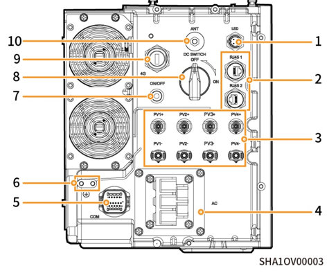

# 端口介绍

### 思格能源控制器左视图

<figure><figcaption></figcaption></figure>

| 序号     | 名称            | 丝印                                         |
| ------ | ------------- | ------------------------------------------ |
| **1**  | 装饰盖灯带接口       | LED                                        |
| **2**  | 网线接口          | RJ45 1/ RJ45 2                             |
| **3**  | 直流输入接口        | PV1+/PV2+/ PV3+/PV4+/ PV1-/PV2-/ PV3-/PV4- |
| **4**  | 交流输出接口        | AC                                         |
| **5**  | 通信接口          | COM                                        |
| **6**  | 接地螺钉          | -                                          |
| **7**  | 开关按钮          | ON/OFF                                     |
| **8**  | 直流开关          | DC SWITCH                                  |
| **9**  | Sigen 思格通信棒接口 | 4G                                         |
| **10** | 天线接口          | ANT                                        |
