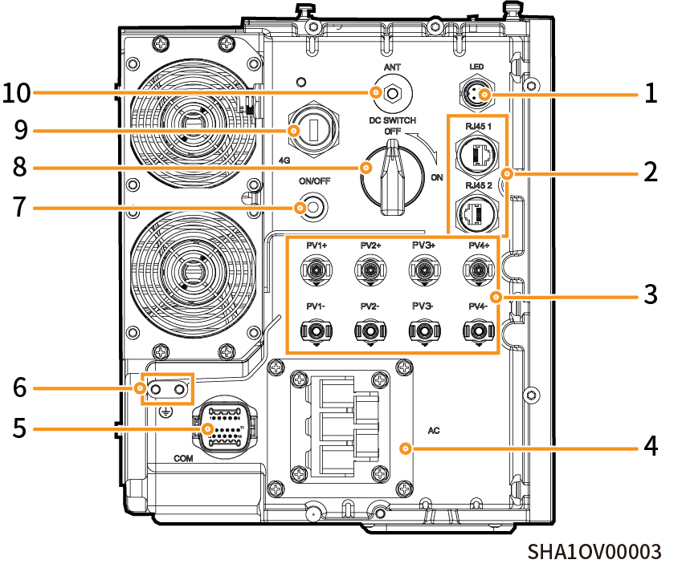

# 端口介绍

### 思格能源控制器左视图

<figure><figcaption></figcaption></figure>

<table><thead><tr><th width="97.181884765625">序号</th><th width="228.6363525390625">名称</th><th>丝印</th></tr></thead><tbody><tr><td><strong>1</strong></td><td>装饰盖灯带接口</td><td>LED</td></tr><tr><td><strong>2</strong></td><td>网线接口</td><td>RJ45 1/ RJ45 2</td></tr><tr><td><strong>3</strong></td><td>直流输入接口</td><td>PV1+/PV2+/ PV3+/PV4+/ PV1-/PV2-/ PV3-/PV4-</td></tr><tr><td><strong>4</strong></td><td>交流输出接口</td><td>AC</td></tr><tr><td><strong>5</strong></td><td>通信接口</td><td>COM</td></tr><tr><td><strong>6</strong></td><td>接地螺钉</td><td>-</td></tr><tr><td><strong>7</strong></td><td>开关按钮</td><td>ON/OFF</td></tr><tr><td><strong>8</strong></td><td>直流开关</td><td>DC SWITCH</td></tr><tr><td><strong>9</strong></td><td>Sigen 思格通信棒接口</td><td>4G</td></tr><tr><td><strong>10</strong></td><td>天线接口</td><td>ANT</td></tr></tbody></table>
