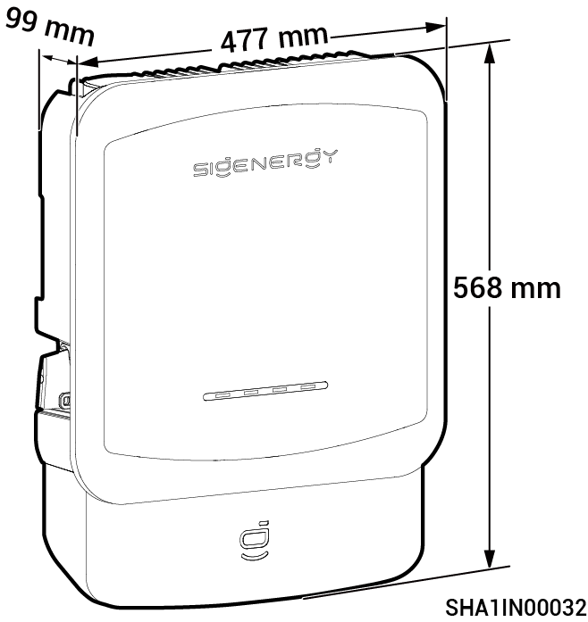
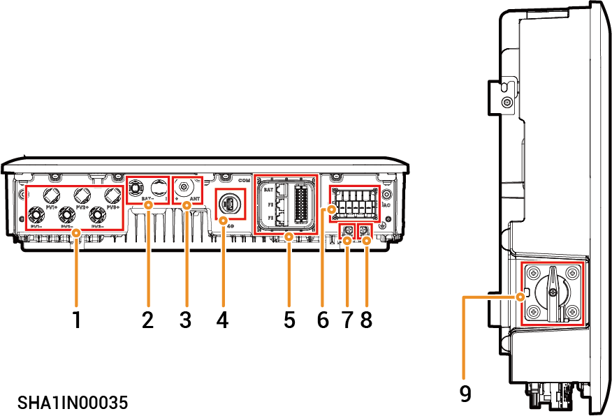

# Sigen Hybrid (3.0-12.0) TP2 Series

## Appearance and Dimensions

<figure><figcaption></figcaption></figure>

## Port Introduction

<figure><figcaption></figcaption></figure>

| No. | Name                                                       | Marking                              |
| --- | ---------------------------------------------------------- | ------------------------------------ |
| 1   | DC terminal block                                          | PV1+/PV1-/PV2+/PV2-/PV3+/PV3-        |
| 2   | Battery pack input interface                               | BAT+/BAT-                            |
| 3   | Antenna interface                                          | ANT                                  |
| 4   | CommMod interface                                          | 4G                                   |
| 5   | Communication port                                         | COM                                  |
| 6   | AC terminal                                                | AC                                   |
| 7   | Grounding point (connected to the battery pack)            |  |
| 8   | Grounding point (connected to the protective ground cable) |  |
| 9   | DC switch                                                  | DC SWITCH                            |
