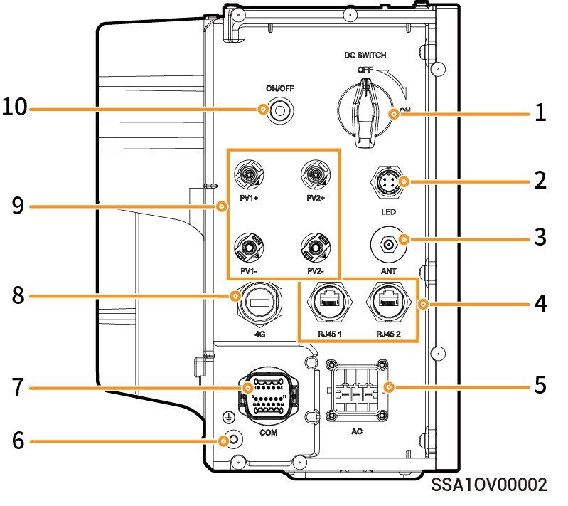

# Einphasiges System (3.0-6.0), Ansicht des Wechselrichters von links

<table><thead><tr><th width="60">Nr.</th><th>Bezeichnung</th><th>Kennzeichnung</th></tr></thead><tbody><tr><td>1</td><td>DC-Schalter</td><td>DC SWITCH</td></tr><tr><td>2</td><td>Dekorative Abdeckleiste Lichtschnittstelle</td><td>LED</td></tr><tr><td>3</td><td>Antennenanschluss</td><td>ANT</td></tr><tr><td>4</td><td>Netzwerkkabelschnittstelle</td><td>RJ45 1/ RJ45 2</td></tr><tr><td>5</td><td>AC-Ausgang</td><td>AC</td></tr><tr><td>6</td><td>Erdungsschraube</td><td>-</td></tr><tr><td>7</td><td>RS-485-Kommunikationsschnittstelle</td><td>COM</td></tr><tr><td>8</td><td>CommMod-Schnittstelle</td><td>4G</td></tr><tr><td>9</td><td>DC-Eingang</td><td>PV1+/PV2+/ PV1-/PV2-</td></tr><tr><td>10</td><td>Netztaste</td><td>ON/OFF</td></tr></tbody></table>
