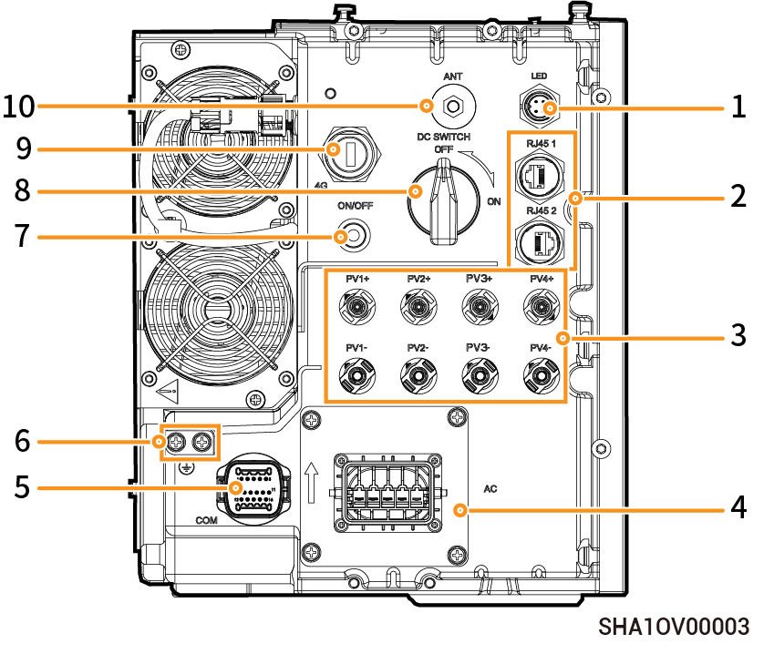

# Lavspændings‑trefasesysteminverter, set fra venstre

<figure><figcaption></figcaption></figure>

<table><thead><tr><th width="70.5555419921875" align="center">Nej.</th><th>Navn</th><th>Markering</th></tr></thead><tbody><tr><td align="center">1</td><td>Dekorativ dækliste til lysgrænseflade</td><td>LED</td></tr><tr><td align="center">2</td><td>Netværkskabelgrænseflade</td><td>RJ45 1/ RJ45 2</td></tr><tr><td align="center">3</td><td>DC-indgangsinterface</td><td>PV1+/PV2+/PV3+/PV4+/PV1-/PV2-/PV3-/PV4-</td></tr><tr><td align="center">4</td><td>AC-udgangsinterface</td><td>AC</td></tr><tr><td align="center">5</td><td>Kommunikationsinterface</td><td>COM</td></tr><tr><td align="center">6</td><td>Jordingsskrue</td><td>-</td></tr><tr><td align="center">7</td><td>Tænd/sluk-knap</td><td>ON/OFF</td></tr><tr><td align="center">8</td><td>DC-afbryder</td><td>DC SWITCH</td></tr><tr><td align="center">9</td><td>Sigen CommMod-interface</td><td>4G</td></tr><tr><td align="center">10</td><td>Sigen CommMod-interface</td><td>ANT</td></tr></tbody></table>
