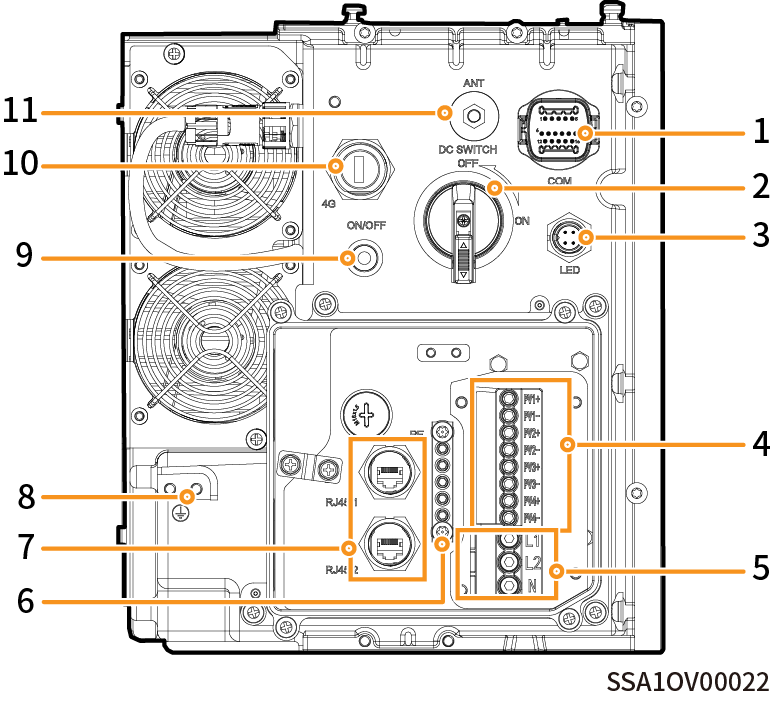

# Split-Phase-System, Ansicht des Wechselrichters von links

<figure><figcaption></figcaption></figure>

<figure><figcaption></figcaption></figure>

<table><thead><tr><th width="60" align="center">Nr.</th><th>Bezeichnung</th><th>Kennzeichnung</th></tr></thead><tbody><tr><td align="center">1</td><td>Kommunikationsanschluss</td><td>COM</td></tr><tr><td align="center">2</td><td>DC-Schalter</td><td>DC SWITCH</td></tr><tr><td align="center">3</td><td>Dekorative Abdeckleiste Lichtschnittstelle</td><td>LED</td></tr><tr><td align="center">4</td><td>DC-Klemmenblock</td><td>PV1+/PV1-/PV2+/PV2-/PV3+/PV3-/PV4+/PV4-</td></tr><tr><td align="center">5</td><td>AC-Klemmenblock</td><td>L1/L2/N</td></tr><tr><td align="center">6</td><td>Erdungsschiene aus Aluminium</td><td>-</td></tr><tr><td align="center">7</td><td>Netzwerkkabelschnittstelle</td><td>RJ45 1/RJ45 2</td></tr><tr><td align="center">8</td><td>Erdungsschraube</td><td>-</td></tr><tr><td align="center">9</td><td>Netztaste</td><td>ON/OFF</td></tr><tr><td align="center">10</td><td>(Reserviert) CommMod-Anschluss</td><td>4G</td></tr><tr><td align="center">11</td><td>Antennenanschluss</td><td>ANT</td></tr></tbody></table>
