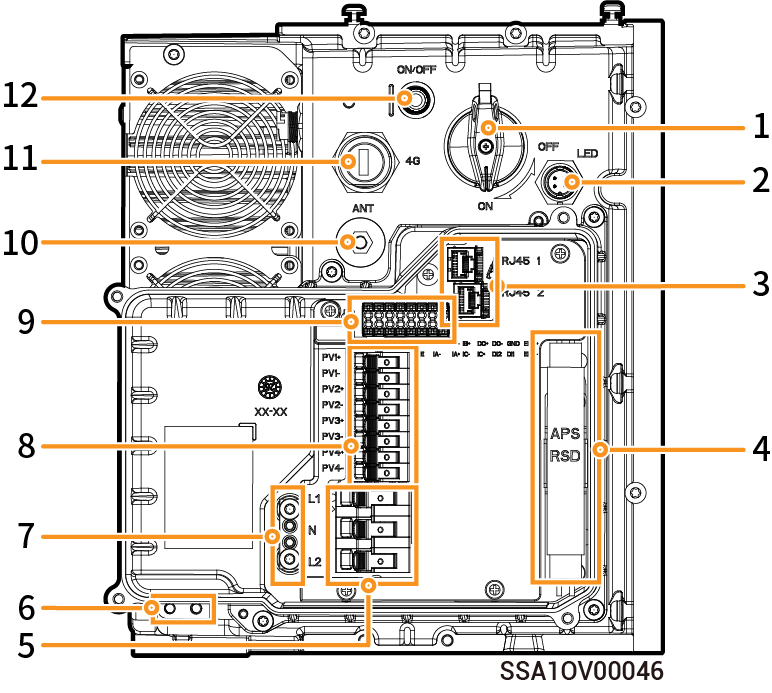

# SigenStor Home Inverter Left View

<figure><figcaption></figcaption></figure>

<table><thead><tr><th width="95">S/N</th><th>Name</th><th>Marking</th></tr></thead><tbody><tr><td>1</td><td>RSD trigger switch</td><td>-</td></tr><tr><td>2</td><td>Decorative cover light strip connector</td><td>LED</td></tr><tr><td>3</td><td>Network interface</td><td>RJ45 1/RJ45 2</td></tr><tr><td>4</td><td>Rapid Shutdown Device</td><td>RSD</td></tr><tr><td>5</td><td>AC terminal block</td><td>L1/N/L2</td></tr><tr><td>6</td><td>Ground screw</td><td>-</td></tr><tr><td>7</td><td>Grounding aluminum busbar</td><td>-</td></tr><tr><td>8</td><td>DC terminal block</td><td>
PV1+/PV1-/PV2+/PV2-

PV3+/PV3-PV4+/PV4-
</td></tr><tr><td>9</td><td>Signal terminal block</td><td>485-/485+/IB-/IB+/DO+/DO-/GND/EPO+/PE/IA-/IC-/IC+/DI2/DI1/EPO-</td></tr><tr><td>10</td><td>Antenna port</td><td>ANT</td></tr><tr><td>11</td><td>CommMod port</td><td>4G</td></tr><tr><td>12</td><td>On-Off Switch</td><td>ON/OFF</td></tr></tbody></table>
