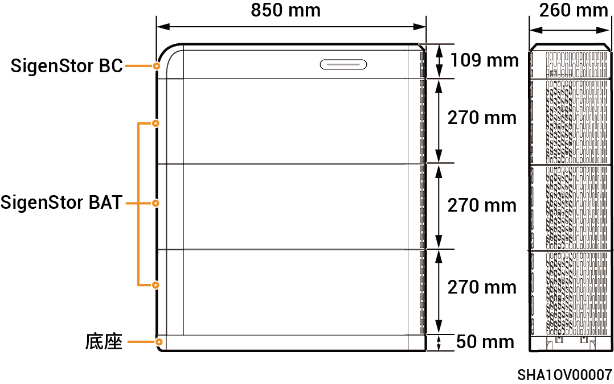

# SigenStor储能系统

## 外观与尺寸

<figure><figcaption></figcaption></figure>

## 端口介绍

<figure><figcaption></figcaption></figure>

| 序号 | 名称         | 丝印                                         |
| -- | ---------- | ------------------------------------------ |
| 1  | 开关按钮       | ON/OFF                                     |
| 2  | 直流开关       | DC SWITCH                                  |
| 3  | 电池包输入接口    | BAT+/BAT-                                  |
| 4  | 接地点（连接逆变器） | .png>) |
| 5  | 通信端口       | COM                                        |
| 6  | 装饰件灯带线     | LED                                        |
