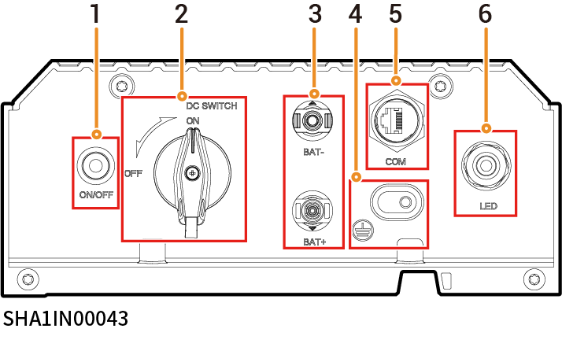

# Sistema de almacenamiento de energía

## Aspecto y dimensiones

<figure><figcaption></figcaption></figure>

## Introducción a los puertos

<figure><figcaption></figcaption></figure>

| N.º | Denominación                                       | Marcado                                    |
| --- | -------------------------------------------------- | ------------------------------------------ |
| 1   | Botón de encendido                                 | ON/OFF                                     |
| 2   | Interruptor de CC                                  | DC SWITCH                                  |
| 3   | Interfaz de entrada del paquete de baterías        | BAT+/BAT-                                  |
| 4   | Punto de conexión a tierra (conectado al inversor) | .png>) |
| 5   | Puerto de comunicación                             | COM                                        |
| 6   | Línea luminosa decorativa                          | LED                                        |
