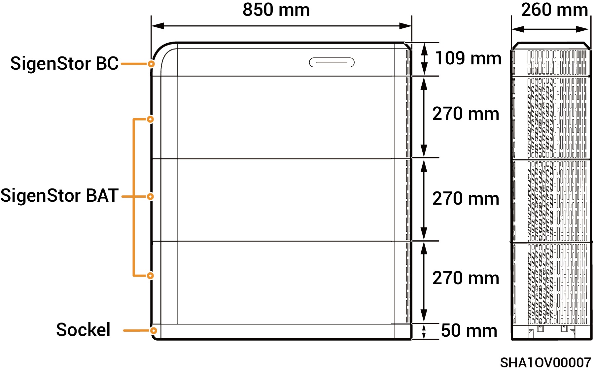

# SigenStor-Energiespeichersystem

## Erscheinungsbild und Abmessungen

<figure><figcaption></figcaption></figure>

## Anschluss

<figure><figcaption></figcaption></figure>

| Nr. | Bezeichnung                                  | Kennzeichnung                              |
| --- | -------------------------------------------- | ------------------------------------------ |
| 1   | Netztaste                                    | ON/OFF                                     |
| 2   | DC-Schalter                                  | DC SWITCH                                  |
| 3   | Batteriepack-Eingangsschnittstelle           | BAT+/BAT-                                  |
| 4   | Erdungspunkt (Anschluss des Wechselrichters) | .png>) |
| 5   | Kommunikationsanschluss                      | COM                                        |
| 6   | Dekoratives Lichtband                        | LED                                        |
