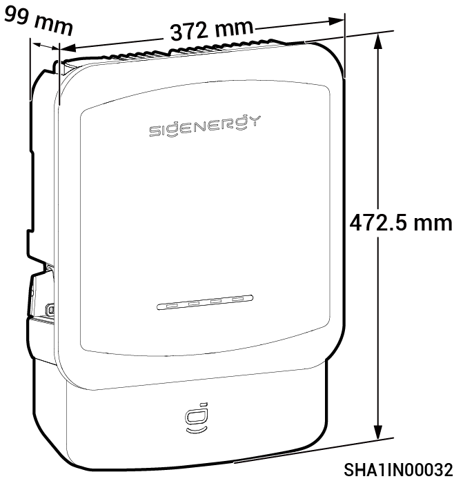
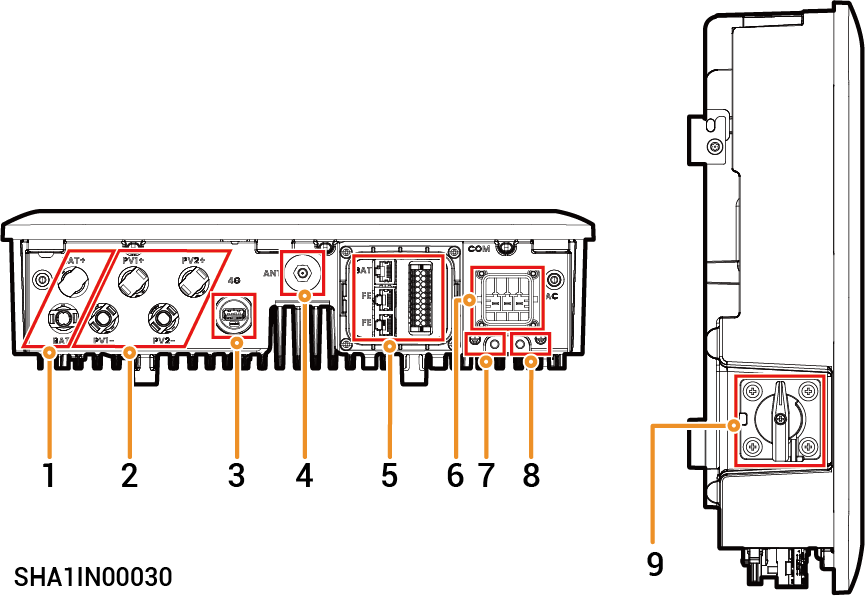

# Sigen Hybrid (2.0-6.0) SP2系列

## 外观与尺寸

### 端口介绍

| 序号 | 名称          | 丝印                                         |
| -- | ----------- | ------------------------------------------ |
| 1  | 电池包输入接口     | BAT+/BAT-                                  |
| 2  | 直流接线排       | PV1+/PV1-/PV2+/PV2-                        |
| 3  | CommMod接口   | 4G                                         |
| 4  | 天线接口        | ANT                                        |
| 5  | 通信端口        | COM                                        |
| 6  | 交流端子        | AC                                         |
| 7  | 接地点（连接电池包）  | .png>) |
| 8  | 接地点（连接保护地线） | .png>) |
| 9  | 直流开关        | DC SWITCH                                  |
