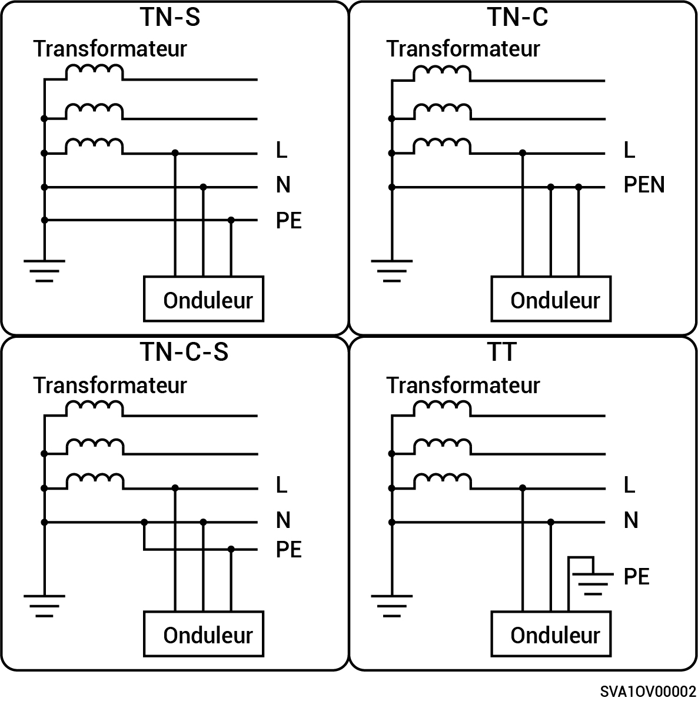

# Système monophasé

* Les méthodes d'alimentation du réseau prises en charge sont TN-S, TN-C, TN-C-S et TT.
* En mode d'alimentation du réseau TT, la tension requise entre N et PE est inférieure à 30 V.

<figure><figcaption></figcaption></figure>
