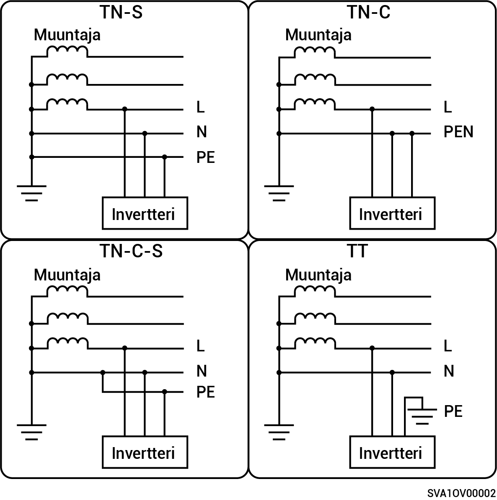

# Yksivaihejärjestelmä

* Tuetut verkkovirtatilat ovat TN-S, TN-C, TN-C-S ja TT.
* TT-verkkovirtatilassa N:n ja PE:n välinen jännitevaatimus on alle 30 V.

<figure><figcaption></figcaption></figure>
