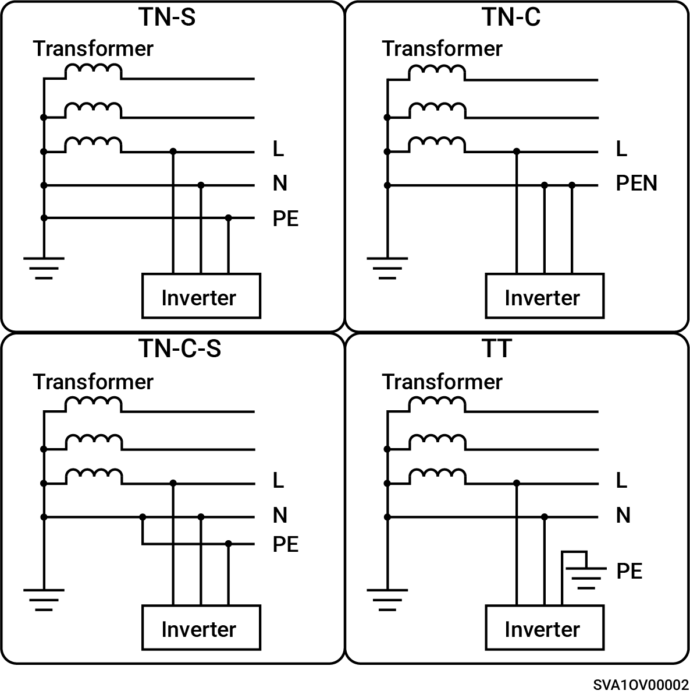

# Enkeltfasesystem

* Understøttede netstrømtilstande er TN-S, TN-C, TN-C-S og TT.
* Når det anvendes til TT-netstrømtilstand, er spændingskravet for N til PE mindre end 30 V.

<figure><figcaption></figcaption></figure>
