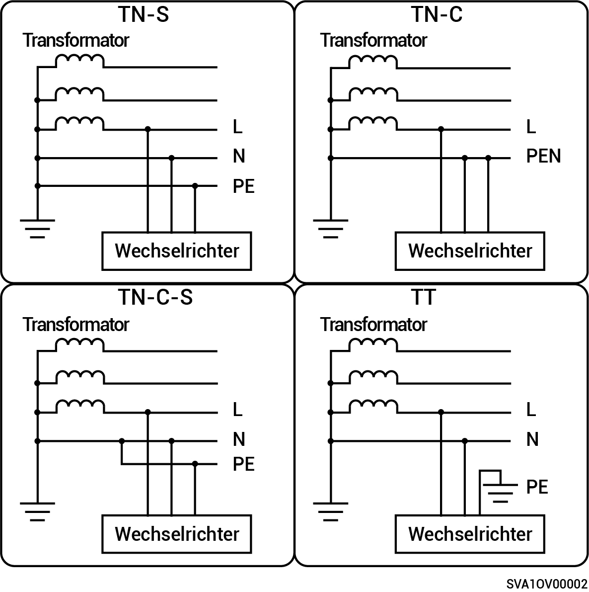

# Sigen Hybrid (2.0-6.0) SP2-Baureihen

* Unterstützt werden die Netzleistungsmodi TN-S, TN-C, TN-C-S und TT.
* Im TT-Netzbetrieb beträgt die erforderliche Spannung zwischen N und PE weniger als 30 V.

<figure><figcaption></figcaption></figure>
