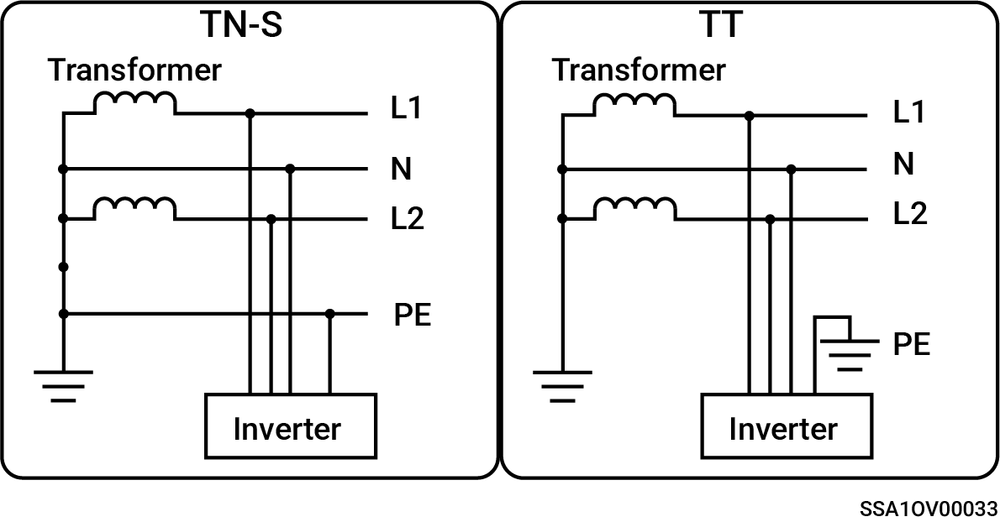

# Splitfase-system og SigenStor Home

* Understøttede netstrømtilstande er TN-S og TT.
* Når det anvendes til TT-netstrømtilstand, er spændingskravet for N til PE mindre end 30 V.

<figure><figcaption></figcaption></figure>
