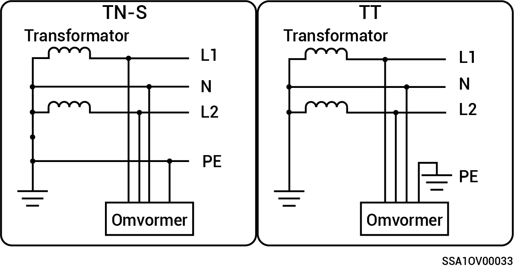

# Split-fase systeem

* Ondersteunde netvoedingsmodi zijn TN-S en TT.
* Wanneer toegepast op de TT-netvoedingsmodus, is de spanningsvereiste voor N naar PE minder dan 30V.

<figure><figcaption></figcaption></figure>
