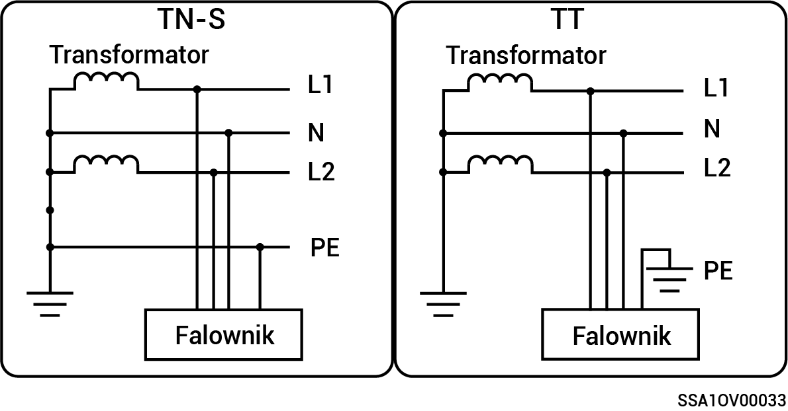

# Instalacja z rozdzieloną fazą

* Obsługiwane tryby zasilania sieciowego to: TN-S oraz TT.
* W razie stosowania w trybie sieci TT wymagane jest napięcie N do PE o wartości mniejszej niż 30V.

<figure><figcaption></figcaption></figure>
