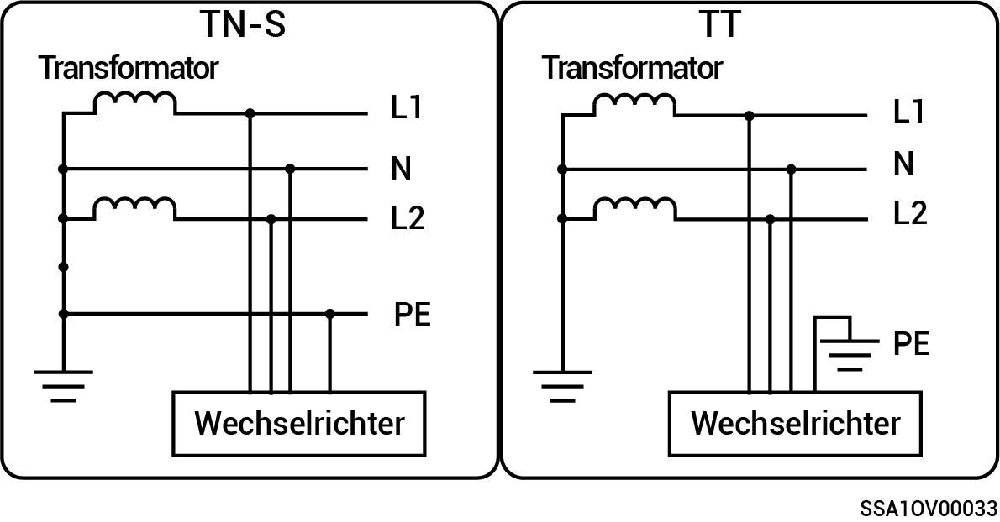

# Split-Phase-System

* Unterstützt werden die Netzleistungsmodi TN-S und TT.
* Im TT-Netzbetrieb beträgt die erforderliche Spannung zwischen N und PE weniger als 30 V.

<figure><figcaption></figcaption></figure>
